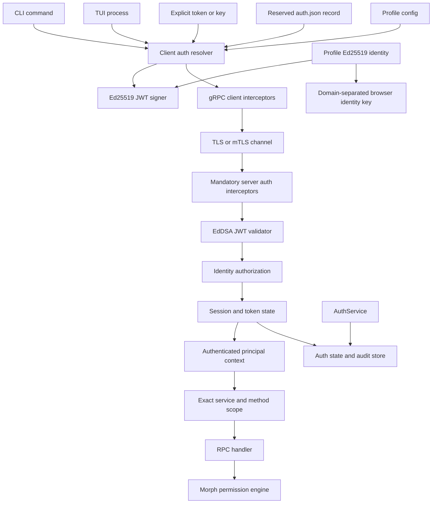
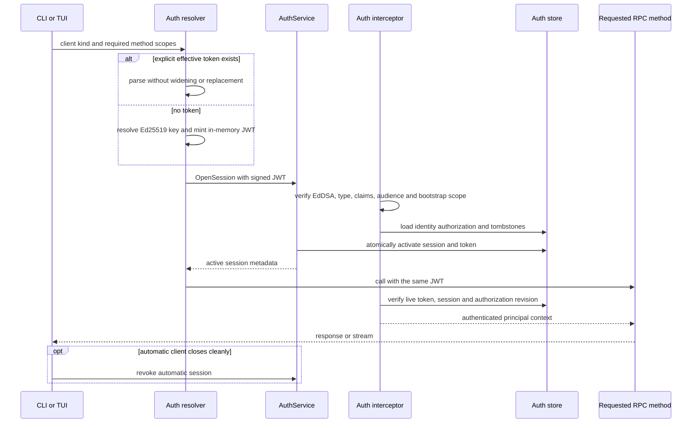
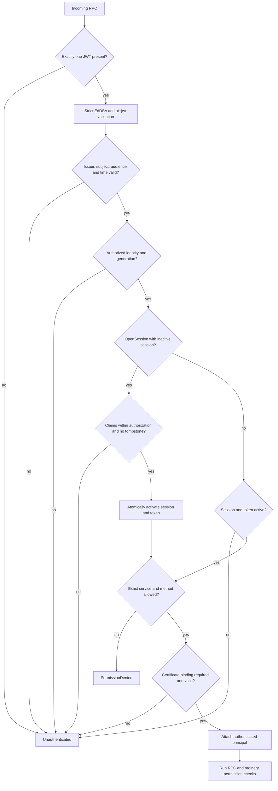
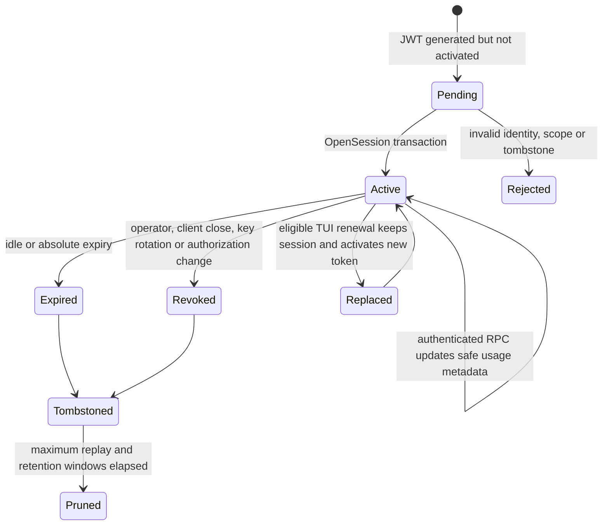

# feat: Add Morph identity and mandatory RPC authentication

## Summary

Replace Morph's optional profile-scoped HMAC owner proof with a profile identity, Ed25519-signed JWT access tokens,
durable authorization and auth-session state, and mandatory authentication for every gRPC method. The same validated
principal must drive RPC method authorization, permission actor identity, audit records, token revocation, and optional
mutual TLS certificate binding.

This is a direct cutover. Morph will not read, migrate, or accept `rpc-owner.key`, legacy owner-proof metadata, or
unauthenticated RPC calls after the new boundary is enabled. Existing Morph capabilities continue to work through the
new authenticated client path, but the old RPC authentication protocol is removed rather than retained as a fallback.

Local usability remains automatic:

- CLI clients use an explicit effective token when supplied; otherwise they mint a short-lived in-memory token from
  the effective Ed25519 identity key.
- The TUI uses an explicit effective token when supplied; otherwise it mints a long-lived, renewable in-memory token
  that is never written back to configuration or `auth.json`.
- Profile initialization atomically provisions an Ed25519 identity when neither config nor `auth.json` supplies one.

---

## Problem Frame

Morph currently has two different RPC trust levels:

- most RPC methods run without application authentication;
- selected owner-sensitive paths recognize an optional HMAC proof loaded from `rpc-owner.key`.

The current proof is method-bound, request-bound, short-lived, and replay checked, but it is not a general identity or
authorization system. A caller without a proof can still reach ordinary RPC methods, the proof has one implicit profile
owner, there are no inspectable auth sessions, and revocation means rotating a shared file and restarting clients.
Transport is also plaintext gRPC, so an RPC endpoint exposed beyond loopback has neither encrypted transport nor a
general application identity boundary.

The main integration points are already centralized enough to replace this cleanly:

- `internal/rpc/server/auth.go` and `internal/rpc/client/owner_auth.go` own the current interceptors;
- `internal/rpc/rpcmeta/permissions.go` turns authenticated RPC context into a permission actor;
- `internal/rpc/client/client.go` is the common client constructor used by CLI, TUI, session, gateway, automation,
  permission, browser, and end-to-end clients;
- `internal/state/core`, `storememory`, and `storesqlite` already provide the durable-store pattern needed for auth
  sessions and token records;
- `internal/credential/file.go` already owns profile `auth.json`, locking, atomic replacement, and platform-specific
  secret-file protection;
- `internal/cli/daemon/rpc.go` assembles the server, permission policy, browser attachment identity, and all RPC
  dependencies.

The replacement must keep authentication and permissions distinct. A valid JWT permits a principal to invoke a gRPC
method. The existing permission engine still decides whether that authenticated actor may perform the requested Morph
operation.

---

## Scope Decisions

- The legacy owner credential is removed, not migrated.
- The new protocol has no unauthenticated compatibility mode.
- Provider credentials already stored in `auth.json` remain functional; the file gains a reserved Morph auth section
  without converting provider credentials into RPC identities.
- `auth.key` is Ed25519 private signing material or a key reference. Its derived public key is the identity. No separate
  HS256-style JWT secret is introduced because the identity key is the signing secret.
- JWT character count is not an independent security control. Token generation supports configurable lifetime, claim
  scope, and bounded nonce entropy; the encoded token length follows from those claims and Ed25519's fixed signature.
- JWT is mandatory even when mTLS is enabled. mTLS provides transport confidentiality, peer authentication, and
  optional token sender constraint.
- `full_access` remains a permission preset, not an RPC authentication bypass.
- This work does not turn Morph into a general OAuth or OpenID Connect provider.

---

## Requirements

### Identity and secret handling

- R1. Every Morph profile must have one root Ed25519 identity. The identity ID and JWT `kid` must be derived from the
  public key using a stable SHA-256 JWK thumbprint; profile names, filenames, or caller-provided labels are not identity
  proof.
- R2. When no effective key exists, profile setup or first daemon initialization must generate the key pair atomically
  with cryptographically secure randomness and owner-only permissions on Unix and Windows.
- R3. The effective private key may come from an explicit flag, profile config `auth.key`, or the reserved Morph record
  in profile `auth.json`. The effective public key must always be derived and checked against any configured identity
  metadata.
- R4. The effective access token may come from an explicit flag, profile config `auth.token`, or `auth.json`. Secrets
  must be redacted from logs, traces, errors, status output, effective config, crash diagnostics, and process listings
  where Morph controls presentation.
- R5. Secret precedence must be deterministic: explicit runtime flag, profile config, `auth.json`, then automatic token
  generation. An explicitly supplied but invalid token or key must fail rather than silently falling through to a less
  visible source.
- R6. Provider login, refresh, status, and logout must continue to preserve their own records while Morph identity data
  is read or written in the same `auth.json` document.
- R7. Identity rotation must use a recoverable staged protocol across `auth.json` and `auth.db`: prepare the new key,
  journal the transition, transactionally advance the identity generation and revoke prior sessions/tokens, then
  activate the new key and clear the journal. Startup recovery must complete or roll back an interrupted transition
  without accepting both generations. Browser attachment fingerprints derived from the old owner secret must stop
  matching after activation.

### JWT contract and authorization

- R8. Morph access tokens must be signed only with Ed25519 using JOSE `alg: EdDSA` and explicit `typ: at+jwt`.
  Validators must reject `none`, symmetric algorithms, algorithm substitution, unknown critical headers, malformed
  encodings, duplicate metadata values, and tokens above a configured size bound.
- R9. Every token must carry and validate `iss`, `sub`, `aud`, `iat`, `nbf`, `exp`, and `jti`. Morph claims must include
  auth session ID, owner ID, user identity, roles, service scopes, exact method scopes, identity generation, and an
  unpredictable issuance nonce.
- R10. `aud` must identify the active Morph profile RPC audience. `iss` and `kid` must resolve to the same authorized
  Ed25519 public key. `sub`, owner ID, and roles must match the server-side authorization for that identity.
- R11. A token may narrow an identity's authorization but may never expand it. Requested roles, services, methods,
  lifetime, and owner identity must be subsets of the current authorization record.
- R12. RPC method scopes must match canonical full gRPC service and method names structurally. Raw prefix matching and
  caller-invented service aliases must not authorize a method.
- R13. Root-owner wildcard scope must be represented as an explicit validated scope kind. Ordinary identities and
  tokens must list exact methods or validated service-wide scopes.
- R14. Token generation must support configurable TTL, bounded nonce bytes, owner ID, user identity, roles, services,
  methods, and auth session. Server policy must cap TTL, nonce bounds, role choices, and delegated scope.
- R15. Access tokens are bearer credentials unless certificate-bound. The product and documentation must not claim
  that `jti` or an issuance nonce alone prevents reuse of a stolen active token.

### Sessions, tokens, audit, and revocation

- R16. Every accepted access token must reference a durable auth session and an activated token record. The server must
  check live session, token, identity-generation, and authorization state on every unary and streaming RPC.
- R17. The only pre-activation path is `AuthService.OpenSession`, which must itself receive a valid Ed25519-signed JWT
  with the exact bootstrap method scope. It may atomically activate that token and session only after validating the
  identity authorization and every requested claim.
- R18. Revoked or expired session IDs and JWT IDs must leave tombstones until their maximum replay window has passed so
  the same signed token cannot reopen them.
- R19. Session records must include identity ID, owner ID, user ID, roles, source, created time, last-seen time, idle and
  absolute expiry, status, revocation metadata, and identity/authorization generation.
- R20. Token records must include JWT ID, session ID, claim summary, issued/not-before/expiry times, last-used time, use
  count, status, revocation metadata, and optional certificate thumbprint. Raw JWT strings and private keys must never
  be persisted in auth state or audit events.
- R21. Authentication audit state must record successful and rejected session opening, token issuance and activation,
  scope denial, expiry, revocation, authorization change, key rotation, and mTLS binding failure. Routine successful RPC
  authentication may be represented by bounded per-token/per-method counters plus first/last-use times instead of one
  row per call. Audit data must contain safe IDs and method names but no tokens, keys, request bodies, or sensitive
  metadata.
- R22. Token and session revocation must take effect for new calls immediately. Active server streams must receive a
  cancelled authenticated context when their token or session is revoked or expires.
- R23. Cleanup must expire sessions and tokens in bounded batches while retaining revocation tombstones and audit
  history for configured windows.

### Mandatory RPC enforcement

- R24. Every Morph gRPC method, including health and server-streaming methods, must reject missing, malformed, expired,
  inactive, revoked, wrong-audience, wrong-method, or insufficiently authorized JWTs with stable gRPC status codes.
- R25. The server interceptor must construct one immutable authenticated principal containing identity ID, owner ID,
  user ID, roles, session ID, token ID, scopes, auth source, and optional certificate binding. Handlers must consume
  that principal rather than re-reading untrusted metadata.
- R26. `internal/rpc/rpcmeta` must derive permission actors from the validated principal. CLI/TUI surface metadata and
  loopback transport remain contextual signals and can never create owner authority by themselves.
- R27. A validated owner role may map to the existing `local_owner` permission actor only when the token authorization
  permits the claimed CLI or TUI client context. Other authenticated principals remain `rpc_client` with their stable
  identity ID.
- R28. Permission preset and surface metadata must remain separate from authentication claims. A token may authorize
  an RPC method without authorizing the operation evaluated by the permission engine.
- R29. The old `x-morph-owner-*` proof metadata, `rpc-owner.key`, optional owner interceptors, and `browser auth rotate`
  command must be removed in the same cutover that enables mandatory JWT enforcement.

### CLI, TUI, and management UX

- R30. All RPC client construction must use one token resolver and interceptor path. Individual commands must not
  implement their own source precedence, signing, activation, refresh, or retry behavior.
- R31. A CLI RPC client with no effective token must create a new short-lived token in memory, activate it, use only the
  scopes requested by that command, and revoke its automatic auth session on clean exit. The default TTL is five
  minutes and remains bounded by server policy.
- R32. A TUI client with no effective token must create one long-lived token in memory, activate it, and renew it within
  the same auth session before expiry while the process remains alive. The default TTL is eight hours. The token must
  never be persisted automatically and the session must be revoked on clean TUI exit.
- R33. Crashed CLI/TUI processes rely on idle and absolute session expiry; cleanup must not require the client to run.
- R34. Explicit tokens must never be automatically replaced, broadened, renewed, or revoked by client shutdown. Their
  expiry and lifecycle remain operator-managed.
- R35. `morph auth` must retain provider credential commands and add identity, token, session, authorization, audit, and
  mTLS status commands. Token, session, authorization, and audit management operations must go through authenticated
  `AuthService` RPC methods.
- R36. Identity initialization and local key inspection may run before a daemon exists. Commands that change server
  authorization, active sessions, or token state require a reachable authenticated daemon.
- R37. Human and JSON output must show safe identity IDs, key fingerprints, status, scopes, local-time expiry, source,
  and revocation state without rendering raw tokens or private key material unless token generation explicitly sends
  the new token to the requested output.

### TLS and mTLS

- R38. RPC transport must support disabled, server-TLS, and mutual-TLS modes. Disabled TLS is valid only for loopback
  listeners; a non-loopback listener without TLS must fail configuration validation.
- R39. TLS configuration must support server certificate/key, trusted client CA roots, client certificate/key, server
  name, minimum TLS version, and safe certificate reload or explicit restart semantics.
- R40. In mutual-TLS mode the server must verify the client certificate chain, validity, client-auth extended key usage,
  and configured trust roots before JWT evaluation.
- R41. A JWT may include `cnf.x5t#S256`. When present, the server must require mTLS and compare it with the SHA-256
  thumbprint of the presented leaf certificate. A mismatch or missing certificate must reject the call.
- R42. mTLS never replaces JWT, roles, method scopes, live session checks, or Morph permission evaluation.

### Reliability and compatibility of current features

- R43. Root chat, TUI streaming, session management, model management, gateway management, automation management,
  permission approvals, browser management and artifact streaming, daemon health, and end-to-end harnesses must all use
  the authenticated client path without feature-specific bypasses.
- R44. Authentication retry behavior must distinguish connection failures, bootstrap-required, expired token, revoked
  session, scope denial, and mTLS failure. Retrying must not create duplicate active sessions or duplicate token records.
- R45. Configuration reload must not silently change the identity, trust set, or TLS boundary under active calls.
  Security-sensitive changes must atomically advance an authorization revision and cancel affected sessions or require
  a controlled RPC restart.
- R46. All generated protobuf, client, server, memory-store, SQLite-store, CLI/TUI, permission-context, browser identity,
  readiness, and documentation parity surfaces must be updated before the direct cutover is considered complete.

---

## Key Technical Decisions

- KTD1. **Use Ed25519 self-signed Morph access tokens.** Each authorized user identity signs its own token. The daemon
  trusts public keys through root profile identity and explicit authorization records, then limits claims to that
  server-side authorization. This satisfies portable offline signing without introducing a shared symmetric secret.
- KTD2. **Use JWK thumbprints as stable identity IDs.** RFC 7638 SHA-256 thumbprints over the public OKP JWK provide a
  deterministic `kid` and identity identifier that cannot be forged by changing a label.
- KTD3. **Adopt the JWT access-token validation profile, not a general JWT parser.** Tokens use `typ: at+jwt`, required
  issuer, subject, audience, time, and JWT ID validation, explicit EdDSA-only algorithms, strict decoding, small clock
  skew, and mutually exclusive validation rules for any future token type.
- KTD4. **Use `github.com/golang-jwt/jwt/v5` behind `internal/auth`.** The library supports Ed25519 and parser options for
  valid methods, issuer, audience, expiry, and strict validation. Morph domain code remains responsible for type,
  claims, scope, live-state, and authorization checks.
- KTD5. **Keep JWT validation stateful.** A valid signature is necessary but not sufficient. Every call checks the
  activated token and session records so revocation, authorization changes, and identity rotation apply immediately.
- KTD6. **Allow signed bootstrap only on `AuthService.OpenSession`.** An unknown session is rejected everywhere else.
  OpenSession validates the JWT and authorization, creates session and token records in one transaction, and preserves
  tombstones so a revoked token cannot bootstrap again.
- KTD7. **Separate authentication from Morph permissions.** RPC scopes decide whether a principal can enter a method.
  The permission engine still evaluates actor, surface, resource, action, effects, target, ownership, preset, and rules
  before the operation runs.
- KTD8. **Store identity secrets in a reserved `auth.json` section.** A shared raw-document layer preserves provider
  credential entries while identity code updates only the reserved Morph record. Both paths reuse one file lock,
  atomic replacement, redaction, and platform protection boundary.
- KTD9. **Persist production auth state independently of the selected application storage backend.** Auth sessions,
  token metadata, authorizations, tombstones, and audit events live in a profile-owned `auth.db` opened by the daemon
  before RPC starts. Selecting `storage.backend: memory` must not erase revocation after restart. An in-memory AuthStore
  exists only as a deterministic test double. Auth sessions are not chat sessions and are not embedded in conversation
  traces.
- KTD10. **Make authorization grants cap token claims.** On first auth-store initialization, the daemon derives the
  configured root public identity and transactionally seeds its owner authorization before serving RPC. Delegated
  identities receive bounded records that include their public key. A signed token cannot promote itself to owner, add
  an RPC method, extend its TTL, or switch owner/user identity beyond the current record.
- KTD11. **Match canonical gRPC method scopes exactly.** Scope construction uses protobuf service descriptors or a
  generated catalog. Wildcards are typed root or service scopes, not string prefixes.
- KTD12. **Centralize client auth resolution.** `rpcclient.NewClient` receives an auth request describing client kind
  and required scopes. One resolver applies flag/config/auth.json precedence, generates automatic tokens, opens the
  session, attaches metadata, renews eligible TUI tokens, and closes automatic sessions.
- KTD13. **Treat CLI and TUI auto tokens differently by lifecycle, not privilege.** CLI tokens are short and command
  scoped. TUI tokens are longer and renewable because the process is interactive and persistent, but their roles and
  methods remain bounded by the same authorization record.
- KTD14. **Do not pretend issuance nonce prevents bearer replay.** `jti` and nonce identify issuance and support
  auditing/tombstones. Short TTL, live revocation, TLS, secret hygiene, and optional certificate binding mitigate token
  theft. Request-bound proof is outside this plan unless later required as a distinct protocol.
- KTD15. **Authenticate health checks too.** Daemon readiness first waits for the listener, then opens or validates the
  auth session and calls gRPC health with JWT metadata. There is no unauthenticated health exception.
- KTD16. **Make stream authorization live.** The stream interceptor validates at establishment and wraps context with a
  token/session watcher. Expiry or revocation cancels Respond and artifact streams rather than letting authority remain
  valid until the connection closes.
- KTD17. **Use mTLS as an additive sender constraint.** Server TLS protects all remote bearer tokens. Mutual TLS can
  authenticate a client transport and bind a JWT through `cnf.x5t#S256`, following RFC 8705 semantics without claiming
  that Morph implements the rest of OAuth.
- KTD18. **Derive subsystem secrets from the new root identity with domain separation.** Browser attachment private
  fingerprints receive a dedicated derived secret and generation. Raw Ed25519 private material is never passed into
  browser policy code.
- KTD19. **Cut over once and delete the old path.** New components may be built behind tests on the feature branch, but
  the merged runtime never accepts both HMAC owner proofs and JWT. `internal/rpc/rpcauth`, owner interceptors, legacy
  metadata, and `browser auth rotate` disappear in the enforcement phase.
- KTD20. **Preserve provider auth while expanding the `auth` command.** Existing `login`, `status`, and `logout`
  behavior remains. New grouped commands own Morph identity and RPC auth so provider credentials and daemon authority
  are visibly distinct.
- KTD21. **Journal identity rotation across the secret file and auth database.** A filesystem replace and SQLite
  transaction cannot be one atomic commit. Rotation therefore stages the new key under owner-only protection, records
  a database transition with old/new generations, commits revocation and authorization changes, switches the active
  key pointer, and clears the journal. Daemon startup resolves any incomplete stage before accepting tokens.
- KTD22. **Separate security-critical audit commits from bounded usage accounting.** Session opening, issuance,
  revocation, authorization, rotation, and security failures commit durable audit events with their state transition.
  Successful high-volume RPC use updates bounded per-token/per-method counters and first/last-use times so auditing does
  not turn every streamed or polling call into unbounded row growth.

---

## High-Level Technical Design

### Component topology

### Automatic client and session bootstrap

### Authentication decision flow

### Auth session lifecycle

---

## JWT Claim and Scope Contract

| Field | Meaning | Validation source |
| --- | --- | --- |
| `alg` | EdDSA only | Fixed server allowlist |
| `typ` | `at+jwt` | Fixed token-type validator |
| `kid` | SHA-256 JWK thumbprint | Authorized Ed25519 public key |
| `iss` | Morph identity ID | Must agree with `kid` and authorization record |
| `sub` | Stable user identity | Authorization record |
| `aud` | Profile RPC audience | Active profile and daemon configuration |
| `iat`, `nbf`, `exp` | Token time window | Server clock, skew and TTL limits |
| `jti` | Unique token ID | Token record and revocation tombstone |
| `sid` | Auth session ID | Live session record |
| `nonce` | Issuance uniqueness | Entropy bounds and token record |
| `owner_id` | Morph owner namespace | Authorization record |
| `roles` | Auth roles such as owner or operator | Subset of authorization roles |
| `services`, `methods` | Allowed RPC entry points | Canonical descriptor-backed scope catalog |
| `identity_generation` | Key rotation generation | Current identity record |
| `authorization_revision` | Delegation revision | Current authorization record |
| `cnf.x5t#S256` | Optional mTLS leaf thumbprint | Observed TLS peer certificate |

The token carries authentication scope only. It does not carry a permission preset, permission rules, tool grants, or
approval grants.

---

## Effective Credential Precedence

| Priority | Token source | Key source | Behavior |
| --- | --- | --- | --- |
| 1 | `--auth.token` or safe file/stdin flag variant | `--auth.key` or key-file flag | Explicit; invalid input fails |
| 2 | `auth.token` in profile config | `auth.key` in profile config | Explicit; values redacted in effective output |
| 3 | Reserved Morph record in `auth.json` | Reserved Morph identity in `auth.json` | Protected profile-local default |
| 4 | CLI short-lived in-memory token | Provisioned effective identity key | Five-minute default, command-scoped |
| 4 | TUI long-lived in-memory token | Provisioned effective identity key | Eight-hour default, renewable in-process |

Raw secret flags are supported because they are required, but file/stdin forms are preferred because command-line
arguments may be visible to other local processes or shell history.

---

## Phased Delivery

The phases are implementation order inside one feature cutover. Production must not enable mandatory enforcement until
the server, all first-party clients, auth store, bootstrap flow, and end-to-end tests are ready. No phase introduces a
runtime switch that accepts the legacy proof alongside JWT.

### Phase 1: Identity, configuration, and secret storage

Build the Ed25519 identity domain, config contract, `auth.json` reserved record, source precedence, safe generation,
redaction, and key rotation primitives.

Tasks:

- [ ] Add auth configuration, defaults, normalization, environment and CLI overrides, validation, cloning, and
  redaction.
- [ ] Add Ed25519 key generation, PKCS#8 encoding, public JWK representation, RFC 7638 thumbprints, identity generation,
  and domain-separated subkey derivation.
- [ ] Refactor the `auth.json` file layer to preserve provider records and a reserved Morph auth object atomically.
- [ ] Protect identity material with existing Unix mode and Windows ACL patterns.
- [ ] Provision a root profile identity during setup or daemon initialization when no explicit key exists.
- [ ] Replace browser attachment HMAC input with a domain-separated key derived from the new identity.
- [ ] Add identity init, show, and rotate command foundations without retaining `browser auth rotate`.
- [ ] Define staged key records and crash-recovery inputs needed for the later cross-file/database rotation protocol.

Exit criteria:

- [ ] A new profile receives exactly one valid Ed25519 identity under concurrent initialization.
- [ ] Provider credential operations cannot erase, list as a provider, or corrupt the reserved Morph auth record.
- [ ] Config, logs, errors, status, and JSON output never expose the private key or stored token.
- [ ] Identity rotation changes the public thumbprint and browser attachment identity generation atomically.

### Phase 2: JWT, authorization, session, token, and audit state

Implement strict JWT construction/validation and durable auth-domain stores before any RPC method depends on them.

Tasks:

- [ ] Define identity authorization, auth session, token metadata, revocation tombstone, audit event, status, query,
  retention, and error contracts.
- [ ] Implement EdDSA-only access token signing and parsing with required standard and Morph claims.
- [ ] Build the canonical protobuf descriptor-backed service/method scope catalog and subset checks.
- [ ] Enforce role, owner, user, service, method, TTL, nonce, identity-generation, and authorization-revision caps.
- [ ] Add a dedicated AuthStore contract, a production profile-owned SQLite implementation, and an in-memory test
  implementation independent of the configured application state backend.
- [ ] Add transactional session/token activation, renewal, use accounting, revocation, expiry, and bounded pruning.
- [ ] Preserve revoked session and token tombstones through the maximum replay and retention windows.
- [ ] Add safe authentication audit recording and queries without raw credentials.
- [ ] Add bounded per-token/per-method use accounting and retention so routine authenticated calls do not grow one
  audit row per invocation.
- [ ] Seed the root public identity and owner authorization transactionally on first auth database initialization.
- [ ] Add a rotation journal that can complete or roll back staged identity changes after process or filesystem failure.

Exit criteria:

- [ ] Signature validity alone never admits a token whose server-side authorization, session, token, or generation is
  invalid.
- [ ] The in-memory test store and production SQLite store produce the same lifecycle, ordering, filtering, revocation,
  and pruning behavior.
- [ ] Concurrent activation, renewal, use, revoke, and expiry operations are atomic and idempotent.
- [ ] Restart at every identity-rotation stage leaves exactly one accepted identity generation and all prior tokens
  revoked once the new generation activates.
- [ ] Adversarial JWT algorithm, type, audience, time, scope, and claim-confusion cases fail closed.

### Phase 3: AuthService and management commands

Add the authenticated bootstrap and operator management surface needed before global enforcement.

Tasks:

- [ ] Add AuthService RPC messages and methods for session open/list/get/revoke, token register/list/get/revoke,
  authorization list/grant/revoke, audit list/prune, and identity status.
- [ ] Permit inactive-session validation only for the exact OpenSession method and reject it everywhere else.
- [ ] Ensure OpenSession activates the presented token and session in one transaction after complete authorization
  validation.
- [ ] Add client types and safe proto/domain conversions that never return raw stored tokens or keys.
- [ ] Expand `morph auth` with identity, token, session, authorization, audit, and mTLS status command groups while
  retaining provider login/status/logout.
- [ ] Add token generation controls for TTL, nonce bytes, owner, user, roles, services, methods, session, and explicit
  output destination.
- [ ] Make identity authorization changes advance a revision and revoke or reject affected sessions immediately.
- [ ] Finish identity rotation through the staged key, database journal, session/token revocation, browser generation,
  and startup-recovery protocol.

Exit criteria:

- [ ] A root owner can provision an identity, generate and activate a bounded token, inspect it, and revoke either the
  token or its whole session.
- [ ] A delegated identity cannot mint a token outside its role, service, method, owner, user, or TTL authorization.
- [ ] Revoked tokens and sessions remain inspectable without exposing their original JWT.
- [ ] Every management mutation produces a safe audit event.

### Phase 4: Mandatory RPC cutover and first-party client integration

Replace the optional owner proof with mandatory JWT interceptors, update every Morph client, and delete the legacy path
in the same change.

Tasks:

- [ ] Replace server owner interceptors with mandatory unary and stream authentication, live-state validation, exact
  method scopes, stable gRPC errors, and principal context.
- [ ] Replace client owner-proof interceptors with centralized bearer-token resolution, session activation, metadata,
  TUI renewal, and automatic-session cleanup.
- [ ] Require each first-party command to declare the exact RPC scopes its client may need.
- [ ] Update daemon health and startup readiness to bootstrap authentication before calling gRPC health.
- [ ] Derive permission actors and trusted owner role from the authenticated principal rather than proof presence and
  loopback.
- [ ] Preserve surface and preset metadata as non-authoritative permission context.
- [ ] Update root chat, TUI, session, model, gateway, automation, permissions, browser, and end-to-end clients.
- [ ] Cancel active server streams when their token or session expires or is revoked.
- [ ] Remove `internal/rpc/rpcauth`, `rpc-owner.key`, `x-morph-owner-*`, owner client/server interceptors, old tests, and
  `browser auth rotate`.
- [ ] Make missing JWT fail every registered Morph and health RPC in service-catalog parity tests.

Exit criteria:

- [ ] No registered RPC handler runs without a valid, active, correctly scoped JWT.
- [ ] CLI commands auto-use short-lived in-memory tokens only when no explicit token exists.
- [ ] TUI uses and renews a long-lived in-memory token without persisting it.
- [ ] Every existing first-party RPC workflow works through the new boundary, and no legacy credential or metadata is
  read or accepted.

### Phase 5: TLS, mTLS, and certificate-bound tokens

Add encrypted transport, client-certificate authentication, and optional JWT sender constraint.

Tasks:

- [ ] Add disabled, server-TLS, and mutual-TLS config with certificate, key, CA, server-name, and minimum-version
  validation.
- [ ] Reject non-loopback plaintext listeners and clients that attempt to send tokens over an unapproved plaintext
  channel.
- [ ] Configure gRPC server and client transport credentials from the normalized TLS policy.
- [ ] Verify client certificate chain, validity, EKU, and trusted roots in mutual mode.
- [ ] Generate and validate optional `cnf.x5t#S256` claims against the observed leaf certificate.
- [ ] Add certificate status and safe thumbprint reporting to auth commands and doctor.
- [ ] Define controlled restart or atomic reload behavior for CA, server certificate, client certificate, and identity
  changes.
- [ ] Audit TLS mode and certificate-binding failures without logging certificate private material or tokens.

Exit criteria:

- [ ] Remote RPC cannot run over plaintext.
- [ ] Mutual TLS rejects missing, untrusted, expired, wrong-EKU, or mismatched certificates before handler execution.
- [ ] A stolen certificate-bound JWT cannot be used without the matching client certificate.
- [ ] A valid client certificate without a valid JWT still cannot invoke any RPC method.

### Phase 6: Hardening, operations, documentation, and complete verification

Finish retention, diagnostics, denial resilience, documentation, and full-system proof.

Tasks:

- [ ] Add rate and size limits for session opening, JWT parsing, failed authentication, nonce/tombstone storage, and
  audit retention.
- [ ] Add doctor checks for identity readiness, key permissions, effective token source, token expiry, auth store,
  authorization revision, TLS posture, certificates, and non-loopback plaintext rejection.
- [ ] Verify authentication errors are stable, redacted, and do not reveal whether an unknown identity or JWT ID exists.
- [ ] Cover config reload, daemon restart, clock skew, token expiry during streams, concurrent revocation, identity
  rotation, certificate rotation, and SQLite reopen.
- [ ] Update RPC, daemon, security, config, CLI, profile, permissions, browser, architecture, troubleshooting, FAQ, and
  testing documentation.
- [ ] Add cross-platform tests for auth file permissions and replacement on Unix and Windows.
- [ ] Add end-to-end parity tests for every registered gRPC method and first-party command.

Exit criteria:

- [ ] The full project test suite passes with no unprotected RPC service or first-party unauthenticated client.
- [ ] Documentation contains no plaintext/no-auth, loopback-is-owner, HMAC owner-proof, `rpc-owner.key`, or browser-auth
  rotation assumptions.
- [ ] Operators can identify the effective identity and token source, inspect active sessions and tokens, revoke access,
  and diagnose TLS failures without viewing a secret.

---

## Implementation Units

### U1. Identity and configuration contracts

- **Goal:** Define the profile identity, secret-source precedence, auth settings, redaction, and key lifecycle.
- **Requirements:** R1-R7, R14-R15, R38-R39.
- **Dependencies:** None.
- **Files:** `internal/auth/identity.go`, `internal/auth/jwk.go`, `internal/auth/secret.go`,
  `internal/auth/identity_test.go`, `internal/config/auth.go`, `internal/config/config.go`,
  `internal/config/runtime.go`, `internal/config/defaults.go`, `internal/config/normalize.go`,
  `internal/config/validation.go`, `internal/config/env.go`, related config tests, `internal/cli/flags.go`, `example.yaml`.
- **Approach:** Use `crypto/ed25519`, PKCS#8, public OKP JWKs, RFC 7638 thumbprints, explicit identity generations, and
  one normalized source resolver. Keep all secret-bearing values in redacted wrapper types at config and status
  boundaries.
- **Patterns to follow:** Browser config normalization and validation; profile initialization; current credential
  permission helpers; permission fingerprint domain separation.
- **Test scenarios:** Concurrent missing-key initialization; valid flag/config/file precedence; explicit invalid source
  without fallback; mismatched public/private key; malformed PKCS#8; weak permissions; redacted formatting and cloning;
  deterministic public thumbprint; domain-separated subkeys.
- **Verification:** One effective identity is produced deterministically without exposing or ambiguously sourcing its
  private key.

### U2. Shared auth.json document and profile identity storage

- **Goal:** Store Morph identity and optional default token in `auth.json` without damaging provider credentials.
- **Requirements:** R2-R7, R36-R37.
- **Dependencies:** U1.
- **Files:** `internal/credential/document.go`, `internal/credential/file.go`,
  `internal/credential/morph_auth.go`, related credential tests, `cmd/auth/auth.go`,
  `cmd/auth/identity.go`, `cmd/auth/identity_test.go`.
- **Approach:** Read the file as a locked raw JSON document, reserve a validated Morph auth key, and let provider and
  identity adapters update only their own entries before one atomic write. Reject provider names that collide with the
  reserved key.
- **Patterns to follow:** Existing auth file lock, durable atomic replacement, Unix permissions, Windows ACLs, and
  provider credential clone/validation behavior.
- **Test scenarios:** Mixed provider and Morph records; provider login/logout around identity writes; malformed reserved
  record; concurrent writers; crash before replace; Windows and Unix protection failures; identity rotation preserving
  provider refresh tokens.
- **Verification:** Either subsystem can update `auth.json` repeatedly without losing or exposing the other's data.

### U3. JWT signing, parsing, and scope catalog

- **Goal:** Produce and validate strict Morph access tokens whose claims are bounded and structurally scoped.
- **Requirements:** R8-R15.
- **Dependencies:** U1.
- **Files:** `internal/auth/token.go`, `internal/auth/claims.go`, `internal/auth/scope.go`,
  `internal/auth/catalog.go`, related tests, `go.mod`, `go.sum`, `internal/rpc/proto/morph.proto`, generated proto files.
- **Approach:** Wrap `github.com/golang-jwt/jwt/v5`; allow only EdDSA; require explicit token type, audience, issuer,
  expiry and strict decoding; derive method catalog from descriptors; validate all custom claims before producing a
  principal candidate.
- **Patterns to follow:** Permission action/resource normalization and fingerprint exactness; generated protobuf service
  descriptors; browser closed action catalog parity tests.
- **Test scenarios:** `none` and wrong algorithms; algorithm/key confusion; duplicate metadata; missing/wrong type;
  wrong audience/issuer/subject; clock skew; expired/not-yet-valid; oversized token; duplicate jti/nonce; exact method
  versus sibling-prefix confusion; wildcard misuse; claim widening; token created before identity rotation.
- **Verification:** Fuzz and table tests show that only one canonical EdDSA token shape reaches live-state validation.

### U4. Auth domain and persistent stores

- **Goal:** Persist identity authorizations, auth sessions, tokens, tombstones, and audit events with atomic lifecycle
  transitions independently of the application state backend.
- **Requirements:** R11, R16-R23, R44-R45.
- **Dependencies:** U1, U3.
- **Files:** `internal/auth/store.go`, `internal/auth/storememory/store.go`,
  `internal/auth/storememory/store_test.go`, `internal/auth/storesqlite/store.go`,
  `internal/auth/storesqlite/store_test.go`, and daemon auth-store assembly tests.
- **Approach:** Add a focused AuthStore contract. The daemon always opens a profile-owned SQLite auth database before
  serving RPC, regardless of the chat/session storage backend. SQLite transactions own activate, renew, revoke,
  revision, root-authorization bootstrap, rotation journal, and tombstone invariants. Store safe claim summaries and
  IDs, never raw JWT or private keys. Keep the memory implementation semantically identical as a test double.
- **Patterns to follow:** Permission request/grant stores, automation run state, trace pagination, and bounded permission
  pruning.
- **Test scenarios:** Atomic root authorization bootstrap; atomic first activation; idempotent repeated OpenSession;
  concurrent open/revoke; revoked-token reopen; session-wide revoke; token-only revoke; authorization revision;
  interruption at each identity-rotation journal stage; idle/absolute expiry; ordering/filtering/pagination; audit
  retention; bounded per-method usage accounting; SQLite reopen and query failures.
- **Verification:** Store contract tests run unchanged against memory and SQLite, production assembly never selects the
  memory store, and revocation survives daemon and SQLite restart.

### U5. Auth service and command management surface

- **Goal:** Expose signed bootstrap and complete operator inspection/revocation without leaking credentials.
- **Requirements:** R17-R23, R35-R37, R44.
- **Dependencies:** U3, U4.
- **Files:** `internal/rpc/auth_service.go`, `internal/rpc/auth_service_test.go`,
  `internal/rpc/client/auth.go`, `internal/rpc/client/auth_test.go`, `internal/rpc/proto/morph.proto`, generated files,
  `cmd/auth/token.go`, `cmd/auth/session.go`, `cmd/auth/authorization.go`, `cmd/auth/audit.go`, and command tests.
- **Approach:** Keep RPC adapters thin and place lifecycle rules in `internal/auth.Service`. OpenSession receives special
  bootstrap validation; every management operation uses ordinary active-token validation and exact management scopes.
- **Patterns to follow:** PermissionService and approval management commands; browser RPC safe proto conversion; local
  expiry formatting.
- **Test scenarios:** Bootstrap with authorized token; wrong bootstrap method; self-escalating owner role; delegated
  scope; offline token first activation; token/session inspection; targeted and session revocation; authorization grant
  and revision; JSON redaction; output-write failure; stable gRPC error conversion.
- **Verification:** Operators can manage complete auth lifecycle while no API returns stored raw token or private key.

### U6. Mandatory server authentication and principal propagation

- **Goal:** Authenticate every RPC before handlers and propagate one trusted principal into permissions and services.
- **Requirements:** R24-R29, R42-R46.
- **Dependencies:** U4, U5.
- **Files:** `internal/rpc/server/auth.go`, `internal/rpc/server/server.go`, server tests,
  `internal/rpc/rpcmeta/auth.go`, `internal/rpc/rpcmeta/permissions.go`, rpcmeta tests,
  `internal/rpc/service.go`, service tests, `internal/trace/events.go`, auth audit payloads.
- **Approach:** Chain strict token parsing, identity authorization, live-state lookup, exact method scope, optional
  certificate binding, and principal context. Wrap stream contexts in expiry/revocation cancellation. Map auth errors to
  stable `Unauthenticated` and method authorization to `PermissionDenied` without revealing lookup details.
- **Patterns to follow:** Current owner proof interceptors for unary/stream request plumbing; permission context
  derivation; browser artifact stream cancellation; trace safe-payload allowlists.
- **Test scenarios:** Every registered method without JWT; wrong service/method; inactive/revoked token; revoked session;
  permission actor owner versus rpc client; spoofed surface/preset; token expiry and revocation during both streams;
  concurrent calls; audit failure behavior; health authentication.
- **Verification:** Service-catalog parity proves no handler or health endpoint is reachable without an authenticated
  principal.

### U7. Centralized client auth and automatic CLI/TUI sessions

- **Goal:** Make every first-party client authenticate consistently while preserving automatic local UX.
- **Requirements:** R5, R30-R34, R43-R44.
- **Dependencies:** U5, U6.
- **Files:** `internal/rpc/client/client.go`, `internal/rpc/client/auth_interceptor.go`,
  `internal/rpc/client/auth_resolver.go`, related tests, `internal/cli/main.go`, `cmd/tui/program.go`,
  `cmd/session/session.go`, `cmd/gateway/gateway.go`, `internal/cli/automation/automation.go`,
  `internal/cli/permissions/permissions.go`, `cmd/browser/browser.go`, `internal/e2e/rpc_harness.go`, and their tests.
- **Approach:** Client options declare client kind and required scopes. One resolver chooses explicit token or automatic
  signing, opens the session once, attaches JWT metadata, renews eligible TUI tokens under one session, and revokes only
  automatically created sessions on clean close.
- **Patterns to follow:** Current common RPC client constructor and permission metadata interceptors; daemon bootstrap
  cleanup; TUI client cleanup; e2e harness dependency injection.
- **Test scenarios:** All source precedence permutations; CLI short TTL and exact command scopes; TUI long TTL, renewal,
  and no persistence; explicit token no replacement/renewal/revoke; daemon unavailable; idempotent reconnect; client
  close; crash expiry; concurrent calls during renewal; command requesting an undeclared method.
- **Verification:** First-party commands contain no independent token parsing or signing and continue to perform their
  existing RPC workflows.

### U8. Legacy removal and subsystem identity cutover

- **Goal:** Remove the old proof protocol and move browser and permission ownership to the new identity.
- **Requirements:** R7, R26-R29, R43, R46.
- **Dependencies:** U6, U7.
- **Files:** delete `internal/rpc/rpcauth/*`, `internal/rpc/client/owner_auth.go`, and old tests; update
  `internal/cli/daemon/rpc.go`, daemon tests, `cmd/browser/browser.go`, browser tests,
  `internal/browser/attachment.go`, permission actor tests, and relevant end-to-end harnesses.
- **Approach:** Delete all reads and writes of `rpc-owner.key` and all legacy metadata. Derive browser attachment identity
  from a new domain-separated secret. Map validated owner claims into permission context without loopback-as-proof.
- **Patterns to follow:** Browser attachment generation and approval invalidation; permission actor/surface separation.
- **Test scenarios:** Legacy file present but ignored; legacy metadata rejected without JWT; removed browser command;
  identity rotation invalidates attachment grants; spoofed loopback CLI/TUI without owner token; authenticated owner over
  approved transport; generic authenticated RPC client.
- **Verification:** Repository search finds no production legacy credential, metadata, or optional owner-auth path.

### U9. TLS and mTLS transport

- **Goal:** Encrypt RPC, authenticate client certificates, and optionally bind JWTs to the presenting certificate.
- **Requirements:** R38-R42, R45.
- **Dependencies:** U1, U6, U7.
- **Files:** `internal/config/auth.go`, config tests, `internal/rpc/tlsconfig/config.go`,
  `internal/rpc/tlsconfig/config_test.go`, `internal/rpc/server/server.go`, `internal/rpc/client/client.go`,
  `internal/diagnostics/readiness/rpc_auth.go`, readiness tests, `cmd/auth/mtls.go`, command tests.
- **Approach:** Build server/client `crypto/tls` configurations from validated files or references, require TLS for
  non-loopback, use gRPC transport credentials, verify client-auth certificate policy, and compare `cnf.x5t#S256` with
  the observed peer leaf certificate.
- **Patterns to follow:** Browser TLS minimum-version and server-name validation; gateway listener configuration;
  readiness diagnostic groups.
- **Test scenarios:** Server-only TLS; mutual TLS; missing/wrong CA; expired/not-yet-valid cert; wrong EKU/server name;
  certificate-bound token success and mismatch; JWT absent with valid cert; plaintext loopback allowed; plaintext
  non-loopback rejected; certificate reload/restart; redacted TLS errors.
- **Verification:** Transport and application authentication fail independently and report actionable, secret-safe
  diagnostics.

### U10. Operations, full-system verification, and documentation

- **Goal:** Prove complete RPC coverage and update every operator and contributor contract.
- **Requirements:** R21-R24, R35-R46.
- **Dependencies:** U1-U9.
- **Files:** `internal/diagnostics/readiness`, `internal/e2e`, `website/docs/docs/concepts/daemon-and-rpc.md`,
  `website/docs/docs/concepts/permissions.md`, `website/docs/docs/getting-started/profiles-and-config.md`,
  `website/docs/docs/guides/provider-auth.md`, `website/docs/docs/guides/troubleshooting.md`,
  `website/docs/docs/operations/daemon.md`, `website/docs/docs/operations/security.md`,
  `website/docs/docs/operations/doctor.md`, `website/docs/docs/reference/cli.md`,
  `website/docs/docs/reference/config.md`, `website/docs/docs/reference/rpc.md`,
  `website/docs/docs/reference/faq.md`, `website/docs/docs/development/architecture.md`,
  `website/docs/docs/development/testing.md`, `docs/permissions-system-study.md`,
  `docs/browser-automation-study.md`, and `example.yaml`.
- **Approach:** Add generated-service parity tests, command-level integration, SQLite restart tests, cross-platform secret
  protection, bounded audit cleanup, and documentation that distinguishes identity, RPC authorization, permissions,
  TLS, and mTLS binding.
- **Patterns to follow:** Permission coverage tests; browser action parity; documentation schema/example verification;
  full Makefile test path with SQLite FTS5 settings.
- **Test scenarios:** New profile first run; explicit token and key sources; CLI auto token; TUI renewal; every RPC
  service; health and readiness; revocation during streams; daemon restart; config reload; identity rotation; delegated
  authorization; mTLS; malformed and oversized auth input; Windows ACL and Unix mode enforcement.
- **Verification:** Full project, platform, and documentation tests pass with no stale old-auth assumption or uncovered
  RPC method.

---

## Acceptance Examples

- AE1. **New profile bootstrap:** Given a profile with no identity, when the daemon initializes, then exactly one
  Ed25519 key is stored safely, the public thumbprint becomes the root identity, and no legacy owner file is created.
- AE2. **Short-lived CLI token:** Given no configured token, when `morph session list` runs, then the CLI mints a
  five-minute in-memory token limited to its required methods, activates it, completes the call, and revokes its
  automatic session on clean exit.
- AE3. **Long-lived TUI token:** Given no configured token, when the TUI remains open past its first token renewal
  threshold, then it activates a replacement token in the same session without persisting either token or interrupting
  the UI.
- AE4. **Explicit token precedence:** Given an invalid `--auth.token` and a valid key in `auth.json`, when a client starts,
  then it reports the explicit-token error and does not silently mint a token from the key.
- AE5. **Method scope:** Given a token scoped to `SessionService.List`, when it calls `SessionService.Archive`, then the
  interceptor returns `PermissionDenied` and the handler records no mutation.
- AE6. **No self-escalation:** Given an operator identity authorized only for browser status, when it signs a token
  claiming owner role and BrowserService.Start, then OpenSession rejects the claim set and creates no active session.
- AE7. **Immediate revocation:** Given an active token and Respond stream, when the token is revoked, then new calls fail
  immediately and the active stream context is cancelled without waiting for token expiry.
- AE8. **Permission separation:** Given a valid owner JWT for AutomationService.AddJob, when the permission policy denies
  automation creation, then RPC authentication succeeds but the operation still returns permission denied.
- AE9. **Spoof resistance:** Given a loopback caller claiming CLI, TUI, owner, and full access metadata without a valid
  JWT, then every RPC rejects it as unauthenticated.
- AE10. **Identity rotation:** Given active tokens and browser attachment approvals, when the profile identity rotates,
  then old tokens, sessions, and attachment fingerprints stop matching and provider credentials remain intact.
- AE11. **mTLS binding:** Given a token bound to certificate A, when it is presented over a valid mTLS channel using
  certificate B, then Morph rejects it before handler execution.
- AE12. **mTLS is additive:** Given a trusted client certificate but no JWT, when any RPC is invoked, then the call is
  unauthenticated.
- AE13. **No plaintext remote tokens:** Given `rpc.address` is non-loopback and TLS is disabled, when config is validated,
  then daemon startup fails before binding the listener.
- AE14. **Audit without secrets:** Given successful and failed auth activity, when an owner lists audit events, then the
  output identifies sessions, tokens, identities, methods, reasons, and times without raw JWTs, private keys, request
  bodies, or certificate private material.
- AE15. **Complete cutover:** Given `rpc-owner.key` and old proof headers, when the new daemon starts and a legacy client
  connects, then the file is ignored and every legacy-only call is rejected.

---

## System-Wide Impact

- **Configuration:** Adds auth identity, token, TTL, authorization, audit retention, TLS, and mTLS settings plus global
  flags and redaction rules.
- **Profile storage:** Extends `auth.json` with a reserved Morph record and adds a dedicated `auth.db` for identities,
  authorizations, sessions, tokens, tombstones, and audit events, independent of the application storage backend.
- **RPC contract:** Adds AuthService and mandatory interceptors across Morph, Session, Model, Gateway, Automation,
  Permission, Browser, and health services.
- **Clients:** Changes every RPC client constructor, daemon readiness probe, CLI command, TUI lifecycle, and e2e harness.
- **Permissions:** Replaces loopback/proof owner classification with JWT principal and authorization data while keeping
  surface, preset, rules, and operation evaluation independent.
- **Browser:** Replaces owner-credential-derived attachment identity with an identity-generation-bound derived key.
- **Operations:** Adds session/token inspection and revocation, auth audit retention, identity rotation, TLS readiness,
  certificate lifecycle, and new failure modes.
- **Tests:** Requires service-catalog coverage, memory/SQLite parity, cross-platform file protection, stream revocation,
  and all-command authenticated end-to-end coverage.
- **Documentation:** Rewrites current plaintext/no-auth, loopback owner, HMAC proof, and browser credential-rotation
  descriptions.

---

## Risks and Mitigations

- **Self-signed claim escalation:** A valid signer could claim owner or broader methods. Mitigation: authorize public
  keys server-side and require every token claim to be a subset of the current authorization revision.
- **Bearer token theft:** A stolen unbound token works until expiry or revocation. Mitigation: short CLI TTL, in-memory
  TUI defaults, no secret logging, TLS for remote transport, live revocation, and optional mTLS certificate binding.
- **Bootstrap bypass:** An inactive token could be accepted too broadly. Mitigation: allow inactive-session validation
  only on OpenSession, require exact bootstrap scope, and atomically create token/session state after all checks.
- **Revocation race:** A call may start as revocation commits. Mitigation: transactional state, authorization revision,
  context cancellation for streams, and no positive auth cache unless it carries a revocation generation.
- **Long-lived TUI authority:** An eight-hour token increases exposure. Mitigation: keep it in memory, bound it to a
  revocable session, scope it to TUI methods, renew under the same authorization, and revoke on clean exit.
- **auth.json corruption:** Provider and Morph auth writers could overwrite each other. Mitigation: one shared raw
  document lock and atomic update layer with reserved-key validation and mixed-record tests.
- **Identity rotation blast radius:** Rotation invalidates JWTs and browser approvals. Mitigation: explicit command
  confirmation, impact preview, atomic generation change, audit record, and clear reauthentication diagnostics.
- **JWT parser confusion:** Flexible libraries can accept unexpected algorithms or token types. Mitigation: EdDSA-only
  allowlist, explicit `typ`, strict decoding, required claims, exact issuer/audience, bounded size, and adversarial tests.
- **Method scope drift:** New proto methods could be left unprotected or absent from scope bundles. Mitigation:
  descriptor-backed catalog and parity tests that fail for any registered service/method without auth classification.
- **Stream authority outliving token:** Establishment-only checks would let expired or revoked streams continue.
  Mitigation: expiry timers and session/token revocation watchers cancel authenticated stream contexts.
- **Audit denial of service:** Failed calls could grow auth storage unboundedly. Mitigation: bounded event fields,
  aggregation/rate limits, batch retention, and separate counters for high-volume repeated failures.
- **mTLS operational complexity:** Incorrect CA, certificate, SAN, EKU, or server-name settings can lock out clients.
  Mitigation: disabled/server/mutual modes, preflight validation, doctor checks, safe thumbprints, and explicit restart
  behavior.
- **Plaintext local bearer exposure:** Loopback is not a confidentiality boundary against all same-host processes.
  Mitigation: prefer server TLS where practical, minimize TTL and scopes, protect profile secrets, and document the
  local-account threat model honestly.
- **Breaking cutover:** Old clients stop working immediately. Mitigation: update all first-party clients and e2e
  harnesses in the same change, but deliberately provide no legacy runtime fallback or migration logic.

---

## Documentation and Operational Notes

- Explain Morph identity separately from model-provider credentials even though both use `auth.json`.
- Document the exact token/key source precedence and the danger of raw secret flags and config values.
- Explain automatic CLI and TUI token lifetimes, renewal, process-only storage, and clean/crash session behavior.
- Document auth roles and RPC method scopes separately from permission presets, rules, approvals, and Full access.
- State clearly that unbound JWTs are bearer credentials and that nonce/jti do not make a reusable token
  proof-of-possession.
- Document session, token, authorization, audit, identity rotation, and mTLS status commands with redacted examples.
- Document TLS modes, certificate trust, `cnf.x5t#S256`, non-loopback requirements, rotation, and recovery from
  certificate or identity mismatch.
- Remove every claim that RPC is plaintext without application authentication, loopback proves ownership, or browser
  auth uses `rpc-owner.key`.
- Add support guidance for clock skew, expired/revoked tokens, inactive bootstrap sessions, insufficient scope, stale
  identity generation, auth store failures, and mTLS certificate errors.

---

## Sources and Existing Patterns

### Morph sources

- `internal/rpc/rpcauth`: current HMAC credential, method/request binding, nonce replay window, and platform file
  protection to replace.
- `internal/rpc/server/auth.go` and `internal/rpc/client/owner_auth.go`: current unary and stream interceptor seams.
- `internal/rpc/client/client.go`: common first-party client construction and permission metadata.
- `internal/rpc/rpcmeta/permissions.go`: current local-owner and RPC-client actor classification.
- `internal/rpc/proto/morph.proto`: complete RPC service and method catalog plus the future AuthService contract.
- `internal/credential/file.go`: `auth.json` locking, atomic replacement, and provider credential persistence.
- `internal/state/storememory` and `internal/state/storesqlite`: memory/SQLite lifecycle and contract-test patterns to
  follow without coupling auth persistence to the selected application backend.
- `internal/permissions/approval.go` and permission stores: expiring, revocable state and bounded cleanup patterns.
- `internal/cli/daemon/rpc.go`: server assembly, owner credential loading, browser attachment identity, and shutdown.
- `cmd/auth`: existing provider credential UX to preserve and extend.
- `docs/permissions-system-study.md`: current actor, RPC trust, owner-required, approval, and trace semantics.
- `docs/browser-automation-study.md`: current owner credential derivation and browser attachment consequences.

### External standards and libraries

- [RFC 7519: JSON Web Token](https://www.rfc-editor.org/rfc/rfc7519.html): registered claims including issuer,
  subject, audience, expiry, not-before, issued-at, and JWT ID.
- [RFC 8037: EdDSA in JOSE](https://www.rfc-editor.org/rfc/rfc8037.html): Ed25519/OKP representation and EdDSA JOSE
  algorithm.
- [RFC 7638: JWK Thumbprint](https://www.rfc-editor.org/rfc/rfc7638.html): stable SHA-256 identity and key IDs.
- [RFC 8725: JWT Best Current Practices](https://www.rfc-editor.org/rfc/rfc8725.html): algorithm allowlists, issuer,
  audience, explicit typing, and cross-JWT confusion defenses.
- [RFC 9068: JWT Access Token Profile](https://www.rfc-editor.org/rfc/rfc9068.html): `at+jwt`, required access-token
  claims, and resource-server validation posture.
- [RFC 8705: OAuth mTLS and Certificate-Bound Tokens](https://www.rfc-editor.org/rfc/rfc8705.html): mutual TLS client
  authentication and `cnf.x5t#S256` sender constraint semantics.
- [RFC 9449: DPoP](https://www.rfc-editor.org/rfc/rfc9449.html): evidence that jti, timestamp, nonce, request binding,
  and proof of key possession are distinct concerns; Morph does not claim DPoP compliance in this plan.
- [gRPC Authentication Guide](https://grpc.io/docs/guides/auth/): TLS/mTLS transport credentials and per-call token
  metadata composition.
- [`github.com/golang-jwt/jwt/v5`](https://pkg.go.dev/github.com/golang-jwt/jwt/v5): Ed25519 signing and strict parser
  options selected for the implementation.
