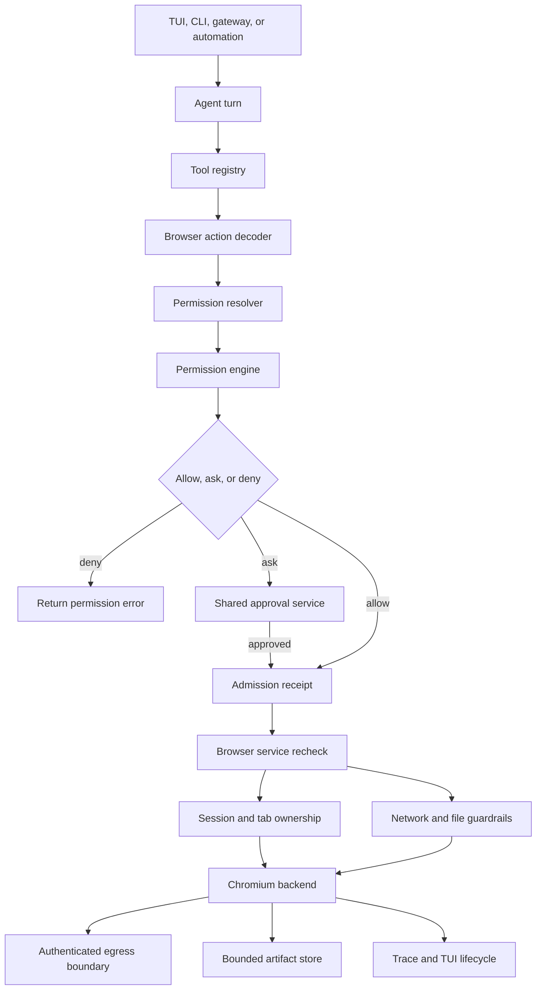
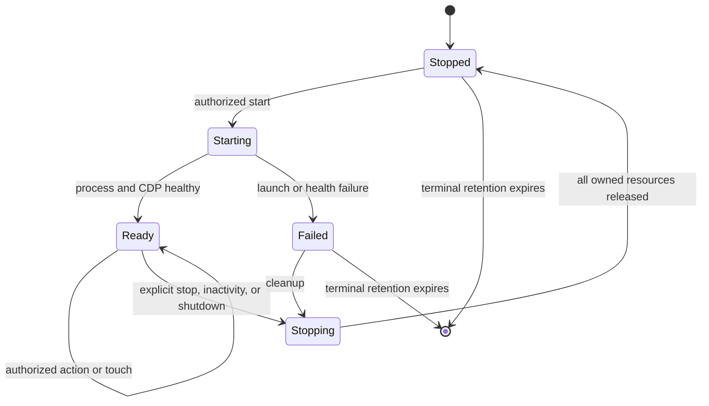
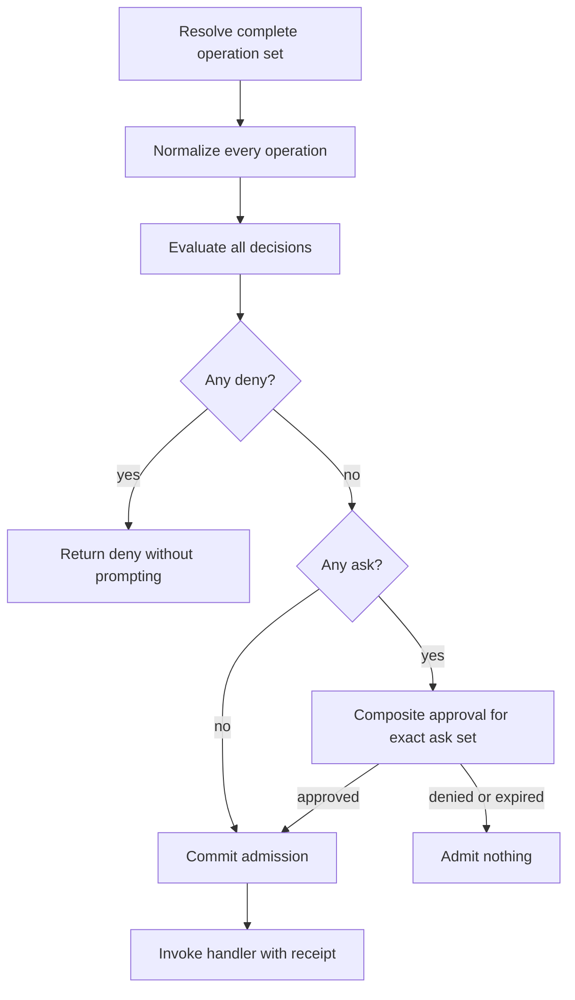
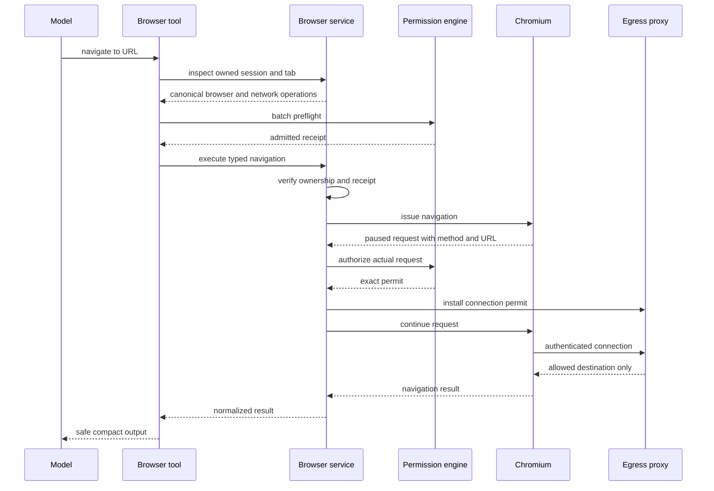

# Morph Browser Automation Study Guide

## 1. Why this document exists

This guide explains the secure browser automation system described by Morph's browser automation plan. It is written
for someone who wants to understand both the product capability and the engineering boundaries that make it safe.

The main questions are:

- Why does Morph need a managed browser instead of more HTTP tools?
- Who owns a browser session, tab, action, and artifact?
- Why is the browser a daemon-owned service?
- How does one model-visible `browser` tool represent many strongly typed actions?
- Which permission operations does each browser action produce?
- How are navigation, redirects, subresources, and WebSockets contained?
- How are stale element references prevented from acting on the wrong page?
- How do uploads, downloads, screenshots, and PDFs remain inside safe boundaries?
- Why is controlling a signed-in personal browser more sensitive than using an isolated browser?
- What must be tested before browser automation can be trusted?

This is a study guide rather than only a configuration reference. It builds a mental model, follows important flows,
explains design decisions, and points to the code and plan sections responsible for each concern.

## 2. The shortest useful mental model

Morph browser automation is a managed, permission-aware Chromium runtime.

Every browser call can be reduced to this sentence:

> Actor **A**, through surface **S**, wants browser session **B** to perform action **X** against target **T**, causing
> effects **E**, while Morph preserves ownership, network, file, artifact, and secret boundaries.

For example:

> Automation job `auto_news`, through the automation surface, wants its isolated browser session to navigate with GET
> to `https://techcrunch.com/`, causing read, network, and external-system effects.

That single intent may resolve into multiple permission operations:

```text
browser + update
network + read
```

Every operation must pass before the browser action is admitted.

The most important rule is:

> The model proposes intent. Morph derives authoritative targets, authorizes the complete operation set, rechecks
> server-owned state, and only then performs the side effect.

## 3. Why web extraction is not enough

`web_search` and `web_extract` are request-oriented retrieval tools. They are useful for stateless research but do not
provide an interactive browser session.

A managed browser adds stateful capabilities:

- cookies and session state;
- tabs and navigation history;
- client-rendered applications;
- accessibility-tree inspection;
- clicking, typing, selecting, scrolling, and keyboard input;
- authenticated dashboards when explicitly configured;
- screenshots, PDFs, downloads, uploads, dialogs, and console output;
- durable browser state through opt-in managed profiles.

These capabilities also add risk. Chromium is a large subprocess that can reach networks, handle credentials, read
files, write artifacts, and affect external systems. Browser automation therefore cannot be treated as a thin wrapper
around arbitrary CDP commands.

## 4. The architecture at a glance



There are several distinct decisions in this flow:

1. **Capability eligibility:** should the model see the browser tool?
2. **Input validity:** does the selected action have the correct request shape?
3. **Permission authorization:** may this actor perform every resolved operation?
4. **Domain ownership:** does the actor own the referenced browser state?
5. **Containment:** can the browser reach only the authorized network and file boundaries?
6. **Execution:** can the backend perform the action within its deadline?
7. **Presentation:** can the result be shown without exposing secrets or internal paths?

Passing one decision does not imply passing the others.

## 5. Core source map

### 5.1 Code-backed foundation

| Concern | Primary source |
|---|---|
| Browser domain types and backend contracts | `internal/browser/types.go` |
| Daemon-owned lifecycle and ownership | `internal/browser/service.go` |
| Network target validation and resolved-address policy | `internal/browser/policy.go` |
| Authenticated managed-browser egress proxy | `internal/browser/proxy.go` and `internal/browser/local_auth.go` |
| Pinned remote CDP relay and discovery rewriting | `internal/browser/remote_cdp_relay.go` |
| Chromium launch and CDP health | `internal/browser/chromedp_backend.go` |
| Chromium executable discovery | `internal/browser/executable.go` |
| Persistent-profile locking | `internal/browser/profile_lock.go` |
| Unix and Windows process cleanup | `internal/browser/process_unix.go` and `internal/browser/process_windows.go` |
| Browser configuration | `internal/config/browser.go` |
| Browser configuration validation | `internal/config/browser_validation.go` |
| Browser permission-operation builder | `internal/permissions/extensions.go` |
| Structured network targets and selectors | `internal/permissions/network.go` |
| Daemon lifecycle wiring | `internal/cli/daemon/rpc.go` |

### 5.2 Design source

The complete architecture, requirements, delivery phases, implementation units, acceptance examples, and risks live
in `.plan/browser-automation.md`.

## 6. Vocabulary in plain language

### 6.1 Browser profile

A browser profile describes how Morph obtains and isolates browser state.

| Profile mode | Meaning |
|---|---|
| `managed_ephemeral` | Morph launches Chromium with temporary isolated state and deletes it after cleanup |
| `managed_persistent` | Morph launches Chromium with isolated state retained beneath a Morph-owned root |
| `remote_cdp` | Morph attaches to an explicitly configured remote Chrome DevTools Protocol endpoint |
| `existing_session` | Morph attaches to an explicitly selected signed-in browser context under stronger controls |

The default is an isolated ephemeral profile. Morph must never silently choose a personal browser profile.

Attached profiles declare one structural scope:

- `targets` limits control to explicit CDP target IDs and cannot create tabs;
- `context` limits control to one browser context;
- `browser` deliberately grants whole-browser visibility and displays a stronger warning.

An `existing_session` profile cannot be the default. It must be selected explicitly.

Both attached modes require `acknowledgeUnmanagedEgress: true`. The setting confirms that the operator understands the
attached browser is outside Morph's managed egress proxy. It is not an authorization rule or approval grant.

### 6.2 Browser session

A browser session is Morph's managed lifetime around a browser backend.

It includes:

- a generated session ID;
- profile name and profile mode;
- current lifecycle state;
- actor, Morph profile, and Morph session ownership;
- creation and last-active timestamps;
- backend, proxy, relay, profile lease, and data-directory resources;
- terminal error information when startup or cleanup fails.

A browser session can outlive one agent run. Run ID remains attribution and authorization provenance, while actor,
profile, and Morph session form the lifetime ownership boundary.

### 6.3 Tab

A tab is an owned browser target inside a session.

The design tracks:

- tab ID;
- owning browser session;
- current URL and title;
- current snapshot generation;
- server-side element-reference mappings;
- active action and authorization generation.

Tabs must not cross actor, profile, or Morph-session boundaries.

### 6.4 Action

The `browser` tool uses an action discriminator. Actions include:

- lifecycle: `status`, `start`, `stop`, `profiles`;
- tabs: `tabs`, `open`, `focus`, `close`;
- navigation: `navigate`, `reload`, `back`, `forward`;
- observation: `snapshot`, `screenshot`, `pdf`, `console`;
- interaction: `click`, `type`, `press`, `scroll`, `select`, `wait`;
- files and browser effects: `upload`, `download`, `accept_dialog`, `dismiss_dialog`.

One tool name keeps the model tool surface compact. Strong action-specific request types keep the implementation from
becoming an untyped bag of optional fields.

### 6.5 Accessibility snapshot

An accessibility snapshot is a compact semantic view of the page.

Instead of returning raw HTML, it emphasizes useful properties such as:

- role;
- accessible name;
- value and state;
- enabled or disabled status;
- actionable relationships;
- short element references.

This is usually smaller and more reliable for text models than a screenshot.

### 6.6 Element reference

An element reference is a short model-visible handle backed by a server-side mapping.

It is scoped to:

- browser session;
- tab;
- snapshot generation;
- the server-observed node.

Navigation or a DOM-changing action invalidates old references. Morph rejects a stale reference instead of guessing
which new element the model intended.

### 6.7 Artifact

An artifact is bounded binary or file output produced by browser work.

Examples include:

- screenshot;
- PDF;
- download;
- other bounded binary evidence.

The model receives safe metadata and a temporary artifact handle rather than raw bytes or an unrestricted local path.
The handle remains bound to the artifact owner and retention window.

There are three authorized presentation paths:

- The TUI can retrieve an image on demand, open a private temporary copy, or save it to a selected destination.
- The CLI can stream an owned artifact with `morph browser artifact get <handle> --output <path>`.
- The model can call `export_artifact` with a handle and destination path.

All three paths reuse the browser artifact-read check. Saving also resolves and authorizes an exact file-create
operation. Existing destination files are never replaced, and backing `.bin` paths remain private implementation
details.

Export prefers an atomic hard-link publish and falls back to exclusive creation only when the operating system reports
that hard links are unambiguously unsupported. Some Linux filesystems report `EPERM` for both unsupported hard links
and real permission failures. Morph deliberately fails closed there instead of treating a permission denial as safe
fallback permission; exporting to those mounts may require choosing a different destination and copying the saved file
with an operator-controlled command.

### 6.8 Admission receipt

An admission receipt is short-lived authorization evidence for one complete operation set.

It is bound to details such as:

- canonical operation-set digest;
- actor and parent provenance;
- profile, surface, Morph session, and run;
- authorization scope;
- effective preset and policy revision;
- nonce and expiry.

The browser service recomputes authoritative operations and accepts the receipt only if the relevant state still
matches.

## 7. Configuration mental model

Browser configuration separates capability, runtime, storage, and network posture.

```yaml
browser:
  enabled: true
  executable: ""
  defaultProfile: default
  profileRoot: ""
  temporaryRoot: ""
  startTimeout: 15s
  inactivityTimeout: 10m
  cleanupInterval: 1m
  terminalRetention: 15m
  profiles:
    - name: default
      mode: managed_ephemeral
  network:
    strict: true
    developmentAllowedHosts: []
    developmentAllowedCIDRs: []
  artifacts:
    root: ""
    maxBytes: 26214400
    maxTotalBytes: 262144000
    retention: 24h
```

The important separation is:

- `browser.enabled` determines whether the service is available.
- the Browser capability determines whether the tool is eligible for a surface;
- permission preset and rules determine whether an exact operation is authorized;
- network and file containment determine whether Chromium can carry it out safely.

Enabling the browser does not grant permission to use it.

## 8. Why managed roots are validated so strictly

Chromium profile data can contain cookies, local storage, credentials, browsing history, and extension state.

Morph therefore validates its managed roots before launch:

1. Roots must be absolute.
2. Profile, temporary, and artifact roots must not overlap.
3. Paths are canonicalized through existing ancestors.
4. Persistent profile paths must remain beneath the managed profile root.
5. Symlink and junction traversal is rejected.
6. Managed profiles must not overlap each other.
7. Known Chrome, Chromium, and Edge personal-data roots are rejected.
8. A persistent profile must hold an exclusive process lock while active.

This prevents a configuration mistake from turning a managed profile into silent control of the user's ordinary
browser data.

## 9. Session lifecycle



### 9.1 Start

Starting a managed session performs these broad steps:

1. Read and normalize the authorization owner from context.
2. Select the configured browser profile.
3. Resolve and check the `browser + start` operation.
4. Create a `starting` session record.
5. Discover Chromium or validate the remote endpoint.
6. Prepare an isolated directory or acquire a persistent-profile lease.
7. Start an authenticated egress proxy or remote CDP relay.
8. Start the backend with a bounded timeout.
9. Verify CDP health.
10. transition the session to `ready`.

Any failure triggers idempotent cleanup and leaves a terminal `failed` record for bounded diagnostic retention.

### 9.2 Touch and inactivity

An authorized action updates `LastActive`. The cleanup loop stops ready sessions that exceed the inactivity timeout.

This prevents abandoned Chromium processes from living indefinitely.

### 9.3 Stop

Stopping a session is owner-sensitive and destructive to runtime state.

Cleanup closes:

- backend connection and process;
- egress proxy;
- remote relay;
- persistent-profile lease;
- ephemeral profile directory.

Cleanup is guarded by `sync.Once`, so races among failure, stop, cancellation, inactivity, and daemon shutdown cannot
release the same resource twice.

### 9.4 Terminal retention

Stopped and failed sessions remain visible briefly for status and diagnostics. The cleanup loop then removes terminal
entries after `terminalRetention` so a long-lived daemon cannot accumulate unbounded session history.

## 10. Ownership model

Browser state is more durable than one tool call, so ownership needs two timescales.

### Lifetime ownership

Lifetime ownership uses:

- actor kind and actor ID;
- Morph profile;
- Morph session ID.

This allows a later turn in the same Morph session to continue or stop its browser.

### Request attribution

Each action also records:

- run ID;
- surface and surface kind;
- permission scope;
- parent provenance where applicable;
- policy revision and authorization generation.

Run ID does not own the whole browser lifetime. It identifies the request that performed an action.

### Why both are needed

If Run ID owned the session, every new turn would orphan the browser started by the previous turn. If Run ID were
ignored everywhere, a stale authorization result could be replayed by a different action. Lifetime ownership and
request-scoped authorization solve different problems.

## 11. The backend seam

Morph keeps `chromedp` and CDP details behind a narrow backend contract.

The service deals in Morph concepts:

- profile;
- session;
- tab;
- snapshot;
- action;
- artifact;
- health and cleanup.

The backend deals in browser transport details:

- Chromium process launch;
- CDP allocation and connection;
- browser and target commands;
- process-group supervision;
- platform-specific termination.

This separation keeps policy and ownership logic independent from driver details and makes deterministic test doubles
possible.

## 12. Managed Chromium isolation

Managed Chromium starts with controls that reduce ambient behavior and bypass paths:

- a Morph-owned data directory;
- no first-run or default-browser flow;
- background networking disabled;
- component updates and sync disabled;
- QUIC disabled;
- non-proxied WebRTC UDP disabled;
- remote debugging bound to loopback;
- proxy bypass disabled, including Chromium's normal loopback exception;
- an authenticated per-session egress proxy.

These flags are defense in depth. QUIC and non-proxied WebRTC UDP remain disabled so traffic cannot bypass the TCP
proxy. Browser permission prompts remain denied by default. The egress proxy and its permission-bound permit ledger,
not a Chromium flag, are the authority for upstream connections.

## 13. Why CDP observation alone is not an egress boundary

CDP can observe and pause many browser requests, which is useful for classifying method, URL, request type, frame,
and initiator.

CDP alone is not sufficient containment because browser traffic can originate from:

- redirects;
- subresources;
- workers and service workers;
- WebSockets;
- speculative connections;
- preconnect behavior;
- downloads;
- browser internals;
- transport behavior outside an individual page command.

The design therefore combines:

1. CDP interception for attribution and exact request authorization.
2. An authenticated proxy or equivalent OS boundary for connection enforcement.
3. Chromium flags that remove direct and bypass transports.

## 14. Authenticated egress proxy

Each managed session receives a fresh random proxy credential.

The proxy:

- listens only on loopback;
- requires `Proxy-Authorization`;
- requires a current action-scoped transport permit before opening an upstream connection;
- consumes the resolved address set already validated during permit preparation;
- rejects missing, mismatched, expired, exhausted, revoked, or over-concurrent permits;
- dials only the pinned validated IP addresses;
- strips proxy credentials and hop-by-hop headers before forwarding;
- supports ordinary HTTP and CONNECT tunnels;
- tracks open connections for shutdown;
- closes permit-owned connections when authority ends or policy changes;
- closes all remaining tunnels when session cleanup runs.

Chromium does not accept credentials embedded in `--proxy-server`. Morph responds only to CDP events whose
authentication source is the proxy. Origin-server authentication challenges are cancelled, preventing the proxy
secret from being sent to a website.

The effective proxy policy is snapshotted when a serialized action begins. A policy change invalidates the runtime's
permit generations and closes their connections. A session does not permanently inherit the permission posture of the
call that started it.

Plain HTTP permits carry exact method, host, port, path, query identity, pinned addresses, expiry, and a non-returnable
request count. HTTPS CONNECT permits carry origin, pinned addresses, expiry, a bounded dial count, and bounded
concurrency. The proxy does not claim to see an encrypted HTTPS path or distinguish HTTPS from WSS after CONNECT.

A browser-internal CONNECT that has no logical-request permit is classified as `background`. It is denied unless a
live action exists and a direct configured rule explicitly allows `network + connect` for that background host and
port. The rule must specify method `CONNECT` and request class `background`; broad defaults, preset rules, and
`full_access` without that exact configured rule is insufficient. Background evaluation does not prompt.

## 15. Pinned remote CDP relay

A remote CDP endpoint creates a separate network boundary.

The relay:

1. validates the configured endpoint;
2. resolves it under browser network policy;
3. pins the validated addresses;
4. listens on an authenticated local endpoint;
5. forwards discovery and WebSocket traffic only to the pinned origin;
6. rejects redirects;
7. rewrites discovery WebSocket URLs back through the relay;
8. removes `devtoolsFrontendUrl` values that could lead clients outside the relay;
9. handles both discovery objects and target arrays;
10. rejects malformed or unknown discovery payload shapes;
11. strips the local relay credential before forwarding upstream;
12. resolves optional upstream Basic/Bearer credentials from an `env:` reference;
13. forwards the upstream credential without exposing it in the local relay URL or discovery response.

The relay rechecks the current strict network posture on each request. Its resolved upstream addresses and credential
identity are fixed when the attached session starts. After changing endpoint policy or rotating credentials, stop the
attached session and start it again so address pinning, identity, and approval are recomputed together.

Without rewriting `/json/version`, `/json/list`, and related discovery results, a client could follow a direct remote
WebSocket URL and bypass the pinned relay.

## 16. Browser permission integration

The Browser capability decides whether the tool is eligible. The permission system decides whether an eligible call
may execute.

The browser uses Morph's existing vocabulary:

- resources: `browser`, `network`, `file`;
- actions: `read`, `list`, `start`, `stop`, `connect`, `create`, `update`, `delete`;
- effects: `read`, `write`, `execution`, `network`, `external_system`, `destructive`, `credential_bearing`;
- target scope: `workspace` or `external` for files;
- owner requirements for sensitive lifecycle and file operations.

Browser code must not create a separate policy language.

## 17. Action-to-operation mapping

| Browser intent | Core operation | Important effects | Additional operation |
|---|---|---|---|
| Status, snapshot, console, wait | `browser + read` | `read` | None |
| Profiles and tabs | `browser + list` | `read` | None |
| Focus or scroll | `browser + update` | `write` | None |
| Start managed Chromium | `browser + start` | `execution` | Owner-required |
| Stop session | `browser + stop` | `write`, `execution`, `destructive` | Owner-required |
| Close tab | `browser + delete` | `write`, `destructive` | Owner-required |
| Open or navigate | `browser + update` | `read`, `write`, `network`, `external_system` | `network + read` |
| Click, type, press, select, dialog response | `browser + update` | `write`, `network`, `external_system` | Actual network operation when one occurs |
| Screenshot or PDF | `browser + create` | `read`, `write` | Internal artifact creation |
| Export artifact | `browser + read`, `file + create` | Inherited artifact effects plus `write` | Exact artifact handle and canonical destination |
| Download | `browser + create` | `read`, `write` | `network + create` |
| Upload | `browser + update` | `read`, `write`, `external_system` | `file + read` |
| Remote or personal attach | `browser + connect` | `network`, `credential_bearing`, `external_system` | `network + connect` and owner requirement |

The exact mapping is action-sensitive because approval fingerprints and policy rules depend on it. Changing an action,
effect, or target changes what the user is authorizing.

## 18. Structured network targets

Browser URLs are not authorized with raw string prefixes.

A canonical network target includes:

- scheme;
- normalized IDNA hostname;
- effective port;
- normalized path;
- query hash;
- HTTP method;
- request class.

A policy selector can constrain:

```yaml
network:
  - scheme: https
    host: techcrunch.com
    port: 443
    pathPrefix: /
    method: GET
    requestClass: navigation
```

Structured matching prevents mistakes such as:

- `example.com.attacker.test` matching `example.com`;
- `/admin-old` matching `/admin` as an accidental string prefix;
- default-port ambiguity;
- trailing-dot hostname confusion;
- IDN confusion;
- encoded path-separator confusion;
- GET authorization silently covering POST;
- navigation authorization silently covering a WebSocket.

The query is hashed into permission identity so approval can remain exact without exposing query contents.

## 19. Multi-operation authorization

One browser action can cross several resources.

Example upload and submit:

```text
browser + update
file + read
network + update
```

The registry must preflight the complete normalized set.



Important properties:

- a terminal deny is reported before any prompt;
- no subset executes;
- one composite approval represents the exact ask set;
- a once grant is consumed only when the complete batch commits;
- changed targets or effects require new authorization.

## 20. Domain recheck and authoritative state

Tool input is a proposal, not authoritative state.

Before a consequential action, the browser service derives facts from its own state:

- actual owning session and tab;
- current tab URL;
- current snapshot generation;
- element mapped by a reference;
- destination observed after click or redirect;
- actual HTTP method;
- resolved upload path and file identity;
- final download response;
- artifact owner and sensitivity;
- current profile identity and CDP endpoint.

The service recomputes the required operation set and compares it with the admission receipt. If relevant state has
changed, Morph authorizes the new operation set rather than stretching the old decision.

## 21. Presets and browser behavior

Browser operations use the normal permission preset model.

### `ask`

Local CLI and TUI owner calls can pause for shared approval when policy evaluates to `ask`. Unattended surfaces return
`approval_required` without waiting indefinitely.

### `approve`

The preset allows ordinary work while retaining approval for sensitive effect categories. Configured rules can narrow
or enhance the baseline.

### `custom`

Configured rules and defaults directly define authorization.

### `full_access`

`full_access` bypasses ordinary permission hard-deny and approval decisions within the caller's authorization scope.

It does not disable:

- structural input validation;
- secret redaction;
- actor, profile, session, tab, and artifact ownership;
- process isolation;
- managed-root containment;
- artifact size and retention limits;
- cleanup guarantees.

Full access means broad machine authority, not absence of engineering correctness.

## 22. Accessibility-first observation

The primary observation format is a compact accessibility tree.

Why accessibility first:

- it provides semantic roles and names;
- it is compact enough for text models;
- it works without image understanding;
- it supports deterministic element references;
- it avoids sending full HTML and scripts into context;
- it aligns interaction with controls a human can identify.

Screenshots supplement snapshots when layout or visual evidence matters. They do not replace semantic targeting for
ordinary interaction.

## 23. Generation-scoped references

Suppose snapshot generation 7 assigns:

```text
[b12] button "Save"
```

After navigation or a DOM-changing action, the tab advances to generation 8. Reference `b12` is rejected.

This avoids a dangerous failure mode:

1. The model sees a harmless button.
2. The page changes.
3. The old node ID now points at a different control.
4. A heuristic click acts on the wrong element.

Morph chooses a clear stale-reference error instead of heuristic retargeting.

## 24. Closed action-discriminated tool schema

The model sees one `browser` tool, but the schema behaves like a union of dedicated request types.

Conceptually:

```text
BrowserRequest =
    StartRequest
  | NavigateRequest
  | SnapshotRequest
  | ClickRequest
  | TypeRequest
  | ScreenshotRequest
  | ...
```

The shared envelope contains only fields genuinely shared by actions, such as action identity and ownership handles.

Each action branch defines:

- required fields;
- allowed optional fields;
- size and duration bounds;
- decoder;
- permission resolver;
- executor;
- result normalizer;
- safe presentation label.

Unknown fields and fields belonging to another action are rejected before permission evaluation or backend work.

Parity tests ensure every declared action has exactly one complete internal route.

## 25. Navigation flow



Redirects repeat target validation. A redirect to a private or otherwise blocked destination never inherits authority
from the original public URL.

## 26. Safe and unsafe HTTP methods

Request method changes permission meaning.

Typical safe retrieval methods:

- GET;
- HEAD.

Methods that can mutate an external system include:

- POST;
- PUT;
- PATCH;
- DELETE.

A form submission is not merely a click. The paused outgoing request is classified as an external write and receives
the corresponding network action and effects.

If the form or profile carries credentials, the operation also receives `credential_bearing` without recording the
secret value.

## 27. WebSockets

A WebSocket begins with a network connection and then permits ongoing bidirectional writes.

Ordinary navigation approval must not silently authorize an indefinite WebSocket. CDP retains the exact logical `ws`
or `wss` target for permission matching. Managed Chromium routes both schemes through CONNECT, so the proxy permit is
origin-level and cannot claim to see the handshake path inside that tunnel.

The logical decision and its physical transport permit are jointly bound to:

- session;
- exact logical origin and path;
- physical origin and pinned resolved destination;
- authorization generation;
- lifetime and cancellation.

When the permit ends, its connection closes. Morph consumes `wandxy/chromedp v0.16.0-morph.5`, based on upstream
`chromedp v0.16.0`. The fork lets Morph atomically adopt or reuse a flattened target session that Morph already
attached and paused. It contains no Morph policy, permission, ownership, or proxy logic.

Managed Chromium recursively supervises pages, iframes, dedicated workers, shared workers, and service workers.
WebSocket creation is observed through CDP and resolved as an exact logical connection operation. Chromium routes both
`ws` and `wss` through opaque proxy CONNECT tunnels, so the proxy sees only the physical origin. A pending-authority
bridge makes the proxy wait for the logical WebSocket decision before it opens that tunnel. Denial, cancellation, or
generation revocation is terminal and cannot fall back to a broader background rule.

Morph does not replace the page's WebSocket or worker APIs. A deterministic Chromium corpus proves those native
features remain available, while denied effects open no upstream connection. Shared or service-worker traffic with no
provable singular active owner remains unattributed and needs an exact configured background rule during a live
generation. It does not inherit an unrelated tab's permission.

## 28. Asynchronous browser effects

Browser pages can trigger effects that were not explicit in the model call:

- popup or new target;
- download;
- file chooser;
- dialog;
- browser permission request;
- navigation from script;
- background connection.

These effects begin denied, paused, or quarantined. An authorized action must explicitly arm the expected effect and
bind it to the current owner and action generation.

This prevents a click intended to expand a menu from silently opening a download, popup, or permission prompt.
In an attached session, a page target that was not created through Morph's authorized tab-opening path remains
quarantined for that session. Destroying the target removes its quarantine record, but it never becomes an owned tab.

## 29. Upload safety

Passing a user-controlled source path directly to Chromium creates a time-of-check to time-of-use race.

The secure upload flow is:

1. Resolve an exact file operation with canonical target and target scope.
2. Authorize the read.
3. Open the source beneath a trusted root without following links.
4. Verify regular-file type, size, and platform file identity.
5. Hold the opened source while copying.
6. Copy bytes into an immutable run-owned staging file.
7. Bind digest, size, owner, and lifetime to the action.
8. Give Chromium only the staging path.
9. Remove the staging file after completion, cancellation, or expiry.

Replacing the original path after approval cannot change the bytes Chromium receives.

## 30. Downloads and artifacts

Downloads, screenshots, and PDFs remain inside a profile-owned artifact store.

Each artifact carries immutable labels:

- source profile and profile mode;
- originating target;
- owner;
- originating effects;
- sensitivity, including `credential_bearing` where applicable;
- size, MIME type, creation, and expiry;
- safe handle.

Retrieval and export cannot lower these labels. A screenshot from a signed-in profile does not become an ordinary
low-risk file merely because it is now stored locally.

Capture and export are separate operations. Capture writes only to Morph's bounded private store and returns a handle.
Retrieval or export later rechecks the artifact owner, expiry, effects, and sensitivity. Export also checks the
canonical destination and creates it with private permissions. It uses a temporary file and no-replace publication so
failure does not leave a partial destination and an existing file is not silently overwritten.

The TUI does not fetch artifact bytes merely to render the transcript. **Open** and **Save As** fetch on demand through
the authenticated BrowserService. Opened copies live in private temporary directories and are reused until expiry,
then removed on expiry, session change, or TUI exit, including signal-driven Bubble Tea shutdown. The server's
single-artifact size limit bounds each copy, and the TUI keeps at most one cached copy per artifact handle. Saved copies
belong to the user and are not removed by artifact retention cleanup.

The CLI equivalent is:

```bash
morph browser artifact get artifact_abc123 \
  --owner-session default \
  --output ~/Desktop/screenshot.png
```

The model-facing equivalent is the `export_artifact` browser action. Its result reports `saved_to`, allowing the model
to state the usable destination without learning Morph's backing artifact path.

Quotas apply at multiple levels:

- maximum single artifact size;
- total artifact storage;
- profile, session, and run ownership;
- retention;
- active-run preservation during cleanup.

## 31. Personal browser attachment

An existing signed-in browser may expose email, financial data, cloud dashboards, saved sessions, and other private
state.

The attachment operation is therefore:

- explicitly configured;
- owner-required;
- represented as `browser + connect`;
- marked `network`, `credential_bearing`, and `external_system`;
- approved through Morph's shared request and grant lifecycle when applicable;
- fingerprinted by profile mode, data identity, CDP origin, attachment scope, and private credential digest;
- constrained to an operator-selected context or target set.

Connection approval authorizes connection establishment only. Every later browser action receives its own current
permission decision.

Changing endpoint, credentials, profile identity, or attachment scope changes the fingerprint and prevents stale grant
reuse.

The keyed identity uses a domain-separated HMAC subkey derived from the profile-scoped owner credential. Credential
rotation therefore invalidates old attachment fingerprints without placing secret material in approval text or traces.
Stop attached sessions before rotating the credential, restart the daemon, and start the sessions again so the relay,
credential identity, and approval all use the new key.

Target-scoped attachments cannot create tabs. Context-scoped attachments filter every discovered or addressed target
by its server-reported browser context. Whole-browser scope is accepted only when named explicitly and is visible in
status output.

Remote browser page traffic does not inherit the managed Chromium proxy boundary. Morph therefore rejects
network-bearing actions on attached profiles unless `full_access` is active.

Every `remote_cdp` and `existing_session` profile must also set `acknowledgeUnmanagedEgress: true`. Status, start, CLI,
RPC, and approval output repeat that attached browsers are outside the managed egress proxy. The acknowledgement does
not authorize the connection and does not make attached page traffic permit-bound.

## 32. Secret handling

Sensitive values include:

- CDP credentials;
- local proxy and relay credentials;
- signed URL queries;
- cookies;
- authorization headers;
- form values;
- password-field input;
- personal-browser data-directory identity.

The design separates private identity from safe presentation.

Private fingerprint material may contain keyed digests. User-visible output receives redacted origin, profile, and
action labels.

Secrets must not appear in:

- model-visible errors;
- traces;
- normal logs;
- CLI status;
- doctor output;
- TUI transcript;
- RPC error messages.

## 33. Operator surfaces

### CLI and RPC

Operator controls expose:

- effective profiles;
- service status;
- active sessions;
- start and stop;
- actionable readiness failures;
- artifact access where authorized.

Page interaction remains in the model-facing tool rather than becoming a broad general RPC action surface.

### Local-owner authentication

Loopback and client-supplied `cli`, `tui`, or preset metadata are context, not proof of ownership.

Owner-sensitive RPC uses daemon-issued or operating-system-backed proof. An untrusted same-host client cannot claim
`local_owner` merely by copying metadata.

### TUI

The transcript presents action-specific states:

- pending;
- approval required;
- completed;
- failed;
- interrupted;
- artifact available.

Presentation uses safe labels rather than raw CDP URLs, signed queries, form values, or internal paths.

## 34. Delivery phases

| Phase | Main outcome |
|---|---|
| 1 | Contracts, configuration, permission mapping, strict roots, authenticated egress, Chromium lifecycle, cleanup |
| 2 | Tabs, accessibility snapshots, references, navigation, interaction, tool registration, batch authorization |
| 3 | Screenshots, PDFs, console, dialogs, uploads, downloads, artifact storage and presentation |
| 4 | Browser RPC and CLI, doctor checks, TUI states, reload, concurrency, multi-surface hardening |
| 5 | Remote CDP and signed-in existing-session attachment with stronger identity and approval controls |

The phases build security boundaries before exposing broader capability. Each phase relies on the invariants already
established rather than bypassing them.

## 35. Worked examples

### Example A: local owner opens a public page

1. Browser capability makes the tool eligible.
2. The action decodes as `open` with a structured HTTPS navigation target.
3. The resolver emits `browser + update` and `network + read`.
4. Policy allows or asks according to the effective preset and rules.
5. The service verifies the owned session.
6. Chromium sends the request through the authenticated proxy.
7. Morph resolves and validates the destination once, pins the accepted addresses, and installs a bounded permit.
8. The proxy consumes the matching permit and dials only a pinned address.
9. The permit and connection are revoked when the action ends.
10. The tab advances its generation after navigation.

### Example B: redirect to a metadata address

1. The original public URL is allowed.
2. The server redirects to a cloud metadata IP.
3. Morph resolves a new network target for the redirect.
4. Strict guardrails reject the blocked destination.
5. The proxy never opens the metadata connection.
6. The browser action returns a redacted policy error.

### Example C: stale click reference

1. Snapshot generation 4 returns button reference `b8`.
2. The page navigates and advances to generation 5.
3. The model asks to click `b8`.
4. Server-side reference resolution detects the generation mismatch.
5. No permission check or backend click is attempted against a guessed element.

### Example D: automation under `ask`

1. An automation action resolves to a network operation that evaluates to `ask`.
2. Automation is unattended and cannot wait for local keyboard input.
3. Morph returns `approval_required` for that request.
4. No browser request is left paused indefinitely.

### Example E: customized `approve` preset

Configuration adds a narrow rule for one automation job, tool, action, and structured network selector.

The matching job can navigate to the exact HTTPS host, port, path, method, and request class. A different job, sibling
hostname, unsafe method, or path outside the segment prefix remains denied.

### Example F: upload source replacement

1. The owner approves upload of `workspace/report.csv`.
2. Morph opens and verifies the source.
3. Morph copies approved bytes into run-owned staging.
4. Another process replaces `workspace/report.csv`.
5. Chromium still receives only the staged approved bytes.

### Example G: personal browser screenshot

1. The owner explicitly attaches to an approved signed-in context.
2. Screenshot authorization includes `credential_bearing`.
3. The screenshot is stored as a bounded artifact with inherited sensitivity.
4. TUI rendering and export recheck artifact ownership and preserve the sensitivity label.

### Example H: full access

1. Browser capability is enabled and the effective preset is `full_access`.
2. Permission hard-deny and approval checks are bypassed within authorization scope.
3. The session still uses isolated process ownership and bounded storage.
4. Structural validation, redaction, ownership, cleanup, and artifact quotas still apply.

## 36. Verification invariants

### Invariant 1: no side effect before complete authorization

Malformed, denied, unresolved, or partially approved operation sets never reach the handler.

### Invariant 2: one call cannot partially commit

If any operation in a browser, network, and file batch fails, none of the call executes.

### Invariant 3: server state is authoritative

Model-supplied URL, tab, element, file, effect, or profile labels cannot override current server-owned state.

### Invariant 4: browser lifetime does not erase ownership

Later runs in the same actor, profile, and Morph session can continue the browser. Other owners cannot.

### Invariant 5: stale references never retarget

A reference from another session, tab, or generation fails before interaction.

### Invariant 6: Chromium has no unauthenticated open proxy

Every local egress and CDP relay channel has a per-session credential that is removed before upstream forwarding.

### Invariant 7: DNS validation and dialing agree

The proxy or relay dials only addresses validated for that exact target, preventing a second uncontrolled resolution.

### Invariant 7a: proxy authentication is not network authority

An authenticated managed-browser proxy request without a matching live transport permit is denied before any upstream
socket is opened.

### Invariant 8: redirects receive new decisions

Authority for one origin does not automatically cover a redirected origin.

### Invariant 9: unattended ask never waits forever

Gateway and automation calls return a stable approval-required outcome rather than entering an interactive wait.

### Invariant 10: credentials never become presentation data

Proxy, relay, CDP, cookie, form, and authorization secrets stay out of model output, traces, diagnostics, and logs.

### Invariant 11: cleanup is idempotent and complete

Cancellation, failed start, inactivity, stop, and daemon shutdown leave no managed process, connection, lock, or
ephemeral directory.

### Invariant 12: terminal history is bounded

Stopped and failed sessions remain briefly useful for diagnostics, then are pruned.

### Invariant 13: artifact sensitivity cannot decrease

Retrieval, rendering, and export preserve or strengthen the originating effects and sensitivity.

### Invariant 14: personal attachment is explicit and scoped

Morph never silently attaches to a user's ordinary browser or expands approved attachment scope.

## 37. Test map

| Concern | Important tests |
|---|---|
| Browser contracts and errors | `internal/browser/types_test.go` |
| Config defaults, normalization, roots, aliases, and profile modes | `internal/config/browser_test.go` and `browser_validation_test.go` |
| Network normalization and blocked addresses | `internal/browser/policy_test.go` |
| Authenticated proxy forwarding, CONNECT buffering, policy changes, cleanup | `internal/browser/proxy_test.go` |
| Real Chromium proxy routing and strict no-bypass behavior | `internal/browser/chromedp_backend_test.go` |
| Forked flattened-session adoption and clean detachment | `TestChromedpFork_AdoptsPausedWorkerTargetSession` |
| CDP address pinning, authentication, object and array rewriting, fail-closed payloads | `internal/browser/remote_cdp_relay_test.go` |
| Session ownership, lifecycle failures, inactivity, retention, and domain authorization | `internal/browser/service_test.go` |
| Browser action-to-operation mapping | `internal/permissions/extensions_test.go` |
| Structured network selector matching and fingerprinting | `internal/permissions/network_test.go` |
| Daemon construction and shutdown | `internal/cli/daemon/daemon_test.go` |

Browser action tests use a deterministic local HTTP fixture rather than public websites.

## 38. How to add a browser action safely

### Step 1: define the typed request

Specify required fields, allowed optional fields, bounds, and invalid combinations.

### Step 2: classify permission operations

Identify browser, network, and file resources; semantic actions; effects; canonical targets; target scopes; and owner
requirements.

### Step 3: add the action catalog entry

Bind the action to exactly one decoder, permission resolver, executor adapter, result normalizer, and presentation
label.

### Step 4: resolve without side effects

Permission resolution may inspect owned state but must not launch, navigate, click, type, write, or connect.

### Step 5: recheck at the service boundary

Use current tab, element, URL, method, file, profile, and ownership state immediately before the consequential action.

### Step 6: arm asynchronous effects explicitly

If the action may open a target, navigate, download, upload, show a dialog, or request browser permission, bind that
effect to the active owner and action generation.

### Step 7: add adversarial tests

Test stale references, changed targets, permission denial, cancellation, timeout, unexpected browser effects, secret
redaction, and zero backend calls before admission.

## 39. Common mistakes and why they are dangerous

### Mistake: treating browser enablement as authorization

Capability only determines eligibility. Permission policy still decides each operation.

### Mistake: authorizing only the browser action

A navigation or upload may also require network and file operations. Omitting them hides real side effects.

### Mistake: trusting a model-supplied element description

The service must resolve the generation-scoped reference against current server state.

### Mistake: using raw URL prefixes

String prefixes cannot safely represent scheme, host, port, path boundaries, method, and request class.

### Mistake: relying only on CDP interception

Observation is not containment. A connection-enforcing boundary is also required.

### Mistake: putting credentials in proxy URLs shown to users

Local channel credentials are private runtime data and must be redacted from every presentation path.

### Mistake: carrying start-time `full_access` forever

Long-lived sessions must read current policy posture rather than freezing the permission state of the start call.

### Mistake: requiring the same run ID for the whole session

That ties browser lifetime to one model request and prevents later turns from managing their browser.

### Mistake: passing approved upload paths directly to Chromium

The path can be replaced after approval. Copy already-opened approved bytes into immutable staging.

### Mistake: exposing raw binary output to the model

Store bounded artifacts and return safe handles and metadata.

### Mistake: silently attaching to a daily browser profile

Signed-in browser state is credential-bearing and requires explicit configuration, scope, warning, and authorization.

## 40. Practical review checklist

When reviewing browser automation code, ask:

- Does every action have one typed schema branch?
- Does malformed input fail before permission evaluation and side effects?
- Can every call resolve at least one concrete operation?
- Are all browser, network, and file operations included?
- Are URL targets structured rather than raw prefixes?
- Is the complete operation set authorized atomically?
- Does the service recompute authoritative targets before acting?
- Are actor, profile, Morph session, tab, and generation ownership checked?
- Can a stale reference ever hit a backend action?
- Can Chromium bypass the authenticated egress boundary?
- Are DNS results pinned between validation and dialing?
- Are redirects, WebSockets, workers, and downloads separately authorized?
- Are proxy and relay credentials stripped before upstream forwarding?
- Can any secret appear in errors, traces, status, or transcript?
- Are uploads staged from already-opened verified sources?
- Do artifacts preserve owner and sensitivity labels?
- Does cancellation close processes, connections, permits, and temporary files?
- Are terminal sessions and artifacts pruned without deleting active state?
- Does `full_access` retain validation, ownership, isolation, redaction, and limits?
- Do tests assert zero backend side effects after denial?

## 41. Study questions

1. Why does one `navigate` action need both browser and network permission operations?
2. Why is a browser capability check separate from permission authorization?
3. Why does Morph use actor, profile, and Morph session for lifetime ownership instead of Run ID?
4. What attack becomes possible if `/json/list` returns direct remote WebSocket URLs?
5. Why must the proxy dial the same resolved addresses that policy validated?
6. Why is a stale element reference rejected instead of heuristically resolved again?
7. Why does a POST form submission have different effects from a GET navigation?
8. Why is WebSocket authorization broader than navigation authorization?
9. Why are upload bytes staged after authorization?
10. Why does a personal-profile screenshot remain credential-bearing as an artifact?
11. What does `full_access` bypass, and what does it continue to enforce?
12. Which resources must be released when a browser start fails halfway through?

## 42. Final mental model

Think of Morph browser automation as five nested boundaries:

```text
Capability
  -> Permission and approval
    -> Session, tab, and reference ownership
      -> Network, file, process, and artifact containment
        -> Typed browser execution and safe presentation
```

The browser is powerful because it is stateful. The design remains understandable by keeping each concern explicit:

- the daemon owns lifetime;
- the Morph session owns browser state;
- the run owns one action's attribution;
- the permission engine owns authorization decisions;
- the service owns authoritative rechecks;
- the proxy owns connection enforcement;
- the backend owns CDP execution;
- the artifact store owns bounded binary data;
- the TUI and RPC layers own safe presentation.

That separation is the central idea behind secure browser automation in Morph.
