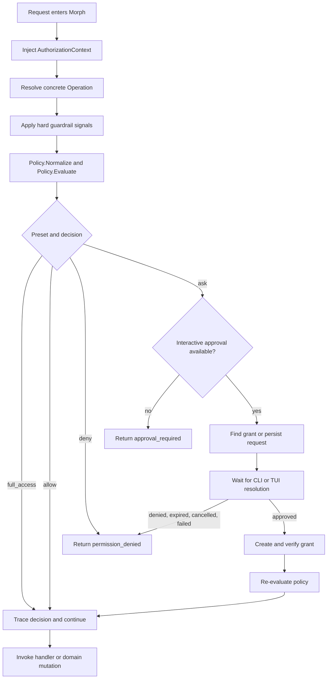
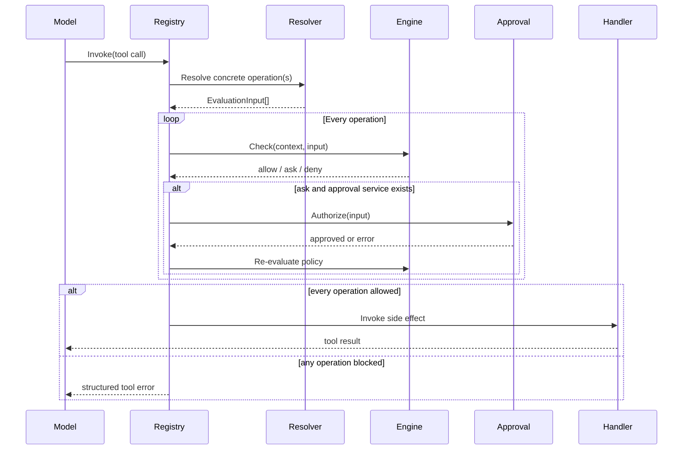
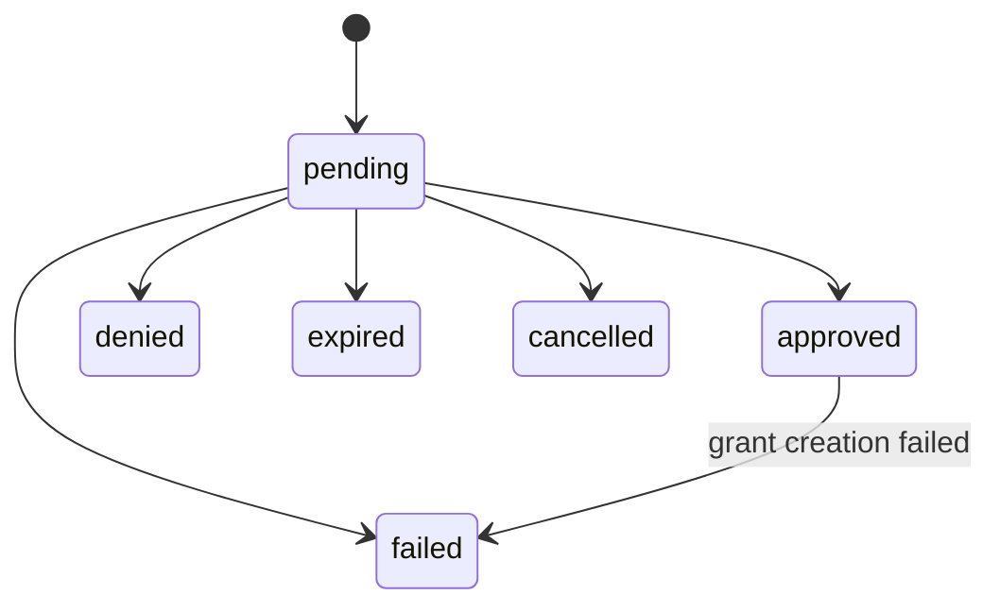
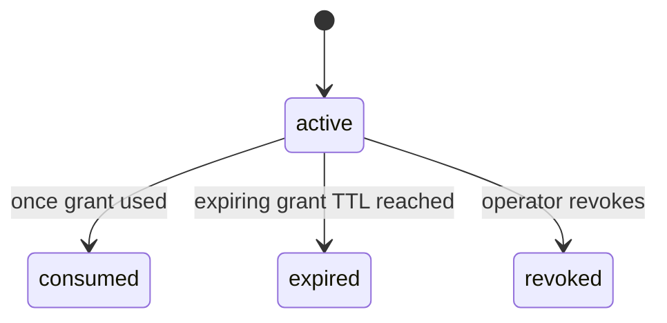
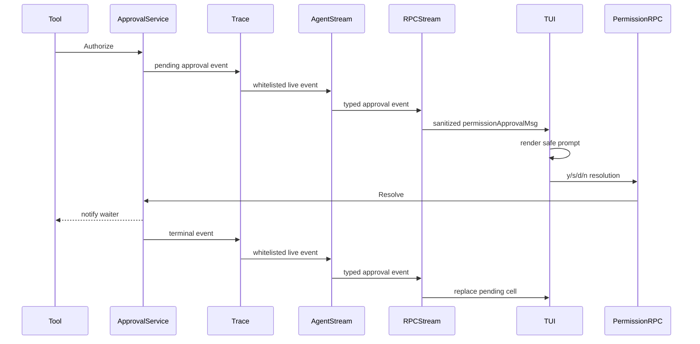

# Morph Permission System Study Guide

## 1. Why this document exists

This guide explains Morph's permission system as it exists in the codebase today. It is written for someone who is new to the project and wants to understand both the idea and the implementation.

The main questions are:

- Who is asking to do something?
- Where did the request come from?
- What operation will happen?
- What side effects can it have?
- What exact target will it affect?
- Is the operation owner-only?
- Does policy allow it, deny it, or require approval?
- If approval is required, how does execution pause and safely resume?
- Where must authorization context and operation metadata be injected?
- How do we verify that denied work cannot cause side effects?

This is a study guide, not only a configuration reference. It describes the reasoning behind the design, follows real flows end to end, and points to the code responsible for each step.

## 2. The shortest useful mental model

Every authorization decision can be reduced to this sentence:

> Actor **A**, through surface **S**, wants to perform action **X** on resource **R**, affecting target **T**, with effects **E**.

For example:

> The local owner, through the TUI, wants to execute a process target `git status`, with the `execution` effect.

In Go, that request is represented by two main values:

```go
authorization := permissions.AuthorizationContext{
    Actor: permissions.Actor{
        Kind: permissions.ActorLocalOwner,
        ID:   "owner",
    },
    Surface:   permissions.SurfaceTUI,
    Profile:   "default",
    SessionID: "session_123",
}

operation := permissions.Operation{
    Tool:     "run_command",
    Resource: permissions.ResourceProcess,
    Action:   permissions.ActionExecute,
    Effects:  []permissions.Effect{permissions.EffectExecution},
    Target:   "git status",
}
```

The policy engine returns one of three decisions:

- `allow`: continue immediately.
- `ask`: stop before the side effect and request interactive approval.
- `deny`: stop before the side effect.

Permission decisions are always enforced:

- `allow` continues.
- `ask` requires an approval workflow.
- `deny` returns a permission error.

The `full_access` preset is the explicit exception and bypasses ordinary permission restrictions.

## 3. What kind of authorization system is this?

Morph is not primarily a traditional role-based access control system.

Classic RBAC asks a question such as:

> Does the user's role have the `process.execute` permission?

Morph asks a richer question:

> Is this actor, from this surface and profile, allowed to execute this particular process target with these effects, under the current ownership and hard-guardrail constraints?

That makes the current system closer to attribute-based access control, or ABAC. Its attributes include:

- actor kind and actor ID;
- creator actor and run provenance for automation;
- exact surface and broad surface kind;
- profile, session, and run;
- tool, resource, and action;
- effects;
- target prefix;
- ownership requirements;
- hard-deny and approval signals from lower-level guardrails.

It still has role-like actor categories such as `local_owner`, `gateway_user`, and `automation`, but those categories are only some of the inputs to a decision.

## 4. The architecture at a glance



The important rule is that the side-effecting handler is last. Context injection, operation resolution, policy checks, approval, grant verification, and policy re-evaluation all happen before it.

## 5. Core source map

| Concern | Primary source |
|---|---|
| Domain vocabulary and normalization | `internal/permissions/types.go` |
| Authorization context injection | `internal/permissions/context.go` |
| Policy normalization, validation, matching, and precedence | `internal/permissions/policy.go` |
| Always-enforced decisions, preset selection, and stable errors | `internal/permissions/engine.go` |
| Built-in ask, approve, full-access, and custom presets | `internal/permissions/preset.go` |
| Approval requests, grants, waiting, expiry, recovery, and cleanup | `internal/permissions/approval.go` |
| Approval target fingerprints | `internal/permissions/fingerprint.go` |
| Tool enforcement | `internal/tools/registry_default.go` |
| Tool permission metadata contract | `internal/tools/registry.go` |
| SQLite approval persistence | `internal/state/storesqlite/permission.go` |
| In-memory approval persistence | `internal/state/storememory/permission.go` |
| Agent wiring and approval trace events | `internal/agent/agent.go` |
| Live trace-event fanout | `internal/agent/trace_stream.go` |
| RPC boundary enforcement and safe streamed payloads | `internal/rpc/service.go` and `internal/rpc/automation_service.go` |
| Approval-management RPC service | `internal/rpc/permission_service.go` |
| CLI approval management | `internal/cli/permissions/permissions.go` |
| CLI/TUI surface metadata | `internal/rpc/rpcmeta/permissions.go` |
| TUI approval state and input | `internal/tui/app/bubbletea_adapter.go` and `internal/tui/app/transcript.go` |
| Automation actor injection | `internal/automation/execution.go` |
| Automation domain rechecks | `internal/automation/service.go` |

## 6. Vocabulary in plain language

### 6.1 Actor

The actor answers: **who or what initiated the work?**

| Actor kind | Meaning | Example |
|---|---|---|
| `local_owner` | The person operating Morph locally | A user typing in the TUI |
| `gateway_user` | A user arriving through a gateway | Telegram sender `12345` |
| `automation` | A scheduled job | Job `auto_weekly_report` |
| `rpc_client` | A generic, remote, or unverified daemon RPC caller | A custom client calling the daemon API |
| `unknown` | Missing or unusable identity | Fail-safe evaluation input |

`Actor.ID` distinguishes actors within a kind. For example, two Telegram users are both `gateway_user` actors but have different IDs.

Actor kind is not the same thing as a role with a fixed permission set. It is one matching attribute among several.

### 6.2 Surface and surface kind

The surface answers: **where did the request enter Morph?**

Exact surfaces include:

- `cli`
- `tui`
- `telegram`
- `slack`
- `http`
- `automation`
- `rpc`

Surface kinds group related surfaces:

| Surface kind | Exact surfaces |
|---|---|
| `local` | `cli`, `tui` |
| `gateway` | `telegram`, `slack`, `http` |
| `automation` | `automation` |
| `rpc` | `rpc` |

This two-level design avoids adding a policy default for every new gateway. A new gateway can use `SurfaceKindGateway` and receive the gateway default even before a surface-specific rule exists.

The exact surface still matters when policy needs a narrower distinction. For example, TUI requests may be allowed to ask interactively while Telegram requests remain denied.

### 6.3 Resource

The resource answers: **what category of thing is affected?**

Resources currently used by protected runtime boundaries include file, process, network, memory, session, automation,
gateway, configuration, model, daemon, plan, and clock.

Examples:

- `write_file` affects a `file` resource.
- `run_command` affects a `process` resource.
- changing the model affects a `model` resource.
- pairing a Telegram sender affects a `gateway` resource.

### 6.4 Action

The action answers: **what is being done to the resource?**

Examples include read, search, list, create, update, delete, execute, start, stop, trigger, manage, and connect.

Resource and action form a semantic pair:

- `file + read`
- `file + update`
- `process + execute`
- `automation + trigger`
- `gateway + manage`

### 6.5 Effect

Effects answer: **what consequences can the operation have?**

| Effect | Meaning | Example |
|---|---|---|
| `read` | Observes data | Reading a file |
| `write` | Changes durable or runtime state | Updating a file |
| `execution` | Starts or controls executable work | Running a command |
| `network` | Uses network access | Fetching a URL |
| `destructive` | Deletes or irreversibly removes something | Deleting memory |
| `credential_bearing` | Reads or changes secrets/credentials | Setting a provider API key |
| `external_system` | Affects something beyond local process state | Sending or scheduling delivery |
| `privilege_changing` | Changes who can do what | Approving a gateway sender |

Resource/action tells us the operation's semantic identity. Effects let one policy cover consequences across many resources.

Example:

```yaml
- name: deny destructive work
  effects: [destructive]
  decision: deny
```

This can match deletion of memory, automation, or files without naming each resource separately.

### 6.6 Target

The target answers: **which exact object, command, path, or identifier is affected?**

Examples:

- file path: `workspace/report.md`
- command: `git status`
- memory ID: `mem_123`
- automation ID: `auto_daily_summary`
- process ID: `process_456`

Target is used for rule matching and approval fingerprints. Changing the target normally changes the approval identity.

### 6.7 Owner requirement

`OwnerRequired` says that an operation is owner-sensitive.

The operation passes the ownership check when at least one of these applies:

1. the actor is `local_owner`;
2. the operation has an `OwnerID` matching the actor ID;
3. an explicit matching rule returns `allow`.

Otherwise evaluation returns `deny` with reason code `owner_required`.

This is particularly important for automation mutations, model selection, credentials, gateway lifecycle, and gateway pairing.

## 7. AuthorizationContext: the request identity envelope

`AuthorizationContext` travels through Go's `context.Context`. It contains:

```go
type AuthorizationContext struct {
    Actor           Actor
    SurfaceKind     SurfaceKind
    Surface         Surface
    Profile         string
    SessionID       string
    RunID           string
    ParentActorKind ActorKind
    ParentActorID   string
    ParentRunID     string
}
```

Think of it as a trusted identity envelope attached to a request.

### 7.1 Why context injection is necessary

A tool definition knows what it does, but it does not automatically know who called it.

For example, `run_command` always executes a process. The authorization outcome should differ among:

- the owner using the TUI;
- a Telegram user;
- an unattended automation;
- an RPC client.

The same operation metadata is evaluated against different authorization contexts.

### 7.2 How context is stored

`permissions.WithContext`:

1. replaces a nil Go context with `context.Background()`;
2. normalizes the authorization value;
3. refuses to inject invalid authorization data;
4. stores the normalized value under a private context key.

`permissions.FromContext` retrieves and re-normalizes it.

The private key prevents unrelated packages from accidentally colliding with the permission context.

### 7.3 Surface-kind inference

Callers usually set an exact surface and omit `SurfaceKind`:

```go
permissions.AuthorizationContext{
    Actor:   permissions.Actor{Kind: permissions.ActorGatewayUser},
    Surface: permissions.SurfaceTelegram,
}
```

Normalization infers `SurfaceKindGateway`.

If a caller explicitly says that Telegram is a local surface, normalization rejects the mismatch.

### 7.4 Current injection points

#### Local CLI/TUI agent turns

`Agent.Respond` fills missing direct local identity with:

- actor: `local_owner`;
- surface: `cli` by default;
- profile: active agent configuration name;
- session: resolved session ID.

If the incoming context already contains authorization data, the agent preserves it while filling the active profile and resolved session.

The CLI and TUI normally reach the agent through the daemon's RPC server. They attach `cli` or `tui` surface metadata,
and the server classifies them as `local_owner` only when the RPC peer address is loopback. A remote peer, missing peer,
generic RPC surface, or unsupported surface remains `rpc_client` even if it attempts to claim `tui` or `cli`.

This means RPC is the transport, not automatically the actor. A verified local interaction can travel over RPC while
retaining `local_owner` semantics.

#### Telegram

The Telegram adapter injects:

- actor kind: `gateway_user`;
- actor ID: sender ID;
- surface: `telegram`;
- session ID: resolved gateway session.

This happens after gateway sender authentication/pairing and before `Agent.Respond`.

#### Slack

The Slack adapter uses the same shape with surface `slack` and the Slack sender ID.

#### Generic HTTP gateway

The generic gateway injects `gateway_user` and surface `http`. It derives a stable, non-secret actor ID from the
configured bearer credential so rules and approval fingerprints can distinguish that gateway principal.

#### Automation execution

The automation runner injects:

- actor kind: `automation`;
- actor ID: job ID;
- surface: `automation`;
- profile: active job profile;
- session ID: run target session.

This is why an unattended job cannot pretend to be an interactive local owner merely because it invokes the same agent code.

#### RPC

RPC service methods derive the actor and surface independently:

- loopback peer plus supported `cli` or `tui` metadata: actor `local_owner`, exact claimed local surface;
- remote peer, missing peer, unsupported metadata, or generic RPC surface: actor `rpc_client`;
- missing or invalid surface metadata: surface `rpc`;
- session ID where applicable.

The loopback check prevents a remote RPC caller from becoming `local_owner` merely by sending
`x-morph-permission-surface: tui`.

### 7.5 Creator provenance fields

`ParentActorKind`, `ParentActorID`, and `ParentRunID` preserve who created an automation and which run initiated it.
Rules can match `ParentActorKind`, while parent actor ID and parent run ID become part of the approval fingerprint.
This lets automation execution retain creator provenance without treating the automation as the interactive owner.

## 8. Operation: the protected action envelope

`Operation` is the other half of evaluation:

```go
type Operation struct {
    Tool          string
    Resource      Resource
    Action        Action
    Effects       []Effect
    Target        string
    TargetScope   TargetScope
    OwnerID       string
    OwnerRequired bool
}
```

### 8.1 Static permission definitions

Every tool declares a base operation in its `tools.Definition`:

```go
Permission: permissions.Operation{
    Resource: permissions.ResourceProcess,
    Action:   permissions.ActionExecute,
    Effects:  []permissions.Effect{permissions.EffectExecution},
},
```

During registration, the registry:

1. rejects a definition that has neither a base operation nor a dynamic resolver;
2. fills `Operation.Tool` from the tool name when absent;
3. normalizes the operation;
4. rejects an invalid resource, action, or effect.

This catches incomplete permission metadata during startup instead of during a side effect.

### 8.2 Why static metadata is not enough

Static metadata says that `write_file` updates a file, but policy may need the exact path.

Dynamic permission resolvers inspect the actual call input and produce concrete operations.

For example, `write_file` turns:

```json
{
  "path": "notes/../secrets.txt",
  "content": "..."
}
```

into a normalized target similar to:

```text
secrets.txt
```

The path is cleaned and slash-normalized before target-prefix policy matching and fingerprinting. This prevents a rule from seeing two spellings of the same logical target.

### 8.3 Resolver validation occurs before authorization

A resolver must reject malformed or incomplete input before the handler runs.

Examples:

- malformed JSON returns `invalid_input`;
- a missing command returns `command is required`;
- a patch with no files returns `invalid patch`;
- an unsupported automation action is rejected;
- an invalid process action is rejected.

If a resolver returns no operations, the registry treats that as an error. A tool cannot accidentally bypass enforcement by returning an empty list.

### 8.4 One tool call can produce multiple operations

A patch may modify several files. Its resolver emits one operation per target, sorted by target.

Example:

```text
patch call
  -> file/create docs/new.md
  -> file/update internal/app.go
```

Every operation must pass. If any one operation is denied, the patch handler does not run.

This is important because authorizing only the first file would permit a multi-target bypass.

### 8.5 Dynamic examples

#### `run_command`

Resolves command and arguments into one target string:

```text
command = git
args    = [status, --short]
target  = git status --short
```

It also imports signals from the hard command guardrail:

- command guardrail deny -> `HardDenyReason`;
- command guardrail approval -> `ApprovalReason`.

#### `process`

The operation changes with the requested action:

| Process action | Permission action | Effects |
|---|---|---|
| start | start | execution, write |
| status/read | read | read |
| stop | stop | destructive, execution, write |
| list | list | read |

#### `automation`

| Tool action | Permission action | Effects | Owner required |
|---|---|---|---|
| status | read | read | no |
| list/runs | list | read | no |
| add | create | external_system, write | yes |
| update/pause/resume | update | external_system, write | yes |
| run | trigger | execution, external_system | yes |
| remove | delete | destructive, external_system, write | yes |

#### Memory mutation

- add targets normalized memory kind;
- update targets memory ID;
- delete targets memory ID and adds `destructive`.

## 9. Operation declarations

Morph does not maintain a separate operation inventory. Permission metadata belongs at the runtime boundary that
enforces it, which prevents a descriptive catalog from drifting away from executable behavior.

Tools declare a static `Definition.Permission`, a call-sensitive `Definition.ResolvePermission`, or both. RPC and
service boundaries construct their concrete operation next to the permission check. These declarations are the source
of truth for resource, action, effects, target, and ownership requirements.

Tests should inspect registered tool definitions and exercise RPC and service checks directly. A declaration is useful
only when the side effect actually passes through the corresponding permission engine call.

## 10. Policy configuration

A policy has:

```go
type Policy struct {
    Preset              Preset
    Default             Decision
    RequestRetention    time.Duration
    GrantRetention      time.Duration
    CleanupInterval     time.Duration
    CleanupBatchSize    int
    ApprovalRateLimit   int
    ApprovalRateWindow  time.Duration
    SurfaceKindDefaults map[SurfaceKind]Decision
    SurfaceDefaults     map[Surface]Decision
    Rules               []Rule
}
```

There is no permission mode toggle. Every decision is enforced. `Preset` chooses the baseline posture. Configured
rules are evaluated before the `ask` and `approve` baselines, while `custom` uses only the detailed rules and defaults
stored in the profile.

### 10.1 Presets

| Value | UI label | Effective behavior |
|---|---|---|
| `ask` | Ask for approval | Evaluates configured rules first, then allows the interactive local owner while asking for execution, network access, destructive work, credential-bearing work, privilege changes, and writes outside workspace roots |
| `approve` | Approve for me | Evaluates configured rules first, then allows the interactive local owner while asking only for destructive work, credential-bearing work, privilege changes, and writes outside workspace roots |
| `full_access` | Full access | Allows every actor and surface without ordinary rule, default, ownership, hard-deny, command-policy, or filesystem-root checks. Unattributed browser background egress still requires an exact configured allow rule |
| `custom` | Custom | Uses only `default`, surface defaults, and `rules` from the profile |

For `ask` and `approve`, all surface-kind defaults are rebuilt as deny. Their built-in rules carve out local-owner
behavior only; gateway, automation, and RPC work therefore remains denied unless a configured rule explicitly allows
the operation. A configured rule can also narrow local behavior or override a built-in `ask`. `full_access` ignores
configured rules for caller-attributed operations. Unattributed browser background egress is the narrow exception
described above. The TUI, CLI, and daemon label `ask` or `approve` with rules as `(customized)`.

The active preset can come from the profile or a trusted per-request context override. The TUI persists preset changes
to the profile and attaches the selected preset to its RPC calls. The server still derives actor identity independently;
a claimed preset never turns a remote caller into `local_owner`.

### 10.2 Beginner-friendly preset overlay example

```yaml
permissions:
  preset: approve
  requestRetention: 720h
  grantRetention: 720h
  cleanupInterval: 1h
  cleanupBatchSize: 100
  approvalRateLimit: 10
  approvalRateWindow: 1m

  rules:
    - name: allow scheduled report execution
      actors: [automation]
      actorIds: [auto_weekly_report]
      surfaces: [automation]
      resources: [automation]
      actions: [execute]
      effects: [execution, external_system]
      decision: allow
      reason: weekly report job may run unattended

    - name: allow report web extraction
      actors: [automation]
      actorIds: [auto_weekly_report]
      surfaces: [automation]
      tools: [web_extract]
      resources: [network]
      actions: [read]
      effects: [read, network, external_system]
      decision: allow
      reason: weekly report may read its configured news source
```

The configured rules are checked first. Other automation operations still fall through to the `approve` baseline and
remain denied because the baseline only grants local-owner behavior.

### 10.3 Default normalization

When omitted:

- preset becomes `custom`;
- overall default becomes `deny`;
- terminal request retention becomes 30 days;
- terminal grant retention becomes 30 days;
- background cleanup runs every hour;
- each cleanup pass considers at most 100 requests and 100 grants;
- each actor/surface may create at most 10 distinct approval prompts per minute by default;
- surface-kind defaults become:
  - local -> ask
  - gateway -> deny
  - automation -> deny
  - RPC -> deny

These defaults describe the custom policy. The `ask` and `approve` presets replace configured defaults with their own
deny-by-default baseline while retaining configured rules as a higher-priority layer. `full_access` ignores rules and
defaults for caller-attributed operations. Unattributed browser background egress is the deliberate exception: an exact
configured allow rule is required because a coincident full-access action does not prove who caused that connection.
Every resulting decision is enforced immediately through the permission engine.

The retention fields govern audit-history cleanup, not whether a pending request or active grant remains usable. Negative
retention values are invalid. A zero value means “use the default,” so zero does not disable cleanup. Cleanup interval and
batch size must be greater than zero after normalization.

### 10.4 Rule fields

A rule can match:

- profiles;
- actor kinds;
- actor IDs;
- parent actor kinds;
- surface kinds;
- exact surfaces;
- tools;
- resources;
- actions;
- effects;
- target scopes;
- target prefixes.

An empty field means “match any value for this dimension.”

Example:

```yaml
- name: deny all credential-bearing operations
  effects: [credential_bearing]
  decision: deny
```

Because every other matcher is empty, this rule applies to every actor, surface, tool, resource, action, profile, and target that has the effect.

### 10.5 Effect matching direction

A rule's effects are requirements that must all exist in the operation.

Rule:

```yaml
effects: [write, destructive]
```

Operation effects:

```text
[write, destructive, external_system]
```

Result: match.

But an operation with only `[write]` does not match because it lacks `destructive`.

### 10.6 Target prefix matching

`targetPrefixes` uses string-prefix matching.

```yaml
targetPrefixes: [workspace/]
```

matches `workspace/docs/readme.md` but not `outside/readme.md`.

For filesystem tools, resolvers clean and slash-normalize targets first. New target types must define their own canonical representation before relying on prefixes.

## 11. Exact policy evaluation order

Understanding the order is essential because later steps can refine or override earlier results.

### Step 1: normalize and validate policy

Preset, decisions, durations, map keys, lists, names, effects, scopes, and prefixes are normalized. The effective preset
is then expanded. Invalid policy fails closed with `deny` before actor or operation matching.

### Step 2: normalize authorization and operation

Invalid authorization becomes an unknown actor/surface for safe evaluation. Invalid operation becomes unknown
resource/action. Unknown values do not match ordinary rules or defaults, so evaluation normally falls toward deny.

### Step 3: full-access preset

If the effective preset is `full_access`, evaluation immediately returns `allow` with reason code `full_access`.
This deliberately bypasses hard-deny reasons, rules, defaults, ownership, and forced approval, but not invalid-policy
failure.

### Step 4: hard deny

For every preset except full access, if `EvaluationInput.HardDenyReason` is present, evaluation immediately returns:

- decision: `deny`;
- reason code: `hard_deny`;
- reason: the supplied hard-guardrail explanation.

No policy rule can override it.

### Step 5: find a matching configured rule

All matching rules are considered. Selection uses this order:

1. decision priority: deny > ask > allow;
2. greater specificity;
3. lexicographically smaller rule name as deterministic tie-breaker.

Within the configured-rule layer, this means a broad deny beats a narrow allow.

Example:

```yaml
- name: allow owner deletes
  actors: [local_owner]
  actions: [delete]
  decision: allow

- name: deny destructive effects
  effects: [destructive]
  decision: deny
```

A destructive owner delete matches both rules. The deny rule wins because deny has higher priority.

### Step 6: find a matching preset rule

If no configured rule matches, `ask` and `approve` evaluate their built-in rules. This preserves the selected preset as
the baseline while allowing explicit configuration to override it. `custom` has no built-in rules.

### Step 7: exact surface default

If no configured or preset rule matches, custom policy checks `surfaces[tui]`, `surfaces[telegram]`, and so on. The
`ask` and `approve` baselines do not use configured exact-surface defaults.

### Step 8: surface-kind default

If there is no exact-surface default, policy checks the effective surface-kind default. Custom policy uses the
configured map. The `ask` and `approve` baselines use deny for every surface kind.

### Step 9: overall policy default

If nothing else matched, use `Policy.Default`.

### Step 10: ownership check

Owner-required operations are denied for non-owners unless ownership matches or an explicit allow rule matched.

### Step 11: forced approval signal

If the current decision is not deny and `ApprovalReason` is present, the result becomes:

- decision: `ask`;
- reason code: `approval_required`;
- reason: supplied approval reason.

This lets the command guardrail require approval even when general permission policy would otherwise allow the operation.

### Evaluation precedence summary

```text
invalid-policy fail-closed
  > full-access allow
  > hard deny
  > configured matching rule
  > built-in preset rule
  > exact surface default
  > surface-kind default
  > policy default
  > owner requirement
  > forced approval for otherwise non-denied work
```

The owner and forced-approval steps are post-processing constraints. They do not weaken a deny.

## 12. Permission enforcement

`Policy.Evaluate` always computes a decision.

`Engine.Check` always enforces that result.

### Enforcement behavior

```text
allow -> no error
ask  -> DecisionError code approval_required
deny -> DecisionError code permission_denied
```

### Full-access preset

```yaml
permissions:
  preset: full_access
```

Full access returns `allow` without consulting hard denials, policy rules, surface defaults, ownership requirements, or
approval reasons. It therefore never creates an approval request and does not need an approval grant. The allow decision
is still traced with reason code `full_access`, so operators can see that the broad preset, not a rule, authorized the
operation.

Full access applies equally across local, gateway, automation, and RPC surfaces. It should be enabled only when
the entire Morph runtime and every caller reaching it are trusted. Enabling it through `morph permissions preset`
requires `--yes`; the TUI requires a second confirmation and then keeps `Full access (unsafe)` in its bottom status
panel. The daemon startup summary and `morph doctor` also flag it. Ordinary one-shot/root CLI chat does not print a
repeated full-access banner.

### Full access also bypasses command and filesystem guardrails

Full access expresses the user's intent to give Morph unrestricted access to the computer. Tool execution therefore:

- ignores `exec.allow`, `exec.ask`, and `exec.deny` command decisions;
- permits file tools and command working directories outside `fs.roots`;
- continues to validate tool input and preserve time, size, text, and protocol checks.

This mode is intentionally unsafe. It is not appropriate when gateways, remote RPC clients, automations, or other
untrusted callers can reach the runtime.

## 13. Tool invocation flow in detail



### 13.1 Registry registration

The registry validates the base operation and fills the tool name.

### 13.2 Permission resolution

The resolver sees actual call input and returns one or more evaluation inputs.

It can also supply a hard-deny reason or an approval reason. When a resolver does not provide a more specific approval
reason, the registry copies the matched policy rule's `reason` into the approval input. This is why a request created by:

```yaml
- name: confirm local writes
  resources: [file]
  effects: [write]
  decision: ask
  reason: local file writes require confirmation
```

can show `Reason: local file writes require confirmation` in `morph permissions explain`. If a lower-level guardrail has
a more precise reason, such as “command requires confirmation,” that resolver reason wins instead of being overwritten by
the broader policy explanation.

### 13.3 Every operation is checked

The registry records each decision as `permission.decision.observed`. The event name is retained for trace compatibility;
it does not mean the decision is observe-only. `Engine.Check` enforces the recorded decision before the handler runs.

If several operations are blocked, deny takes precedence over ask when choosing the returned tool error.

### 13.4 Ask handling

If the result is `approval_required` and an approval service is installed, the registry calls `ApprovalService.Authorize`.

If approval succeeds, the registry re-evaluates policy. The approval does not rewrite policy; it acts as a separately verified grant that allows the registry to proceed past an `ask` result. A post-approval `deny` still blocks.

### 13.5 Handler invocation

Only after all operations pass does `def.Handler.Invoke` run.

This ordering is the central side-effect safety invariant.

## 14. Hard deny and approval signals from command policy

Morph already has command-specific guardrails. The permission resolver integrates them instead of replacing them.

For a command:

```text
rm -rf protected-data
```

the command guardrail may return one of:

- allowed;
- approval required;
- denied.

The resolver maps those results to:

| Guardrail result | Permission input |
|---|---|
| allowed | no special signal |
| approval required | `ApprovalReason` |
| denied | `HardDenyReason` |

The hard-deny signal is evaluated before every policy rule. This prevents a permissive rule from overriding a safety boundary.

The handler repeats command guardrail evaluation before execution. This is defense in depth: even if permission wiring were accidentally bypassed, the command's own hard policy still applies.

## 15. Approval workflow

Approval turns an `ask` decision into a controlled pause rather than a failure.

### 15.1 Request and grant are different

An approval request asks a human to make a decision.

An approval grant is the reusable authorization created by an approved request.

```text
ApprovalRequest: "May this happen?"
ApprovalGrant:   "This exact approved operation may proceed under this scope."
```

### 15.2 Request statuses



Meanings:

- `pending`: waiting for resolution;
- `approved`: approved and associated with a grant;
- `denied`: user denied it;
- `expired`: no answer before deadline;
- `cancelled`: the waiting request/turn was cancelled;
- `failed`: approval infrastructure failed safely.

### 15.3 Grant statuses



### 15.4 Default lifetimes

| Item | Default lifetime |
|---|---|
| Pending request | 2 minutes |
| Once grant | 2 minutes |
| Session grant | 8 hours |
| Always grant | No expiry; active until revoked or deleted through its approval |

Always approval is unavailable when effects include:

- destructive;
- credential-bearing;
- privilege-changing;
- execution;
- network;
- external-system access.

Examples:

- reading or writing one exact normalized file target may be always allowed;
- executing a command cannot be always allowed;
- deleting memory cannot be always allowed;
- changing a credential cannot be always allowed;
- approving a new gateway sender cannot be always allowed.

Older databases may contain `durable` grants created by earlier Morph versions. They remain reusable across sessions only
until their stored expiry. New approvals cannot create that legacy scope.

### 15.5 Fingerprints

Approval lookup uses a SHA-256 fingerprint of:

- actor kind and actor ID;
- profile;
- surface kind and exact surface;
- tool;
- resource and action;
- normalized effects;
- target;
- owner ID.

Session ID is intentionally not inside the fingerprint. Session restrictions are enforced by grant scope during lookup.

Example:

```text
approved: run_command target "git status"
new call: run_command target "git push"
```

The targets differ, so fingerprints differ. The old approval cannot authorize the new command.

Changing actor, profile, surface, action, effects, or owner also changes the fingerprint.

### 15.6 Authorize flow

`ApprovalService.Authorize` performs these steps:

1. require a valid authorization context;
2. normalize the operation;
3. calculate the fingerprint;
4. search for an active matching grant;
5. atomically consume it when it is a once grant;
6. reject interactive approval on non-CLI/TUI surfaces;
7. create or coalesce a pending request;
8. emit a pending audit event;
9. wait for resolution, cancellation, or expiry;
10. require approved status;
11. look up the matching grant again;
12. consume a once grant atomically;
13. return success only after grant verification.

### 15.7 Why grant lookup happens again after approval

Request status alone is not enough. The grant must exist and match the original fingerprint, actor, profile, session rules, status, and expiry.

This prevents a broken partial approval transition from executing work.

### 15.8 Grant scopes

#### Once

- bound to actor, profile, fingerprint, and originating session;
- consumed atomically;
- only one competing invocation can use it;
- expires after two minutes by default.

When two identical invocations are waiting, both may wake after approval, but only one can atomically consume the once grant. The other fails closed.

#### Session

- bound to actor, profile, fingerprint, and session;
- reusable until expiry or revocation;
- cannot authorize the same operation in another session.

#### Always

- bound to actor, profile, fingerprint, and surface;
- can cross sessions;
- has no expiry timestamp and survives process restart in SQLite;
- remains active until explicitly revoked or removed through its approval record;
- is unavailable for destructive, credential-bearing, privilege-changing, execution, network, and external-system effects.

“Always” does not mean every call to a tool. It means the exact fingerprinted operation. For example, always allowing a
write to `/workspace/report.txt` does not authorize `/workspace/secrets.txt`, another actor, another profile, another
surface, or a call whose effects change.

### 15.9 Request coalescing

If two identical operations from the same actor and session ask at nearly the same time, the store returns the existing pending request rather than creating duplicate prompts.

Coalescing key material includes:

- fingerprint;
- actor;
- session;
- pending status.

Each invocation still has its own in-memory waiter.

### 15.10 Cancellation with coalesced waiters

Cancelling one waiter does not cancel the shared request while another waiter still exists.

Only when the final waiter disappears does the request transition to cancelled.

This avoids this failure:

```text
Invocation A and B share one request.
Invocation A is cancelled.
Incorrect behavior: B is cancelled too.
Correct behavior: request remains pending for B.
```

### 15.11 Idempotent resolution

Resolving a request twice with the same result and scope returns the existing resolution.

Conflicting resolution fails:

```text
first:  approve session
second: approve session -> idempotent success
second: deny            -> already resolved error
```

### 15.12 Failure handling

Approval infrastructure fails closed.

Examples:

- grant lookup failure -> do not execute;
- request creation failure -> do not execute;
- request read failure -> emit failed terminal state and do not execute;
- grant creation failure -> mark request failed and do not execute;
- once-grant consumption race -> loser does not execute;
- approval with no matching grant -> do not execute.

`failRequest` also emits a terminal failure event even if persistence is unavailable, so the TUI is not left displaying a permanently pending request.

### 15.13 Restart recovery

At agent startup:

1. state manager starts;
2. agent obtains the permission store;
3. agent creates the approval service;
4. `Recover` cancels all stale pending requests;
5. `Recover` runs one bounded retention-cleanup pass;
6. the agent starts the periodic cleanup loop;
7. environment preparation injects the approval service into the tool registry.

A restarted daemon never silently resumes pending work from the previous process. Pending requests have no live waiter after restart, so cancellation is the safe terminal state.

If cancellation or the startup prune pass fails, agent startup fails instead of continuing with approval state it could not
reconcile.

## 16. Persistence and atomicity

### 16.1 Store contract

`ApprovalStore` includes methods for:

- create/get/list request;
- resolve request;
- cancel pending requests;
- create/find/consume/list/revoke grants;
- explicitly delete terminal requests and grants;
- list requests and grants with status, limit, and offset filters;
- preview or execute a bounded prune pass.

State backends expose it through:

```go
Permission() (permissions.ApprovalStore, bool)
```

The state manager exposes the selected implementation through `PermissionStore()`.

### 16.2 SQLite tables

`permission_approval_requests` stores:

- identity and fingerprint;
- actor and surface;
- profile/session/run;
- operation classification;
- safe summary and reason;
- status, scope, grant ID;
- creation, expiry, and resolution times.

`permission_approval_grants` stores:

- request relationship;
- fingerprint and actor;
- profile/session/scope/status;
- creation and expiry;
- consumption and revocation times.

### 16.3 Important atomic transitions

#### Once consumption

SQLite updates a grant only when all conditions are true:

```text
id matches
status = active
scope = once
expires_at > now
```

Exactly one concurrent caller can affect one row. A caller seeing zero affected rows gets `approval grant is not consumable`.

#### Grant creation

Grant creation and attaching the grant ID to an approved request happen in one transaction. If the request is not approved, the grant transaction rolls back.

#### Resolution

Resolution reads and updates inside a transaction and rejects conflicting terminal transitions.

### 16.4 Expiry

Grant lookup first marks active expiring grants with `expires_at <= now` as expired. Always grants are excluded from that
transition and are matched without an expiry predicate. Expired grants are never returned as authorization.

Expiry and retention are different clocks:

- expiry answers “may this request or grant still be used?”;
- retention answers “how long should its terminal audit record remain stored?”

An expired grant is unusable immediately, but its record normally remains for the configured 30-day audit window.

### 16.5 Retention and bounded cleanup

Morph does not keep completed approval history forever. The approval service runs cleanup once during startup recovery and
then at the configured interval. Each pass is bounded by `cleanupBatchSize`, preventing a large historical backlog from
turning one cleanup transaction into an unbounded database operation.

Default policy settings are:

| Setting | Default | Meaning |
|---|---:|---|
| `requestRetention` | 30 days | Keep terminal request audit records for this long |
| `grantRetention` | 30 days | Keep terminal grant audit records for this long |
| `cleanupInterval` | 1 hour | Delay between background cleanup passes |
| `cleanupBatchSize` | 100 | Maximum requests and grants considered per pass |

Request cleanup rules:

- pending requests are never pruned;
- approved, denied, expired, cancelled, and failed requests become eligible when `resolved_at` is older than the request cutoff;
- an approved request whose linked grant is still retained is preserved so the request-to-grant audit chain stays intact;
- it becomes eligible when that grant is selected for the same prune pass, was previously removed, or never existed.

Grant cleanup rules:

- consumed grants use `consumed_at` for the retention cutoff;
- revoked grants use `revoked_at`;
- expired grants use `expires_at`;
- an active grant whose expiry is already older than the grant cutoff is semantically expired and can be removed;
- active, unexpired grants and active always grants are never pruned.

Example with a 30-day retention window:

```text
request denied 10 days ago       -> keep
request cancelled 45 days ago    -> prune when selected by the bounded batch
session grant expires tomorrow   -> keep
always grant created 2 years ago -> keep while active
once grant consumed 45 days ago  -> prune when selected
approved request linked to that consumed grant
                                  -> may be pruned in the same pass
```

`Prune(ctx, true)` is a dry run: it calculates cutoffs and counts the records eligible in the next bounded pass without
deleting anything. `Prune(ctx, false)` deletes those selected records transactionally.

The startup pass is strict: an error stops agent startup. Periodic cleanup is best-effort; a failed pass leaves the audit
records in place for a later pass and does not weaken authorization checks.

### 16.6 In-memory store

The in-memory store mirrors SQLite filtering, pagination, revocation, and cleanup behavior with a mutex. It is useful for
tests and non-durable operation, but it does not survive process restart.

### 16.7 Explicit terminal-record deletion

Retention cleanup is automatic and age-based. A local operator can instead delete an individual terminal record at any
time with its ID:

```bash
morph permissions delete approval_123
morph permissions delete grant_123
```

The safety rules are intentionally based on record state, not age:

- a pending approval request cannot be deleted because a live tool call may still be waiting on it;
- denied, expired, cancelled, and failed requests can be deleted immediately;
- deleting an approved request also deletes its linked grant;
- when that linked grant is active and unexpired, the same transaction revokes it before deleting both records;
- an active, unexpired grant cannot be deleted and must first be revoked;
- consumed, expired, and revoked grants can be deleted immediately;
- a grant still marked active whose expiry time has passed is logically terminal and can be deleted.

Deleting an approval is intentionally a request-to-grant cascade because the request owns the grant it created. The store
locks both records, revokes a live grant, deletes the grant, and then deletes the approval in one transaction. This prevents
a concurrent invocation from using the grant between separate revoke and delete operations.

Deleting a grant directly remains non-cascading: it does not delete the request that created it. An active grant still
cannot be deleted directly; use either of these flows:

```bash
morph permissions revoke grant_123
morph permissions delete grant_123

# Or atomically revoke and delete the whole approval chain:
morph permissions delete approval_123
```

## 17. TUI approval flow



### 17.1 Safe trace payload

The approval trace includes:

- request ID;
- status and scope;
- tool/resource/action/effects;
- safe operation summary;
- reason;
- expiry.

The summary is generated as:

```text
run_command · execute process
```

It intentionally does not include the raw target. A command containing a secret should not be echoed into the transcript simply because approval is required.

### 17.2 Why the event must be streamed before the turn finishes

Approval creates a deliberate pause inside a running tool call. The TUI must receive the pending event while that turn is
still running; waiting for the completed transcript would create a circular wait:

```text
tool waits for approval
TUI waits for the turn to finish before seeing the request
turn cannot finish until the TUI answers
```

Two explicit boundaries make the live path safe:

1. `isStreamableTraceEvent` in `internal/agent/trace_stream.go` includes
   `permission.approval.changed`, allowing the agent's live fanout to forward it.
2. `getRPCTracePayload` in `internal/rpc/service.go` decodes the typed event and returns only the TUI-safe approval fields.

The second boundary deliberately excludes the raw target and fingerprint. A missing event from either boundary makes the
tool appear to run forever even though it is actually waiting for an approval prompt the TUI has not received.

### 17.3 Keyboard choices

| Key | Meaning |
|---|---|
| `y` | allow once |
| `s` | allow for session |
| `a` | always allow this exact operation, when eligible |
| `n` | deny |

The always choice is hidden and rejected for destructive, credential-bearing, privilege-changing, execution, network,
and external-system effects.

### 17.4 Multiple simultaneous requests

The TUI stores pending approvals in an ordered queue. It presents keyboard control for the oldest pending request, then advances after that request reaches a terminal state.

This prevents two parallel tool calls from overwriting each other's approval state.

### 17.5 Terminal transcript states

Pending cells are replaced in place by approved, denied, expired, cancelled, or failed states. They are not appended as unrelated transcript messages.

If the resolution RPC itself fails, the TUI creates a terminal failed state and clears the keyboard wait rather than leaving the request visually pending forever.

## 18. CLI approval flow

The root command is `morph permissions`.

Available commands:

```text
morph permissions list
morph permissions pending
morph permissions grants
morph permissions approve --scope once approval_123
morph permissions approve --scope session approval_123
morph permissions approve --scope always approval_123
morph permissions deny approval_123
morph permissions revoke grant_123
morph permissions revoke approval_123
morph permissions delete approval_123
morph permissions delete grant_123
morph permissions explain approval_123
morph permissions prune --dry-run
morph permissions prune
```

The listing commands intentionally separate the two record types:

- `list` shows approval requests of every status;
- `pending` shows only unresolved approval requests;
- `grants` shows grants independently of requests.

All three return newest records first, default to 50 rows, and accept `--limit` and `--offset`. The limit must be between
1 and 500. `list` accepts request statuses `pending`, `approved`, `denied`, `expired`, `cancelled`, and `failed`.
`grants` accepts grant statuses `active`, `consumed`, `expired`, and `revoked`. For example:

```bash
morph permissions list --status denied --limit 25
morph permissions pending --limit 10 --offset 10
morph permissions grants --status active
```

`revoke` accepts either identifier. For an `approval_...` ID, the service loads the request and follows its persisted
`GrantID`; it fails clearly when the request does not exist or did not create a grant. A `grant_...` ID is revoked directly.

`delete` uses the ID prefix to select the operation. `grant_...` deletes only that terminal grant. `approval_...` deletes
the terminal request and follows its persisted grant link: a live linked grant is revoked, then the linked grant and request
are deleted atomically.

Cleanup can be inspected before mutation:

```bash
morph permissions prune --dry-run
# 3 requests and 1 grants eligible (...cutoffs...)

morph permissions prune
# 3 requests and 1 grants deleted (...cutoffs...)
```

Each invocation processes only one configured batch. Re-running it drains an older backlog incrementally.

### Example: approve once

Terminal A is blocked waiting for approval:

```text
Permission approval required
run_command · execute process
Effects: execution
```

Terminal B:

```bash
morph permissions pending
morph permissions explain approval_123
morph permissions approve --scope once approval_123
```

The blocked invocation wakes, verifies and consumes the grant, rechecks policy, and then runs exactly once.

### CLI surface metadata

Permission-management commands add gRPC metadata:

```text
x-morph-permission-surface: cli
```

The TUI uses the same field with value `tui`.

The server combines the claimed surface with its observed RPC peer address. A caller is treated as an interactive local
owner only when the surface is `cli` or `tui` and the peer address is IPv4 or IPv6 loopback. Resolve and revoke reject
remote peers, missing peers, generic RPC callers, and unsupported surfaces.

### Local-owner RPC trust boundary

Surface metadata identifies the claimed interaction surface; it is not authentication. The loopback peer check prevents
remote surface spoofing, but another process running under the local machine's trust boundary can still send the same
metadata.
The daemon therefore uses loopback plus supported surface metadata as its local-owner trust boundary.

## 19. General RPC enforcement

RPC has two related but different permission paths.

### 19.1 Protected application methods

Session mutation, model selection, credential changes, gateway lifecycle, pairing, and automation mutations call `Service.checkPermission` before doing work.

The RPC checker:

1. classifies a loopback `cli`/`tui` caller as `local_owner` and every other caller as `rpc_client` when authorization is absent;
2. preserves the exact supported local surface or falls back to `rpc`;
3. evaluates the configured permission engine;
4. maps deny to gRPC `PermissionDenied`;
5. maps ask to gRPC `FailedPrecondition` with “approval required.”

General RPC mutations do not themselves open an interactive approval prompt. They return the need for approval to the caller.

### 19.2 Permission-management service

The dedicated PermissionService lets clients:

- list requests with status and pagination filters;
- inspect one request;
- resolve a request;
- list grants with status and pagination filters;
- revoke a grant by grant ID or by the approval request that created it;
- delete a terminal request or grant by its own ID;
- preview or execute retention pruning.

Resolve, revoke, delete, and prune require both a claimed CLI or TUI surface and a loopback RPC peer. Surface metadata alone is
insufficient.

The RPC shape intentionally omits sensitive internal matching material such as raw target fingerprints and actor IDs from normal approval output.

## 20. Domain rechecks and defense in depth

Boundary enforcement is necessary but not always sufficient. Sensitive domains recheck permission close to the mutation.

### 20.1 Automation RPC plus service recheck

An automation mutation can pass through:

```text
RPC boundary check
  -> automation service check
    -> persistence or execution
```

The service checks add, update, remove, and run before mutation. This protects callers that invoke the service through
another path and keeps RPC refactors from becoming permission bypasses.

### 20.2 Tool handler guardrails

Filesystem and command handlers retain their own policies after the central permission check. For every non-full-access
preset, the registry passes the exact operations that policy allowed or the owner approved to the handler. That
authorization can let the matching filesystem operation cross a configured root without creating a general bypass;
this requires a configured rule that allows that concrete external operation. External writes require approval in the
built-in `ask` and `approve` baselines unless a configured rule allows them. Full access is the broad exception and
bypasses command decisions and filesystem roots without per-operation authorization. Input validation, timeout limits,
and size limits remain separate constraints.

## 21. Worked evaluation examples

### Example A: owner reads a workspace file

Context:

```text
actor       = local_owner
surface     = tui
surfaceKind = local
```

Operation:

```text
tool     = read_file
resource = file
action   = read
effects  = [read]
target   = workspace/README.md
```

With the `approve` preset and no matching configured rule, the built-in local-owner rule returns `allow`. The handler can
read the workspace file without creating an approval request.

### Example B: same read requiring approval

Suppose a configured rule explicitly returns `ask` for `read_file`, or a custom policy sets the TUI surface default to
`ask`. The configured rule is evaluated before the preset baseline, so the same operation now requires approval.

Because TUI is interactive:

- request is persisted;
- TUI shows approval prompt;
- allow-once creates a once grant;
- one invocation consumes it and reads the file.

### Example C: the same read with the full-access preset

With `preset: full_access`:

- deny or ask rules are not evaluated;
- owner and surface defaults do not constrain the call;
- no approval prompt or grant is created;
- the trace records `decision=allow`, `reason_code=full_access`, and `preset=full_access`;
- file tools may access paths outside configured workspace roots;
- command allow, ask, and deny guardrails are bypassed;
- ordinary input, timeout, size, and protocol validation still applies.

### Example D: Telegram user attempts destructive memory deletion

Context:

```text
actor       = gateway_user
surface     = telegram
surfaceKind = gateway
```

Operation:

```text
resource = memory
action   = delete
effects  = [write, destructive]
```

Gateway surface-kind default is deny. The registry returns `permission_denied` before the memory handler executes.

Even if policy returned ask, Telegram is not an interactive approval surface, so the approval service would return `approval_required` rather than waiting for an answer that cannot arrive.

### Example E: automation tries to create another automation

Context actor is `automation`, surface is `automation`.

The operation is owner-required and has write/external-system effects.

Unless an explicit policy rule allows this actor and operation, evaluation denies it. An unattended automation cannot approve its own request.

### Example F: command hard deny versus allow rule

Assume the effective preset is `custom`, `ask`, or `approve` rather than `full_access`.

Policy:

```yaml
- name: allow owner process execution
  actors: [local_owner]
  resources: [process]
  actions: [execute]
  decision: allow
```

Command guardrail classifies a command as denied.

Evaluation receives `HardDenyReason`, so hard deny wins before the allow rule is considered. The handler never executes.
`full_access` is the deliberate exception: it is evaluated first and bypasses command hard-deny policy.

### Example G: changed target invalidates approval

Approved call:

```text
write_file target = docs/report.md
```

Next call:

```text
write_file target = config/secrets.yaml
```

Fingerprint changes. The old grant does not match. The new target must be evaluated and, if needed, approved independently.

### Example H: broad deny beats narrow allow

Rules:

```yaml
- name: allow owner memory work
  actors: [local_owner]
  resources: [memory]
  decision: allow

- name: deny destructive effects
  effects: [destructive]
  decision: deny
```

Deleting memory matches both. Deny has higher decision priority, so deletion is denied.

### Example I: owner-required RPC credential update

Operation:

```text
resource      = configuration
action        = update
effects       = [write, credential_bearing]
ownerRequired = true
```

A generic or remote RPC client is not automatically the local owner. Only a loopback CLI/TUI caller enters the current
local-owner trust boundary. Without an explicit allow rule, ownership post-processing denies the generic RPC mutation.

Always approval is unavailable because the operation is credential-bearing.

## 22. Verification thinking: what must always be true?

The permission system should be reviewed as a set of invariants, not merely as a set of functions.

### Invariant 1: side effects occur only after authorization

Verification question:

> Can any handler, database mutation, process start, or external delivery happen before the final check?

Tests should count side effects and assert zero on deny, ask without approval, invalid input, cancellation, expiry, and storage failure.

### Invariant 2: ordinary authorization cannot override hard deny

Verification question:

> Does any ordinary policy allow rule, approval, or grant bypass a hard command/filesystem rule?

Expected answer: no. Only the explicitly selected `full_access` preset bypasses hard-deny and filesystem-root policy;
ordinary configured and preset rules do not.

### Invariant 3: approval matches the exact operation

Verification question:

> Does changing actor, surface, profile, tool, action, effects, target, or owner invalidate the grant?

Fingerprint tests should mutate each material field.

### Invariant 4: once means exactly one

Verification question:

> Under concurrent waiters, can more than one invocation consume a once grant?

The atomic store update must permit one consumer only.

### Invariant 5: session grants do not cross sessions

Verification question:

> Can a matching operation in another session steal a once or session grant?

Only always grants and legacy unexpired durable grants may cross sessions.

### Invariant 6: unattended surfaces never wait for human input

Verification question:

> Can automation, Telegram, Slack, HTTP, or generic RPC block forever waiting for an approval UI?

Approval is restricted to CLI/TUI.

### Invariant 7: terminal state is always visible

Verification question:

> Does deny, timeout, cancellation, disconnect, or store failure leave the tool or transcript pending?

Each branch must produce a terminal request state or terminal failure event.

### Invariant 8: restart cannot resume stale work

Verification question:

> After daemon restart, can a pending request execute without a new live waiter and valid grant?

Startup recovery cancels pending requests.

### Invariant 9: malformed resolver input cannot bypass checks

Verification question:

> Does invalid JSON or an empty resolver result fall through to the handler?

It must return a structured error before handler invocation.

### Invariant 10: every sensitive boundary is actually wired

Verification question:

> Does runtime code resolve the concrete operation and check it before performing the side effect?

Permission metadata and its enforcement call must remain on the executable path.

### Invariant 11: an interactive request is delivered live

Verification question:

> Can the TUI see and resolve a pending request before the blocked tool call and turn complete?

Tests must cover both the agent stream allowlist and the RPC safe-payload conversion. Persisting the trace event alone is
not sufficient because the turn is intentionally waiting for the user.

### Invariant 12: cleanup never removes live authorization state

Verification question:

> Can pruning delete a pending request, an active unexpired grant, or an old approved request whose grant is still retained?

Expected answer: no. Dry-run and actual pruning must use the same eligibility rules and batch limits, and deleting a
request/grant audit chain must respect the configured request and grant cutoffs.

## 23. Test map

| Behavior | Important tests |
|---|---|
| Types, normalization, surface inference | `internal/permissions/types_test.go` |
| Context injection/retrieval | `internal/permissions/context_test.go` |
| Rule matching and precedence | `internal/permissions/policy_test.go` |
| Always-enforced allow/ask/deny decisions and stable errors | `internal/permissions/engine_test.go` |
| Preset baselines, configured-rule overlays, and full-access behavior | `internal/permissions/preset_test.go` and `internal/permissions/policy_test.go` |
| Approval lifecycle, scopes, coalescing, explicit deletion, cleanup loop, and failures | `internal/permissions/approval_test.go` |
| Internal waiter behavior | `internal/permissions/approval_internal_test.go` |
| Tool registry ordering and no-side-effect checks | `internal/tools/registry_default_test.go` |
| Dynamic command targets and hard policy | `internal/tools/runcommand/run_command_test.go` |
| Filesystem target normalization | `internal/tools/writefile/write_file_test.go` and `internal/tools/patch/patch_test.go` |
| Process action classification | `internal/tools/process/process_test.go` |
| Automation action classification | `internal/tools/automation/automation_test.go` |
| SQLite persistence, filtering, pagination, explicit deletion, and pruning | `internal/state/storesqlite/permission_test.go` |
| Live approval trace fanout | `internal/agent/trace_stream_test.go` |
| Loopback local-owner classification and remote surface-spoof resistance | `internal/rpc/rpcmeta/permissions_test.go` |
| RPC protection, safe trace streaming, and error mapping | `internal/rpc/permissions_test.go` and `internal/rpc/service_test.go` |
| Approval RPC lifecycle | `internal/rpc/permission_service_test.go` |
| RPC client translation | `internal/rpc/client/permission_test.go` |
| CLI lifecycle, filters, pagination, revoke, delete, and prune | `internal/cli/permissions/permissions_test.go` |
| TUI queue, keyboard choices, safe rendering | `internal/tui/app/permission_approval_test.go` |

## 24. How to add a new protected tool

Suppose we add `delete_file`.

### Step 1: classify the base operation

```go
Permission: permissions.Operation{
    Resource: permissions.ResourceFile,
    Action:   permissions.ActionDelete,
    Effects: []permissions.Effect{
        permissions.EffectWrite,
        permissions.EffectDestructive,
    },
},
```

### Step 2: resolve the exact target

```go
ResolvePermission: func(_ context.Context, call tools.Call) ([]permissions.EvaluationInput, error) {
    // Decode and validate before side effects.
    // Clean and slash-normalize the path.
    return []permissions.EvaluationInput{{
        Operation: permissions.Operation{
            Resource: permissions.ResourceFile,
            Action:   permissions.ActionDelete,
            Effects: []permissions.Effect{
                permissions.EffectWrite,
                permissions.EffectDestructive,
            },
            Target: normalizedPath,
        },
    }}, nil
},
```

### Step 3: keep handler-side hard filesystem checks

Permission policy does not replace allowed-root resolution, symlink protection, or other filesystem safety.

### Step 4: add tests

Required cases:

- definition classification;
- normalized target;
- invalid input blocks before handler;
- allow executes once;
- deny executes zero times;
- ask without approval executes zero times;
- once approval executes once;
- changed target requires a new approval;
- unsafe effects reject always approval;
- hard filesystem denial remains authoritative.

## 25. How to add a new request surface

Suppose Morph adds Discord.

### Step 1: define the exact surface when useful

```go
const SurfaceDiscord Surface = "discord"
```

### Step 2: map it to a surface kind

`getSurfaceKind(SurfaceDiscord)` should return `SurfaceKindGateway`.

### Step 3: inject authorization at the adapter boundary

```go
ctx = permissions.WithContext(ctx, permissions.AuthorizationContext{
    Actor: permissions.Actor{
        Kind: permissions.ActorGatewayUser,
        ID:   discordUserID,
    },
    Surface:   permissions.SurfaceDiscord,
    SessionID: session.ID,
})
```

### Step 4: decide whether it is interactive

Current approval service supports only CLI and TUI. A gateway should not be added as interactive without a complete secure prompt-response protocol, actor binding, replay protection, expiry behavior, and delivery semantics.

### Step 5: test broad gateway defaults

The new exact surface should inherit `SurfaceKindGateway` decisions even when no Discord-specific default exists.

## 26. How to add a new protected RPC mutation

1. Build the concrete operation near the RPC method.
2. Call `s.checkPermission` before invoking the side effect.
3. Preserve authorization context when calling the domain service.
4. Recheck in the domain service when the mutation is sensitive or callable through multiple paths.
5. Test `allow`, `ask`, and `deny` mappings.
6. Assert the underlying API was not called on ask or deny.
7. Decide whether owner requirement is needed.
8. Decide whether effects include destructive, credential-bearing, external-system, or privilege-changing.

## 27. Common mistakes and why they are dangerous

### Mistake: declaring permission metadata without checking it

Why dangerous: metadata is descriptive unless the executable path passes it to the permission engine before the side effect.

### Mistake: checking after the handler

Why dangerous: the side effect already happened.

### Mistake: using only a static operation for a target-sensitive tool

Why dangerous: one approval could unintentionally cover every path, command, or object.

### Mistake: using raw filesystem paths as targets

Why dangerous: equivalent paths such as `a/../blocked.txt` can defeat prefix reasoning.

### Mistake: treating effects as risk scores

Why dangerous: effects are factual consequences, not subjective severity. Policy determines how those consequences are treated.

### Mistake: assuming surface metadata authenticates a caller

Why dangerous: metadata can be claimed by a custom client. Morph now requires a loopback peer before granting local-owner
semantics, but loopback establishes only a machine-local trust boundary, not cryptographic client identity.

### Mistake: allowing unattended approval waiting

Why dangerous: jobs and gateway turns can hang indefinitely with no secure responder.

### Mistake: creating a grant without tying it to an approved request

Why dangerous: it creates authorization with no auditable human decision.

### Mistake: resolving a request but not verifying the grant

Why dangerous: partial storage failure could appear approved without valid authorization.

### Mistake: clearing a shared request when one waiter cancels

Why dangerous: one caller can cancel unrelated coalesced work.

## 28. Operational security boundaries

### Local-owner RPC classification

CLI/TUI metadata identifies the claimed surface, while the server independently requires a loopback RPC peer before
classifying the actor as `local_owner`. This prevents remote callers from elevating themselves with surface metadata.
Another process inside the same machine-local trust boundary can send the same metadata, so operators should treat local
RPC access as trusted access.

### Interactive approvals

Only CLI and TUI resolve live approvals. Gateway, automation, and generic RPC operations that evaluate to `ask` return
`approval_required` immediately instead of creating a request that waits for keyboard input.

### Gateway and automation identity

Gateway adapters derive `gateway_user` actors from authenticated sender identities. The generic HTTP gateway derives a
stable, non-secret principal ID from its configured bearer credential. Generic RPC calls remain `rpc_client`; loopback
CLI/TUI classification is a separate local trust decision.

Automation creation stores actor, surface, profile, session, run, and capture time as provenance. At execution Morph
creates an `automation` actor for the job, carries the creator as parent provenance, and checks current policy immediately
before calling the runner. An unattended `ask` never waits.

Approval prompt creation is bounded per actor and surface by `approvalRateLimit` and `approvalRateWindow`. Metrics expose
created requests, rate-limited requests, reused grants, and remote notices. Existing bounded pruning retains terminal
requests and grants for their configured audit windows, and SQLite auto-migration adds new provenance fields without
granting authority to old records.

### Approval lifetimes and retention

Audit retention and cleanup cadence are user-facing policy settings. The shorter execution lifetimes for pending requests,
once grants, and session grants are still service defaults rather than separate profile settings. Always grants do not
expire. Do not confuse authorization lifetime with the configurable retention window for terminal audit records.

### Target semantics

Target is a string. Each resolver is responsible for canonicalization appropriate to its domain.

### Enforcement coverage

Permission enforcement is fail-closed for tools: the registry rejects any definition without
`Definition.Permission` or `Definition.ResolvePermission`, and invocation checks every resolved operation before the
handler runs. RPC and domain services must still call `Checker.Check` before their side effect; using gRPC or a service
does not protect an operation automatically. There is no static analysis proving RPC and service coverage, so
side-effect prevention tests remain essential at those boundaries.

All built-in tools are protected: file read/write/patch/list/search, command/process, web search/extract, memory
search/extraction/writes, session search/messages, plan read/update, time read, and automation management. Dynamic
tools resolve the concrete action and target before policy evaluation.

Session mutations, model selection, credential updates, gateway lifecycle/pairing, and automation mutations also have
RPC or service checks. Daemon start/stop remains local process control rather than a daemon-management RPC. The source
declaration and runtime check must both exist before documentation calls an operation protected.

### Audit records

Policy decisions and approval request lifecycle changes are traced. Approval requests and grants remain queryable for
their configured retention windows, and bounded pruning removes eligible terminal history.

### Policy rollout

Permission decisions are always enforced. Production policy changes should be validated against real workflows before rollout.

## 29. A practical review checklist

When reviewing permission-related code, ask these in order:

1. What is the actor?
2. Where is the exact surface injected?
3. Is profile/session/run identity preserved?
4. What resource and action describe the operation?
5. Are all effects factual and complete?
6. Is the target concrete and canonical?
7. Should the operation be owner-required?
8. Does a hard guardrail produce `HardDenyReason`?
9. Does a soft guardrail produce `ApprovalReason`?
10. Is permission resolution before the side effect?
11. Can one call affect several targets, and are all checked?
12. Does deny produce zero side effects?
13. Does ask without approval produce zero side effects?
14. Is interactive approval possible on this surface?
15. Does the grant scope match the intended lifetime?
16. Can a changed target reuse the grant?
17. Can another session consume a once/session grant?
18. Is always approval forbidden for the effects, and does it still fingerprint one exact operation?
19. Do cancellation, expiry, disconnect, and storage failure terminate visibly?
20. Does restart recovery prevent stale execution?
21. Is the runtime permission check present on every path to the side effect?
22. Are trace fields safe to display?
23. Is the approval event allowed through both live-stream boundaries?
24. Does cleanup preserve pending requests, live grants, and retained request-to-grant links?
25. Is the caller actually authenticated, or merely labeled?

## 30. Final mental model

The permission system is a chain of evidence:

```text
trusted request origin
  + normalized actor and surface
  + concrete normalized operation
  + effective preset and hard guardrail result
  + deterministic policy evaluation
  + optional exact approval grant
  + final recheck
  = permission to perform the side effect
```

No single field is the permission system by itself:

- actor is not enough;
- surface is not enough;
- an operation declaration is not enough without an enforcement call;
- an allow rule is not enough to override hard deny outside `full_access`;
- approved request status is not enough without a grant;
- a grant is not enough when its fingerprint, actor, profile, session scope, status, or expiry does not match.

The system is safest when every boundary supplies accurate context, every operation supplies accurate consequences and target identity, and every test proves that blocked work has no side effect.
