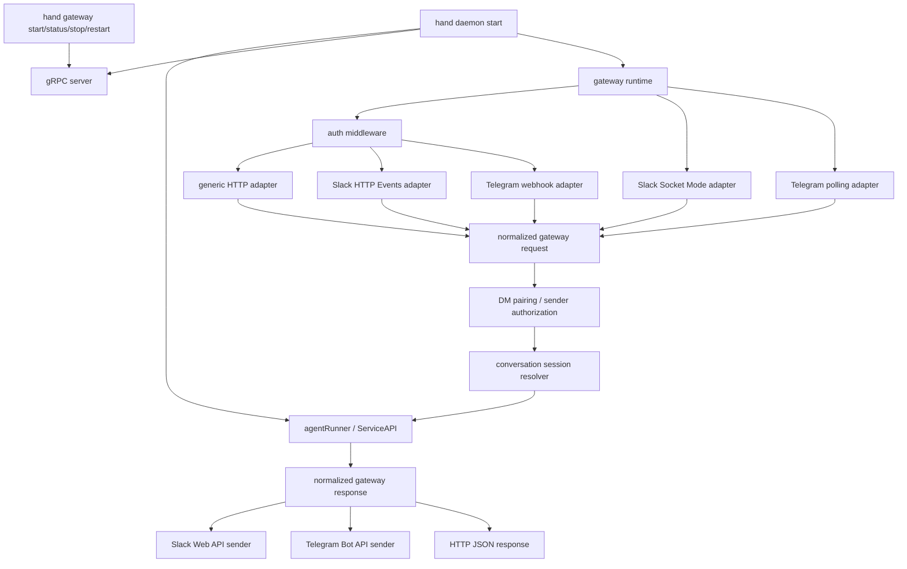
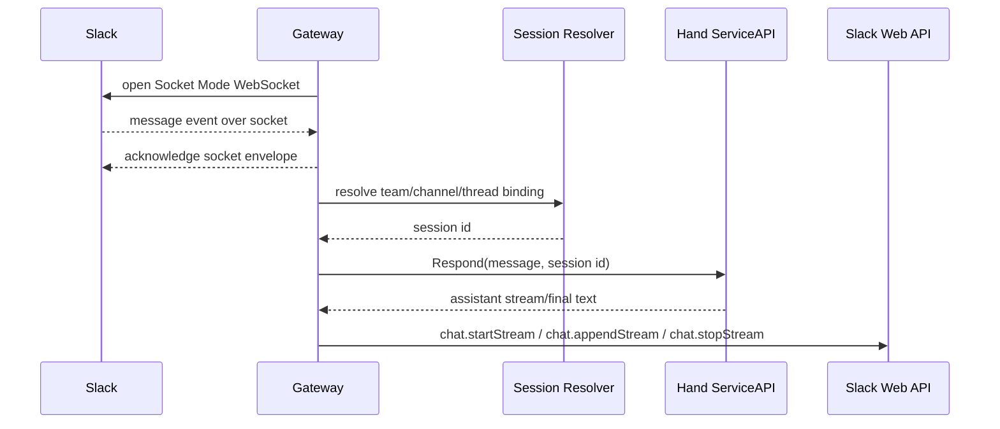
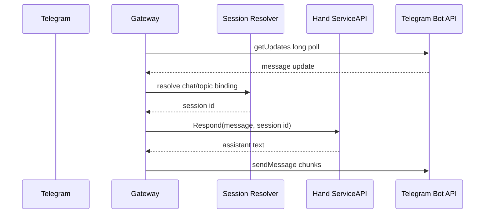

---

## title: "feat: Add daemon-integrated gateway integrations"
type: "feat"
status: "active"
date: "2026-06-05"

# feat: Add daemon-integrated gateway integrations

## Summary

Add optional gateway integrations inside `hand daemon start` so external clients can reach the same long-lived Hand agent runtime through generic HTTP, Slack, and Telegram. Generic HTTP uses an HTTP endpoint, Slack defaults to Socket Mode, and Telegram defaults to long polling; Slack HTTP Events API mode and Telegram webhook mode remain available as explicit hosted-deployment options. The gateway should share the daemon's lifecycle, config reload behavior, session store, memory, model clients, and shutdown path rather than introducing a second long-lived process.

---

## Problem Frame

Hand already has a long-lived daemon with a clean `agent.ServiceAPI` surface and gRPC adapters for CLI/TUI clients. External chat surfaces need gateway ingress and channel-specific request/response handling, but running a separate gateway process would duplicate runtime ownership and make lifecycle, config, and state harder to reason about. The plan keeps the daemon as the single owner and treats gateway work as adapter code around the existing agent service.

---

## Requirements

**Daemon lifecycle**

- R1. Gateway runs inside `hand daemon start` and stops on the same context, signal, and config-reload lifecycle as the existing gRPC server.
- R2. Gateway is disabled by default and only listens when explicitly enabled by flag, config, or environment.
- R3. Startup output and logs report gateway state without exposing tokens, bot credentials, signing secrets, webhook payloads, or user message bodies.

**Generic HTTP**

- R4. Generic HTTP clients can send a message with a stable `conversation_id` and receive the Hand response without knowing Slack or Telegram payload formats.
- R5. Generic HTTP uses bearer-token authentication when configured and requires a token for any non-loopback bind.
- R6. Generic HTTP maps each `conversation_id` to a deterministic Hand session so repeated requests continue the same conversation.

**Telegram**

- R7. Telegram supports long polling as the default ingress using the bot token, so local Hand daemons can receive Telegram updates without a public webhook URL.
- R8. Telegram supports webhook mode when explicitly configured, verifying `X-Telegram-Bot-Api-Secret-Token` before dispatch.
- R9. Telegram message updates are mapped to stable sessions using chat, topic/thread, and sender context, then replies are sent back through the Telegram Bot API.
- R10. Telegram outbound text supports visible streaming progress only where the Bot API natively supports it, then persists the final answer with the appropriate chat/topic reply metadata, platform-safe chunking, and Hermes-style MarkdownV2 formatting with plain-text fallback.

**Slack**

- R11. Slack supports Socket Mode as the default ingress using bot and app tokens, so local Hand daemons can receive Slack events without a public webhook URL.
- R12. Slack supports HTTP Events API mode when explicitly configured, verifying webhook requests with the Slack signing secret before JSON parsing or dispatch.
- R13. Slack HTTP `url_verification` requests return the challenge without starting an agent turn.
- R14. Slack message events addressed to Hand are mapped to stable sessions using team, channel, and thread context, then replies are sent back through Slack Web API.
- R15. Slack retries, reconnects, and duplicate event IDs are handled idempotently so provider redelivery cannot create duplicate agent turns.
- R16. Slack outbound text supports native streaming through Slack's `chat.startStream`, `chat.appendStream`, and `chat.stopStream` APIs when streaming is enabled, with `chat.postMessage` retained for non-streaming and fallback delivery.

**Shared channel behavior**

- R17. Generic HTTP, Slack, and Telegram share a normalized gateway request model, response model, session resolver, auth helpers, and safe error shape.
- R18. Channel adapters may choose which inbound events are actionable, ignoring bot/self messages and unsupported event types without surfacing noisy errors to the user.
- R19. Tests cover auth, lifecycle, session routing, inbound normalization, outbound delivery, duplicate/retry behavior, polling conflict behavior, reconnect behavior, and shutdown.

**DM pairing and sender authorization**

- R20. Gateway DM providers can use a shared pairing flow where an unknown direct-message sender receives a short TOTP-derived approval code, the original message is not processed as an agent turn, and the operator approves the sender through daemon gateway management.
- R21. Telegram uses the shared DM pairing flow for unknown private-chat senders, pairing by Telegram `from.id` rather than chat ID, and stores approval as a sender authorization independent of the conversation/session binding.
- R22. Telegram groups never issue pairing challenges. Group messages are authorized through `HAND_GATEWAY_TELEGRAM_ALLOWED_USERS`, `HAND_GATEWAY_ALLOWED_USERS`, and previously paired Telegram sender IDs; unauthorized group senders are ignored without invoking the agent.
- R23. Pairing state is durable, redacted in logs/status output, bounded by TOTP validity windows, request expiry, and pending-request limits, and reusable by future DM providers such as Slack, Signal, WhatsApp, or Discord without provider-specific store logic.

**Gateway management commands**

- R24. `hand gateway status` reports the current gateway runtime state from the running daemon, including enabled/running/stopped state, listener bind, configured channel modes, channel health, and last safe error without exposing secrets or message bodies.
- R25. `hand gateway start` asks the running daemon to start the gateway runtime from the current daemon config when it is stopped; it is idempotent when the gateway is already running and does not start a second daemon or standalone gateway process.
- R26. `hand gateway stop` asks the running daemon to stop gateway listeners, socket clients, and polling loops while leaving the daemon and gRPC server running.
- R27. `hand gateway restart` asks the running daemon to stop the active gateway runtime, reload gateway config from the daemon's current effective config, and start the gateway again without restarting the daemon or gRPC server.

---

## Key Technical Decisions

- KTD1. **Gateway is daemon-owned optional integration runtime:** This preserves the daemon as Hand's single long-lived owner and lets config reload restart gateway integrations and gRPC together.
- KTD2. **Split reusable gateway libraries from daemon orchestration:** Reusable protocol-neutral pieces should live under `pkg/gateway` packages, while `internal/gateway` owns daemon-specific lifecycle wiring, config binding, state access, and runtime management. `cmd/daemon` should remain orchestration-only.
- KTD3. **Use `agent.ServiceAPI` directly, not the gRPC client:** The gateway lives in-process with the daemon, so routing through gRPC would add avoidable serialization, reconnection, and failure modes.
- KTD4. **Make Slack Socket Mode the default:** Hermes uses Slack Socket Mode, and OpenClaw defaults Slack accounts to Socket Mode with HTTP mode as an option. Hand should follow that path so local daemons can receive Slack events through an outbound WebSocket rather than requiring a public webhook URL for the common case.
- KTD5. **Make Telegram long polling the default:** Hermes receives Telegram updates through `python-telegram-bot` polling, including conflict handling for the one-poller-per-token constraint. Hand should follow that local-first path so Telegram works without a public webhook URL, while keeping webhook mode for hosted deployments.
- KTD6. **Normalize channel ingress before invoking Hand:** Generic HTTP, Slack, and Telegram should all produce one internal request shape with source, conversation key, user identity, text, and reply target. This follows the useful part of OpenClaw's channel adapter pattern without importing its larger plugin/control-plane architecture.
- KTD7. **Persist conversation bindings through Hand sessions:** Channel conversations should map to Hand session IDs via durable storage rather than relying on current-session state, so a daemon restart can continue external conversations.
- KTD8. **Verify provider auth on raw request bodies when using HTTP webhooks:** Slack HTTP mode signature verification depends on the raw body and timestamp. Telegram webhook verification depends on the secret-token header. Both must run before parsing or dispatch.
- KTD9. **Acknowledge provider webhooks quickly, dispatch asynchronously:** Slack HTTP mode and Telegram webhook mode should verify/authenticate, normalize, dedupe, persist delivery state, enqueue bounded work, and return the provider acknowledgment before any agent turn runs. Agent execution and outbound replies should happen asynchronously under the daemon's gateway dispatcher with idempotency keys, retry/backoff, cancellation on shutdown, and observable failed/degraded state. Provider retries must be safe to accept without duplicating agent turns.
- KTD10. **Keep channel outbound clients focused and injectable:** Slack and Telegram senders should have explicit interfaces with injectable transports, socket clients, polling clients, or stream clients so unit tests do not hit external APIs.
- KTD11. **Expose gateway management through daemon control, not a top-level gateway process:** The CLI should provide `hand gateway start|status|stop|restart` as short-lived management commands over the existing daemon RPC/control path. This keeps the daemon as the only long-lived owner while still letting operators recover a failed adapter, inspect state, restart adapters after secret/config changes, or temporarily stop external ingress.
- KTD12. **Use Slack native streaming instead of edit-loop simulation:** Slack provides `chat.startStream`, `chat.appendStream`, and `chat.stopStream` for streaming message chunks. Hand should use those APIs for Slack streaming, and reserve `chat.postMessage` for non-streaming responses or fallback if native streaming is unavailable.
- KTD13. **Use Telegram MarkdownV2 with plain-text fallback:** Hermes formats standard Markdown into Telegram MarkdownV2, sends and edits messages with `ParseMode.MARKDOWN_V2`, and retries as plain text when Telegram rejects formatting. Hand should follow that approach instead of using Telegram HTML.
- KTD14. **Treat DM pairing as shared sender authorization, not session binding:** OpenClaw's reusable channel pairing model and Hermes' private-DM-only challenge behavior are the right shape for Hand. Pairing should approve a provider sender identity, while conversation bindings continue to map chat/channel/thread identifiers to Hand sessions. This lets Telegram ship first without hardcoding pairing to Telegram, and keeps group chats quiet when unauthorized users send messages.
- KTD15. **Use `github.com/pquerna/otp/totp` for TOTP-derived pairing codes:** Pairing approval codes should be generated and verified with `github.com/pquerna/otp/totp` using daemon-owned pairing secret material, source, sender ID, and a short time step. Pending request storage should hold sender metadata and timestamps, not generated code values or reusable approval secret material. This keeps codes short-lived, naturally expiring, and verifiable without storing code values that can be replayed after disclosure.

---

## High-Level Technical Design

---

## Scope Boundaries

### In Scope

- Daemon-integrated gateway lifecycle and config.
- Daemon gateway management commands for start, status, stop, and restart.
- Reusable `pkg/gateway` libraries for auth, normalized request/response types, provider payload helpers, idempotency primitives, queue abstractions, and channel sender contracts.
- Generic HTTP request/response API for direct integrations and test harnesses.
- Slack Socket Mode ingestion, message filtering, reconnect handling, optional HTTP Events API ingestion, request verification, native stream delivery, and outbound message posting.
- Telegram long-polling ingestion, optional webhook ingestion, secret-token verification for webhook mode, message filtering, polling conflict handling, and outbound message posting.
- Shared DM pairing, sender allowlists, and Telegram sender authorization for private chats and groups.
- Durable conversation-to-session binding for daemon restarts.
- Unit and focused integration tests using fake transports and fake agent services.

### Separate Product Areas

- OAuth install flows for Slack workspaces.
- Slash commands, Slack interactivity, buttons, modals, and file uploads.
- Telegram media download, voice transcription, inline buttons, callback queries, payments, and guest-mode-specific behavior.
- WebSocket/SSE streaming for generic HTTP clients.
- Tool execution approval workflows over Slack/Telegram.
- Multi-agent or daemon-to-daemon coordination over the gateway.
- Public tunneling or TLS certificate automation.

### Out of Scope

- A standalone `hand gateway` command or second long-lived gateway process.
- Gateway management commands that can outlive the daemon or run external listeners directly.
- Public `pkg/gateway` APIs that expose daemon internals, model clients, session stores, raw secrets, or workspace state.
- Replacing the existing gRPC RPC server.
- Importing OpenClaw's plugin runtime or channel SDK architecture wholesale.

---

## System-Wide Impact

This feature adds new external integration surfaces to a personal agent that can use tools, memory, and workspace context. The implementation must treat authentication, request body handling, socket and polling lifecycle, management commands, redaction, session binding, and logs as security-sensitive. It also adds platform-facing behavior where Slack and Telegram can retry, redeliver, reconnect, or conflict with another active poller, so idempotency, backpressure, and timeout behavior are production requirements.

---

## Implementation Units

### U1. Gateway Configuration and Validation

**Status:** Completed.

**Progress:**

- [x] Gateway config, defaults, env overrides, CLI flags, validation, startup display, and tests are implemented.

**Goal:** Add gateway config types, defaults, CLI flag overrides, environment overrides, validation, and startup display fields.

**Requirements:** R1, R2, R3, R5, R7, R8, R11, R12.

**Dependencies:** None.

**Files:** `internal/config/config.go`, `internal/config/runtime.go`, `internal/config/defaults.go`, `internal/config/env.go`, `internal/config/validation.go`, `internal/cli/flags.go`, `internal/config/load_test.go`, `internal/config/env_test.go`, `internal/config/validation_test.go`, `cmd/daemon/daemon.go`, `cmd/daemon/daemon_test.go`, `cmd/hand/main_test.go`, `example.yaml`, `README.md`.

**Approach:** Add a `GatewayConfig` under root config with `enabled`, `address`, `port`, generic auth token fields, Slack fields, and Telegram fields. Keep gateway defaults disabled, bind loopback by default for HTTP surfaces, make Slack mode default to `socket` when Slack is enabled, and make Telegram mode default to `polling` when Telegram is enabled. Expose matching CLI overrides on daemon startup, including `--gateway.enabled`, `--gateway.address`, `--gateway.port`, `--gateway.auth-token`, `--gateway.telegram.enabled`, `--gateway.telegram.mode`, `--gateway.telegram.bot-token`, `--gateway.telegram.webhook-secret`, `--gateway.slack.enabled`, `--gateway.slack.mode`, `--gateway.slack.bot-token`, `--gateway.slack.app-token`, and `--gateway.slack.signing-secret`. Validate that Slack socket mode has bot token and app token, Slack HTTP mode has bot token and signing secret, Telegram polling mode has bot token, Telegram webhook mode has bot token plus webhook secret when webhook auth is required, and enabled non-loopback HTTP binds have an auth path. Extend loading with `HAND_`-prefixed gateway credential env vars such as `HAND_GATEWAY_TELEGRAM_BOT_TOKEN`, `HAND_GATEWAY_SLACK_BOT_TOKEN`, and `HAND_GATEWAY_SLACK_APP_TOKEN`; do not support user-configurable credential env-name fields like `botTokenEnv` or non-`HAND_` provider credential env vars. Ensure CLI flags override config/env using existing precedence rules, and update startup rendering with either `Gateway: disabled` or configured listener/channel states.

**Patterns to follow:** Existing `RPCConfig` in `internal/config/runtime.go`, default cloning in `internal/config/defaults.go`, override style in `internal/config/env.go`, CLI flag wiring in `internal/cli/flags.go`, validation phrasing in `internal/config/validation.go`, startup rows in `cmd/daemon/daemon.go`.

**Test scenarios:**

- Config defaults keep gateway disabled and loopback-bound.
- Config file values populate gateway address, port, auth token, Slack mode, Slack bot token, Slack app token, Slack signing secret, Telegram mode, Telegram bot token, and Telegram webhook secret.
- Environment variables override gateway config values using the same precedence style as existing config.
- CLI flags override config file and environment values for gateway enabled state, bind address, port, auth token, Telegram mode/secrets, and Slack mode/secrets.
- Root help and daemon command help include the gateway flags, and startup output never renders configured token values.
- Validation passes for disabled gateway with empty secrets.
- Validation fails when gateway HTTP surfaces are enabled on non-loopback without generic auth or channel-specific auth.
- Validation fails when Slack socket mode lacks an app token or bot token.
- Validation fails when Slack HTTP mode lacks a signing secret or bot token.
- Validation fails when Telegram polling mode lacks a bot token.
- Validation fails when Telegram webhook mode lacks a bot token or required webhook secret.
- Startup panel renders disabled/enabled gateway state and never includes configured secret values.

**Verification:** Config loading, override, CLI flag override, validation, command help, and daemon startup rendering tests cover the new fields without exposing secrets.

### U2. Daemon Lifecycle Integration

**Status:** Completed.

**Progress:**

- [x] Daemon service group, gateway manager/server lifecycle, graceful shutdown, restart behavior, and tests are implemented.

**Goal:** Start and stop gateway integrations inside the existing daemon runtime beside the gRPC server.

**Requirements:** R1, R2, R3, R19, R25, R26, R27.

**Dependencies:** U1.

**Files:** `cmd/daemon/daemon.go`, `cmd/daemon/daemon_test.go`, `internal/gateway/server.go`, `internal/gateway/server_test.go`, `internal/gateway/manager.go`, `internal/gateway/manager_test.go`.

**Approach:** Replace the single `serveRPC` blocking call with a daemon service group that can run gRPC and, when enabled, gateway integrations concurrently under one context. Preserve the current graceful gRPC shutdown behavior, add analogous HTTP shutdown with timeout, and stop Slack Socket Mode and Telegram polling cleanly on daemon cancellation. Keep test hooks for listeners, socket clients, polling clients, and server functions so daemon tests can simulate startup failures, early exits, config reload cancellation, reconnect loops, polling conflicts, and shutdown races.

**Patterns to follow:** Existing `serveRPC` structure, `runDaemonUntilConfigChange` restart flow, and daemon test hook style in `cmd/daemon/daemon_test.go`.

**Test scenarios:**

- Disabled gateway starts only gRPC and preserves current daemon behavior.
- Enabled generic HTTP or Telegram webhook mode starts both gRPC and HTTP listeners and returns when the context is canceled.
- Enabled Slack socket mode starts the Slack socket adapter without requiring the HTTP listener to be publicly reachable.
- Enabled Telegram polling mode starts the polling adapter without requiring the HTTP listener to be publicly reachable.
- If gateway listener creation fails, the daemon returns an error before reporting a healthy gateway.
- If HTTP serve exits unexpectedly, daemon shutdown also stops gRPC.
- Config reload cancellation gracefully stops both servers before the next config starts.
- Config reload cancellation closes Slack Socket Mode before the next config starts.
- Config reload cancellation stops Telegram polling before the next config starts.
- Gateway restart stops existing HTTP/socket/polling components before starting replacements and leaves gRPC responsive throughout the transition.
- HTTP graceful shutdown timeout logs a warning and closes the server.

**Verification:** Gateway manager/server tests cover disabled, start, stop, restart, listener failure, HTTP serve failure, cancellation, stuck shutdown, and adapter lifecycle paths. Daemon lifecycle tests cover disabled gateway behavior, gateway startup failure, RPC-triggered shutdown, gateway-triggered shutdown, context cancellation, and shutdown error tolerance.

### U3. Gateway Core HTTP Contract

**Status:** Completed.

**Progress:**

- [x] Generic HTTP health/respond routes, auth helpers, JSON envelopes, normalized request/response types, and tests are implemented.

**Goal:** Implement generic HTTP routes, auth middleware, normalized request/response types, and safe error responses.

**Requirements:** R4, R5, R6, R17, R19.

**Dependencies:** U1, U2.

**Files:** `internal/gateway/server.go`, `internal/gateway/http.go`, `internal/gateway/generic.go`, `pkg/gateway/types/types.go`, `pkg/gateway/auth/auth.go`, `pkg/gateway/auth/auth_test.go`, `pkg/gateway/httpjson/httpjson.go`, `pkg/gateway/httpjson/httpjson_test.go`, `internal/gateway/server_test.go`, `internal/gateway/generic_test.go`.

**Approach:** Provide `GET /health` with safe unauthenticated readiness and `POST /v1/respond` with bearer auth when configured. Decode a focused request containing `conversation_id`, `message`, optional `user_id`, optional `source`, and optional `instruct`. Convert it into the normalized gateway request and return JSON with `conversation_id`, `session_id`, `text`, and safe error fields. Package protocol-neutral request/response structs, auth helpers, and JSON error shapes in `pkg/gateway` so channel adapters and future clients can reuse them without depending on daemon internals.

**Patterns to follow:** HTTP server style in `cmd/trace/trace.go`, JSON testing style in existing handler tests, constant-time secret comparison expectations from security-sensitive code.

**Test scenarios:**

- `GET /health` returns safe status without requiring auth or leaking config.
- `POST /v1/respond` rejects missing bearer token when generic auth is configured.
- `POST /v1/respond` rejects invalid bearer token using the same response shape as missing auth.
- Valid request calls the fake agent with the resolved session ID and returns assistant text.
- Empty `conversation_id` or `message` returns `400` and does not call the agent.
- Agent errors return a safe error response without stack traces or provider details.
- `pkg/gateway` request/response and auth helpers can be tested without constructing daemon config, agent services, or state stores.

**Verification:** Generic HTTP tests cover unauthenticated health, bearer auth rejection, request validation, single-object JSON decoding, method rejection, responder option propagation, assistant response shape, and safe internal errors. Reusable `pkg/gateway` tests cover normalized request/response types, fixed-length bearer token comparison, and safe JSON error envelopes.

### U4. Conversation Session Resolver

**Goal:** Map external conversation keys to stable Hand session IDs without depending on current-session state.

**Requirements:** R6, R9, R14, R17, R19.

**Dependencies:** U3.

**Status:** Completed.

**Progress:**

- [x] Gateway binding keys, stable session resolver, agent/state persistence hooks, SQLite/memory store coverage, and tests are implemented.

**Files:** `internal/gateway/session.go`, `internal/gateway/session_test.go`, `pkg/gateway/bindings/bindings.go`, `pkg/gateway/bindings/bindings_test.go`, `internal/agent/service.go`, `internal/agent/service_test.go`, `internal/state/core/session.go`, `internal/state/storesqlite/session_test.go`, `internal/state/storememory/session_test.go`.

**Approach:** Add a dedicated persistence path for gateway conversation bindings if existing session metadata cannot safely carry the mapping. The resolver should derive a stable binding key from source and provider identifiers, create a Hand session when missing, and reuse it thereafter. It should avoid switching the daemon's current session as a side effect. Put binding-key construction and validation in `pkg/gateway/bindings`; keep storage and session creation in `internal/gateway`.

**Technical design:** Directional only: `source + ":" + account/team + ":" + conversation/thread` resolves to a stored `session_id`; missing entries create `ses_`* through the session service and persist the binding.

**Patterns to follow:** `CreateSession` and storage session tests in `internal/rpc/client/client.go`, session persistence contracts in `internal/state/core/session.go`, SQLite/memory parity tests under `internal/state/storesqlite` and `internal/state/storememory`.

**Test scenarios:**

- Same generic `conversation_id` resolves to the same session across repeated calls.
- Different sources with the same raw conversation value resolve to different sessions.
- Slack team/channel/thread keys produce stable sessions.
- Telegram chat/topic keys produce stable sessions.
- Resolver creates a session on first use without changing current session.
- Store failure returns a safe gateway error and does not invoke the agent.

**Verification:** Resolver tests prove deterministic session continuity and storage parity.

### U5. Telegram Polling and Webhook Adapter

**Status:** Completed.

**Progress:**

- [x] Telegram polling adapter, webhook auth, update normalization, topic-aware targets, sender transport, draft/edit simulated streaming, dispatch queue integration, and tests are implemented.
- [x] Sender-layer MarkdownV2 parse-mode support is implemented for `sendMessage`, `editMessageText`, and `sendMessageDraft`.
- [x] Telegram MarkdownV2 formatter is implemented in `pkg/gateway/telegram/format.go`.
- [x] Formatter and sender tests assert MarkdownV2 parse mode, safe Markdown-to-MarkdownV2 conversion, plain-text fallback, and streaming-safe formatted partials.
- [x] Focused validation passes with `CGO_ENABLED=1 go test -tags sqlite_fts5 ./pkg/gateway/telegram ./internal/gateway/telegram`.

**Goal:** Add Telegram long-polling ingress by default, optional webhook verification, update normalization, message filtering, native streaming outbound text where supported, chunked final delivery, and topic-aware replies.

**Requirements:** R7, R8, R9, R10, R17, R18, R19.

**Dependencies:** U3, U4.

**Files:** `internal/gateway/telegram.go`, `internal/gateway/telegram_polling.go`, `internal/gateway/telegram_webhook.go`, `internal/gateway/telegram_send.go`, `internal/gateway/telegram_stream.go`, `pkg/gateway/telegram/auth.go`, `pkg/gateway/telegram/format.go`, `pkg/gateway/telegram/updates.go`, `pkg/gateway/telegram/stream.go`, `pkg/gateway/telegram/auth_test.go`, `pkg/gateway/telegram/format_test.go`, `pkg/gateway/telegram/updates_test.go`, `pkg/gateway/telegram/stream_test.go`, `internal/gateway/telegram_test.go`, `internal/gateway/telegram_polling_test.go`, `internal/gateway/telegram_webhook_test.go`, `internal/gateway/telegram_send_test.go`, `internal/gateway/telegram_stream_test.go`.

**Approach:** Implement Telegram polling mode as the default adapter using `getUpdates` with a tracked offset and context-aware long-poll loop. The polling client should normalize supported `Update` message shapes, ignore unsupported updates, advance offsets only after accepted handling decisions, and treat Telegram 409 conflicts as a clear fatal or retryable state indicating another poller is using the same bot token. Also add optional webhook mode at `POST /gateway/telegram/webhook`: verify the configured secret-token header, decode the same supported update shapes, and reuse the same normalization and dispatch path. For streaming responses, prefer Telegram `sendMessageDraft` when the target is clearly supported by the Bot API; it gives users an ephemeral animated draft preview while the answer is generated. For chats, groups, topics, or threads where native draft streaming is unavailable, support Hermes-style simulated streaming by sending one placeholder message and applying throttled `editMessageText` updates to that same message. Add Telegram formatting at the sender layer by extending `telegramSendRequest` with a parse-mode field and applying it consistently to `sendMessage`, `editMessageText`, and `sendMessageDraft`. Follow Hermes' MarkdownV2 approach: convert standard model Markdown into Telegram MarkdownV2, including headers, bold, italic, links, inline code, fenced code blocks, strikethrough, spoilers, blockquotes, and required MarkdownV2 escaping. For simulated edits and drafts, format each partial text before sending; if Telegram rejects MarkdownV2 parsing, retry the same delivery as plain text without duplicating visible final replies. Do not use Telegram HTML. Final replies should remove any cursor/progress marker and persist the completed answer with `sendMessage` or a final edit, chunking text at Telegram's message limit with topic/thread metadata when present. Put secret-token verification, MarkdownV2 formatting/plain fallback helpers, Update parsing, reply target extraction, and stream payload helpers in `pkg/gateway/telegram`; keep polling loops, outbound client ownership, and daemon lifecycle in `internal/gateway`.

**Patterns to follow:** Hermes `gateway/platforms/telegram.py` uses polling as the local gateway path, registers handlers for supported message types, handles polling conflicts when another poller owns the token, formats outbound text as MarkdownV2 with plain-text fallback on parse failure, and implements simulated streaming with `send_message` plus repeated `edit_message_text`. OpenClaw's Telegram extension is useful for its separation between message context, conversation routing, and outbound delivery. Hand's Telegram adapter should cover text messages, topic routing, conflict handling, optional webhook mode, MarkdownV2-safe outbound delivery, and a Telegram-specific streaming abstraction that chooses native draft streaming when supported and simulated edit streaming otherwise.

**Test scenarios:**

- Telegram polling mode calls `getUpdates` with the configured bot token and does not require a public webhook URL.
- Telegram polling advances the update offset after supported and intentionally ignored updates so the daemon does not replay the same update forever.
- Telegram polling 409 conflicts are surfaced as a safe gateway state and do not spin in a hot retry loop.
- Valid Telegram secret-token header is accepted.
- Missing or mismatched secret-token header is rejected before dispatch when configured.
- Polling and webhook message updates with text resolve the expected chat/topic session and invoke the agent through the same normalization path.
- Edited messages, callbacks, media-only messages, and unsupported updates are acknowledged without invoking the agent.
- Private-chat streaming uses `sendMessageDraft` with a stable non-zero draft ID and finalizes with a persistent `sendMessage`.
- Group/topic targets that are not natively supported by `sendMessageDraft` use one placeholder message plus throttled `editMessageText` updates, preserving `message_thread_id` on the initial placeholder/final message.
- Native draft and simulated edit streaming updates are throttled and coalesced so Telegram rate limits or repeated identical edit errors do not break the final response.
- If either streaming path is rejected or rate-limited beyond the retry budget, the adapter disables streaming for that turn and sends the final response normally.
- Telegram sender sets MarkdownV2 parse mode for `sendMessage`, `editMessageText`, and `sendMessageDraft` when sending formatted output.
- Telegram sender converts regular Markdown into Telegram MarkdownV2, including headers, bold, italic, links, inline code, fenced code blocks, strikethrough, spoilers, blockquotes, and required MarkdownV2 escaping.
- Telegram sender retries as plain text when Telegram rejects MarkdownV2 parsing, without duplicating visible final replies.
- Outbound messages are chunked at the Telegram text limit and preserve chunk order.
- `message_thread_id` is included when replying in a topic.
- Telegram sender handles API `ok=false`, HTTP failures, and invalid bot token responses as safe gateway errors.

**Verification:** Telegram tests cover polling ingress, polling conflict handling, webhook auth, shared update normalization, topic routing, native draft streaming, simulated edit streaming, MarkdownV2 conversion, MarkdownV2 send/edit/draft requests, plain-text fallback on parse failure, streaming fallback to final delivery, chunking, and outbound HTTP without live Telegram calls. Focused validation runs with `CGO_ENABLED=1 go test -tags sqlite_fts5 ./pkg/gateway/telegram ./internal/gateway/telegram`.

### U6. Shared DM Pairing and Sender Authorization

**Status:** Completed.

**Progress:**

- [x] Reusable DM pairing package and tests are implemented.
- [x] TOTP-derived pairing code generation/verification is implemented.
- [x] Durable pairing request metadata and approved-sender storage is implemented for memory and SQLite stores.
- [x] Telegram private-chat pairing and group sender authorization are implemented.
- [x] Daemon gateway pairing management commands are implemented.
- [x] Pairing, allowlist, Telegram authorization, and management command tests pass.

**Goal:** Add a generalized DM pairing system for gateway providers, starting with Telegram, so unknown direct-message senders can request access without requiring operators to manually discover provider-specific numeric IDs first.

**Requirements:** R20, R21, R22, R23.

**Dependencies:** U3, U4, U5.

**Files:** `go.mod`, `go.sum`, `pkg/gateway/pairing/pairing.go`, `pkg/gateway/pairing/pairing_test.go`, `pkg/gateway/pairing/messages.go`, `pkg/gateway/pairing/messages_test.go`, `internal/gateway/authz.go`, `internal/gateway/authz_test.go`, `internal/gateway/pairing.go`, `internal/gateway/pairing_test.go`, `internal/gateway/telegram/telegram.go`, `internal/gateway/telegram/telegram_polling.go`, `internal/gateway/telegram/telegram_webhook.go`, `internal/gateway/telegram/telegram_polling_test.go`, `internal/gateway/telegram/telegram_webhook_test.go`, `internal/state/core/gateway_pairing.go`, `internal/state/storememory/gateway_pairing.go`, `internal/state/storememory/gateway_pairing_test.go`, `internal/state/storesqlite/gateway_pairing.go`, `internal/state/storesqlite/gateway_pairing_test.go`, `internal/rpc/proto/hand.proto`, `internal/rpc/service.go`, `internal/rpc/client/client.go`, `cmd/daemon/daemon.go`, `cmd/daemon/daemon_test.go`.

**Approach:** Add a provider-neutral pairing package that works on normalized sender identity rather than raw provider payloads. A pairing request should include source, sender ID, optional sender display name, created/last-seen/expiry timestamps, and optional provider metadata. Approved senders should be stored separately from pending requests and checked by the gateway authorization layer before session resolution. Add `github.com/pquerna/otp` and use `github.com/pquerna/otp/totp` for approval code generation and verification. Derive a per-request TOTP secret from daemon-owned pairing secret material plus source and sender ID, using a short period and a small validation window for clock drift. Store pending request metadata, not generated code values or derived TOTP secrets. Use 8-digit numeric TOTP codes for compatibility with the library and familiar authenticator semantics, a 1-hour pending-request expiry, a bounded pending-request limit per provider, and safe redaction in status/log output. Repeated direct messages from the same unknown sender while a pending request exists should refresh last-seen metadata and may show the current TOTP code only when a new challenge message is intentionally sent.

For Telegram, normalize sender authorization from `message.from.id`; do not use `chat.id` as the authorization identity when `from.id` is present. Private chats should enforce Telegram DM policy before media handling, session resolution, or agent dispatch. When an unknown private-chat sender is not in `HAND_GATEWAY_TELEGRAM_ALLOWED_USERS`, not in `HAND_GATEWAY_ALLOWED_USERS`, and not already paired, create or reuse a pairing request, send a MarkdownV2-safe challenge message to that private chat, and stop processing the original update. Groups and topics should never receive pairing challenge messages. Group senders should be authorized only when their Telegram `from.id` appears in `HAND_GATEWAY_TELEGRAM_ALLOWED_USERS`, appears in `HAND_GATEWAY_ALLOWED_USERS`, or is already paired for Telegram; unauthorized group messages should be ignored without invoking the agent.

Expose daemon-owned management commands for pairing state under the existing gateway control surface: `hand gateway pairing list`, `hand gateway pairing approve <source> <code>`, `hand gateway pairing revoke <source> <sender-id>`, and `hand gateway pairing clear-pending [source]`. Approval should verify the submitted code against pending requests for that source using the current TOTP window; when multiple pending requests could match, the command should fail clearly and ask the operator to use the request ID or sender ID variant rather than guessing. These commands should talk to the running daemon over RPC, mutate daemon-owned state, and render source, sender ID, display name, age, and status without exposing message bodies, TOTP secret material, or raw provider payloads. Keep the reusable pairing mechanics in `pkg/gateway/pairing`; keep storage, daemon RPC wiring, and Telegram integration in `internal`.

**Patterns to follow:** OpenClaw `src/pairing/pairing-store.ts` and `src/pairing/pairing-challenge.ts` for the reusable channel-pairing shape, account/source-scoped approval store, create-if-missing challenge behavior, expiry, and pending caps. Hermes `gateway/pairing.py` and `gateway/run.py` for private-DM-only pairing challenges, CLI approval, and quiet handling of unauthorized group messages. Hand's existing `pkg/gateway/bindings` package is the model for keeping reusable gateway value objects out of daemon orchestration. For code semantics, rely on `github.com/pquerna/otp/totp` rather than hand-rolling RFC 6238 behavior.

**Test scenarios:**

- TOTP pairing code generation produces stable 8-digit numeric codes for the same source/sender/time window using `github.com/pquerna/otp/totp`.
- TOTP verification accepts the current window and configured adjacent drift window, and rejects stale windows outside that allowance.
- Pending pairing requests expire after the configured TTL and expired requests cannot be approved even when a fresh TOTP code is mathematically valid for the same sender.
- Pending requests are capped per provider and excess unknown senders do not create unbounded state.
- Repeated unknown DM messages from the same sender reuse the existing pending request and do not create duplicate requests.
- Approving a valid TOTP code creates an approved sender, removes the pending request, and allows future authorization checks.
- Approving an invalid, expired, blank, or wrong-source code returns a safe not-found result without creating approved senders.
- Approving a TOTP code that matches more than one pending request fails as ambiguous and does not approve any sender.
- Pairing code values, daemon pairing secret material, and derived TOTP secrets are never persisted in pending request storage or rendered by status/list commands after the challenge is sent.
- Revoking an approved sender removes authorization without touching unrelated providers.
- `HAND_GATEWAY_TELEGRAM_ALLOWED_USERS` authorizes matching Telegram sender IDs.
- `HAND_GATEWAY_ALLOWED_USERS` authorizes matching sender IDs across gateway providers.
- Telegram private-chat update from an unknown sender sends a pairing challenge and does not call the agent.
- Telegram private-chat update from an approved sender reaches session resolution and agent dispatch.
- Telegram group update from an unknown sender sends no pairing challenge and does not call the agent.
- Telegram group update from a sender in `HAND_GATEWAY_TELEGRAM_ALLOWED_USERS` reaches session resolution and agent dispatch.
- Telegram group update from a sender in `HAND_GATEWAY_ALLOWED_USERS` reaches session resolution and agent dispatch.
- Telegram group update from an already paired Telegram sender reaches session resolution and agent dispatch.
- Telegram authorization uses `from.id` rather than `chat.id` when both are present.
- Pairing challenge text is safe for Telegram MarkdownV2 and does not expose provider secrets, tokens, or message bodies.
- Daemon gateway pairing list/approve/revoke/clear-pending commands mutate daemon-owned state and redact output.
- Pairing RPC and CLI calls fail clearly when the daemon is unreachable.

**Verification:** Pairing package tests cover TOTP code generation and verification, expiry, pending caps, ambiguous-code handling, approval, revocation, and message rendering. Storage parity tests cover memory and SQLite stores without persisting code values. Telegram tests prove DM pairing, allowlist authorization, group silence for unknown senders, and paired-sender group access. RPC and command tests prove pairing management operates through the running daemon without a standalone long-lived process.

### U7. Slack Socket Mode and HTTP Adapter

**Status:** Completed.

**Progress:**

- [x] Slack Socket Mode ingress is implemented.
- [x] Slack HTTP Events API ingress and request verification are implemented.
- [x] Slack outbound posting and native stream delivery are implemented.
- [x] Slack adapter tests pass without live Slack calls.
- [x] Slack Socket Mode dispatch uses the shared dispatcher for idempotent event handling.
- [x] Slack Socket Mode reconnects with exponential backoff.
- [x] Slack stream terminal, rate-limit, and transient HTTP errors are classified to avoid duplicate replies after visible output.

**Goal:** Add Slack Socket Mode ingestion by default, optional Events API HTTP ingestion, event normalization, filtering, idempotency, reconnect handling, native stream delivery, and outbound replies.

**Requirements:** R11, R12, R13, R14, R15, R16, R17, R18, R19.

**Dependencies:** U3, U4, U6.

**Files:** `internal/gateway/slack.go`, `internal/gateway/slack_socket.go`, `internal/gateway/slack_http.go`, `internal/gateway/slack_send.go`, `internal/gateway/slack_stream.go`, `pkg/gateway/slack/auth.go`, `pkg/gateway/slack/events.go`, `pkg/gateway/slack/stream.go`, `pkg/gateway/slack/auth_test.go`, `pkg/gateway/slack/events_test.go`, `pkg/gateway/slack/stream_test.go`, `internal/gateway/slack_test.go`, `internal/gateway/slack_socket_test.go`, `internal/gateway/slack_http_test.go`, `internal/gateway/slack_send_test.go`, `internal/gateway/slack_stream_test.go`.

**Approach:** Implement Slack socket mode as the default adapter using Slack bot and app tokens. The socket client should acknowledge envelopes, normalize supported message events, ignore bot/self events, and reconnect with backoff on transient disconnects. Also add optional HTTP mode at `POST /gateway/slack/events`: read and cap the raw request body, verify `X-Slack-Signature` and `X-Slack-Request-Timestamp`, handle `url_verification`, ignore retry duplicates and bot/self events, then normalize supported message events. For non-streaming responses, send through `chat.postMessage` with injectable HTTP transport, preserving thread replies where Slack provides `thread_ts`. For streaming responses, start a native Slack stream in the user request thread with `chat.startStream`, coalesce model deltas into markdown chunks sent through `chat.appendStream`, and finalize with `chat.stopStream`. Include `recipient_user_id` and `recipient_team_id` when Slack requires them for channel streaming, and fall back to `chat.postMessage` if stream start fails before any chunk is visible. Put raw-body signature verification, Events API payload parsing, and stream request/response shapes in `pkg/gateway/slack`; keep daemon adapter lifecycle and token loading in `internal/gateway`.

**Patterns to follow:** Hermes `gateway/platforms/slack.py` uses Slack Socket Mode for local gateway operation. OpenClaw defaults Slack accounts to socket mode in `extensions/slack/src/monitor/provider.ts` and registers HTTP mode through `extensions/slack/src/http/registry.ts`. Follow that default shape, but keep the Go package boundaries explicit for Hand. Use Slack's official raw-body HMAC verification flow and Events API acknowledgment expectations only for HTTP mode. Use Slack's official stream APIs for streaming instead of `chat.update` loops; Slack reports `streaming_state_conflict` when trying to update a currently streaming message.

**Test scenarios:**

- Slack socket mode connects with bot/app tokens and registers message handling without requiring a public webhook URL.
- Slack socket mode acknowledges inbound envelopes before or while dispatching work so Slack does not redeliver the same envelope.
- Slack socket mode reconnects with exponential backoff after a transient disconnect and stops cleanly on daemon cancellation.
- Valid Slack HTTP signature over raw body is accepted.
- Missing, malformed, stale timestamp, or mismatched HTTP signature returns unauthorized and does not parse JSON.
- HTTP `url_verification` returns the challenge and does not call the agent.
- Socket or HTTP message event with a supported message addressed to Hand resolves the expected session and sends a reply.
- Bot/self messages and unsupported events return success without invoking the agent.
- Retry duplicate event IDs do not create duplicate agent turns.
- Slack sender posts to the configured Web API base URL with bearer bot token, channel, text, and thread timestamp.
- Slack stream sender starts a stream with `channel`, `thread_ts`, and required recipient fields, appends coalesced markdown chunks, and stops the stream with the final text.
- Slack stream sender handles `stopped_by_user`, `message_not_in_streaming_state`, `streaming_state_conflict`, rate limits, and transient HTTP failures without duplicating final replies after visible output.
- If `chat.startStream` fails before any visible output, the adapter falls back to `chat.postMessage`; if append/stop fails after visible output, the adapter records a safe error and avoids posting a duplicate full response unless the stream was never visible.
- Slack sender handles API `ok=false`, HTTP failures, and rate-limit responses as safe gateway errors.

**Verification:** Slack tests cover socket ingress, socket reconnect/stop behavior, HTTP raw-body auth, event normalization, duplicate handling, native stream delivery, stream fallback behavior, and outbound HTTP without live Slack calls.

### U8. Shared Gateway Dispatch and Error Handling

**Status:** Completed.

**Progress:**

- [x] Initial daemon-owned dispatcher exists with bounded queueing, idempotency, shutdown, and tests.
- [x] Dispatcher status, retry/backoff, degraded-state reporting, per-job timeout, and cross-channel integration are completed.
- [x] Queue, dedupe, and safe status behavior remain in `internal/gateway/dispatch` until reuse outside the daemon requires public package boundaries.
- [x] Dispatch tests and channel adapter tests cover Telegram webhook, Slack HTTP, and Slack socket behavior consistently.

**Goal:** Make channel adapters share asynchronous dispatch, timeouts, duplicate suppression, backpressure, redaction, and safe logging behavior.

**Requirements:** R3, R15, R17, R18, R19.

**Dependencies:** U3, U4, U5, U6, U7.

**Files:** `internal/gateway/dispatch/dispatch.go`, `internal/gateway/dispatch/dispatch_test.go`, `internal/gateway/server.go`, `internal/gateway/server_test.go`, `internal/gateway/telegram/telegram_webhook.go`, `internal/gateway/telegram/telegram_webhook_test.go`, `internal/gateway/slack/slack_http.go`, `internal/gateway/slack/slack_http_test.go`, `internal/gateway/slack/slack_socket.go`, `internal/gateway/slack/slack_socket_test.go`.

**Approach:** Centralize the flow from normalized inbound request to session resolution, agent call, and outbound delivery where asynchronous dispatch is needed. HTTP webhook adapters enqueue a verified normalized job and return provider ACK immediately; Slack socket mode uses the same queue for idempotency and reconnect-safe dispatch. The daemon-owned dispatcher maintains a bounded queue, idempotency records for provider event IDs or socket envelope IDs, worker concurrency limits, per-job/default timeouts, retry/backoff for transient outbound failures, cancellation on daemon shutdown, and safe status for failed/degraded work. Queue, dedupe, and safe status behavior stay under `internal/gateway/dispatch` for now; public `pkg/gateway` package boundaries are deferred until another caller needs them. Logs include only source and coarse routing metadata, not message bodies or tokens.

**Patterns to follow:** Existing safe logging posture in daemon tests, guardrail redaction tests under `internal/guardrails`, OpenClaw's explicit webhook auth/body-order guardrails as a principle rather than a dependency.

**Test scenarios:**

- Dispatch applies a request timeout and cancels the agent call when exceeded.
- HTTP webhook handlers enqueue accepted work and return provider ACK before invoking the agent.
- Queue saturation returns a provider-safe backpressure response where the platform will retry, without accepting work that cannot be tracked.
- Duplicate keys within the retention window are acknowledged without invoking the agent.
- Duplicate keys outside the retention window can invoke the agent again.
- Worker retry/backoff handles transient sender failures and records terminal failures for status reporting.
- Daemon shutdown stops accepting new work, drains or cancels in-flight jobs within a configured timeout, and records unfinished jobs safely.
- Error responses hide secrets, auth headers, and raw provider payloads.
- Logs include source and coarse routing metadata but not message bodies or tokens.

**Verification:** Shared tests prove consistent adapter behavior and reduce per-channel drift.

### U9. Documentation and Operator Readiness

**Status:** Completed.

**Progress:**

- [x] Gateway configuration documentation is updated.
- [x] Readiness checks cover generic HTTP, Telegram, and Slack gateway modes.
- [x] Operator guidance covers Telegram DM pairing, sender IDs, and group allowlists.
- [x] Operator guidance covers Telegram MarkdownV2 formatting behavior and provider secrets without leaking example secrets.

**Goal:** Document gateway configuration and update readiness checks so a user can expose generic HTTP, Slack, or Telegram safely.

**Requirements:** R2, R3, R5, R7, R8, R11, R12, R20, R21, R22, R23.

**Dependencies:** U1, U3, U5, U6, U7.

**Files:** `README.md`, `example.yaml`, `internal/diagnostics/readiness/gateway.go`, `internal/diagnostics/readiness/readiness.go`, `internal/diagnostics/readiness/readiness_test.go`, `cmd/doctor/doctor_test.go`.

**Approach:** Add concise config examples for generic HTTP, Slack socket mode, Slack HTTP mode, Slack streaming, Telegram polling mode, Telegram webhook mode, Telegram DM pairing, and Telegram group allowlists. Extend doctor/readiness checks to report whether gateway is disabled, locally enabled, externally bound with auth, or missing required provider secrets. Include operator guidance for finding Telegram sender IDs, approving/revoking paired senders, and using `HAND_GATEWAY_TELEGRAM_ALLOWED_USERS` plus `HAND_GATEWAY_ALLOWED_USERS` for group authorization. Keep guidance operational and avoid turning README into a channel manual.

**Patterns to follow:** Existing README config section, `example.yaml` commented defaults, readiness checks under `internal/diagnostics/readiness`.

**Test scenarios:**

- Doctor reports disabled gateway as informational.
- Doctor warns when gateway is enabled on non-loopback without required auth.
- Doctor warns when Slack socket mode is enabled without app token or bot token.
- Doctor warns when Slack HTTP mode is enabled without signing secret or bot token.
- Doctor warns when Telegram polling mode is enabled without bot token.
- Doctor warns when Telegram webhook mode is enabled without bot token or required webhook secret.
- Doctor explains Telegram group authorization when Telegram is enabled and no sender allowlist or paired sender exists.
- README and example config mention secrets by name, not sample real-looking tokens.

**Verification:** Readiness tests cover safe operational feedback and docs give complete setup direction for first use.

### U10. Gateway Management Commands

**Status:** Planned.

**Progress:**

- [ ] Daemon RPC exposes gateway status/start/stop/restart.
- [ ] CLI management commands are implemented.
- [ ] Gateway manager reports safe channel state and redacted errors.
- [ ] Command, manager, and RPC tests pass.

**Goal:** Add short-lived CLI management commands that inspect and control the daemon-owned gateway runtime.

**Requirements:** R3, R24, R25, R26, R27.

**Dependencies:** U1, U2.

**Files:** `cmd/daemon/daemon.go`, `cmd/daemon/daemon_test.go`, `internal/gateway/manager.go`, `internal/gateway/status.go`, `internal/gateway/manager_test.go`, `internal/rpc/proto/hand.proto`, `internal/rpc/service.go`, `internal/rpc/client/client.go`, `internal/rpc/service_test.go`, `internal/rpc/client/client_test.go`.

**Approach:** Add `hand gateway status`, `hand gateway start`, `hand gateway stop`, and `hand gateway restart` under the existing daemon command. Each command should connect to the running daemon over the same configured RPC address and port used by other daemon clients. The daemon should own a gateway manager that can report safe state, start the configured runtime if it is stopped, restart a failed runtime, explicitly restart a running runtime, and stop listeners/socket/polling clients without stopping gRPC or the agent service. Commands should fail clearly when the daemon is unreachable, gateway config is disabled, or required provider secrets are missing.

**Patterns to follow:** Existing urfave/cli command layout in `cmd/session/session.go`, RPC client construction from session commands, daemon lifecycle test hooks in `cmd/daemon/daemon_test.go`, and protobuf service expansion patterns in `internal/rpc/proto/hand.proto`.

**Test scenarios:**

- `hand gateway status` prints disabled, stopped, starting, running, degraded, or failed state with channel modes and safe last errors.
- `status` fails with a clear message when no daemon is reachable.
- `start` calls the daemon gateway manager and reports already-running as success.
- `start` fails without starting partial listeners when gateway config is disabled or invalid.
- `stop` stops HTTP listeners, Slack socket clients, and Telegram polling loops while leaving gRPC responsive.
- `stop` reports already-stopped as success.
- `restart` stops the current runtime, starts a replacement from effective daemon config, preserves gRPC responsiveness, and rolls back to a stopped/failed state with safe status if replacement startup fails.
- CLI output redacts bearer tokens, bot tokens, app tokens, signing secrets, webhook secrets, raw payloads, and user messages.
- RPC tests prove gateway management methods require no external provider calls when using fake transports.

**Verification:** Command, manager, and RPC tests prove gateway management is an in-daemon control surface rather than a second process.

---

## Acceptance Examples

- AE1. Given gateway is disabled, when `hand daemon start` runs, then only the existing daemon services start and startup output says the gateway is disabled.
- AE2. Given gateway is enabled on `127.0.0.1` with a generic bearer token, when a valid `POST /v1/respond` request includes a repeated `conversation_id`, then Hand responds in the same session each time.
- AE3. Given Slack socket mode is enabled with valid app and bot tokens, when Slack sends a message event over the socket, then Hand acknowledges the event, invokes Hand with the mapped session, and posts the reply back into the same thread or DM.
- AE4. Given Slack HTTP mode is enabled and Slack sends an Events API `url_verification` payload with a valid signature, when Slack calls the webhook, then Hand returns the challenge and does not start an agent turn.
- AE5. Given a valid Slack HTTP message event in a thread, when the message is addressed to Hand, then the gateway invokes Hand with the thread's mapped session and posts the reply back into the same thread.
- AE6. Given Slack streaming is enabled and a user asks Hand in a thread, when Hand generates a long response, then the gateway starts a Slack stream in that thread, appends markdown chunks as the answer is produced, and stops the stream with the final answer.
- AE7. Given Slack streaming is unavailable before any visible output, when Hand completes the response, then the gateway posts one normal `chat.postMessage` reply instead of losing the answer.
- AE8. Given Telegram polling mode is enabled with a valid bot token, when `getUpdates` returns a text message with a topic ID, then the gateway invokes Hand with the topic's mapped session, advances the update offset, and sends the reply back to that topic.
- AE9. Given Telegram webhook mode is enabled and a text update arrives with a valid webhook secret header, when the update includes a topic ID, then the gateway invokes Hand with the topic's mapped session and sends the reply back to that topic.
- AE10. Given Telegram streaming is enabled for a supported private chat, when Hand generates a long response, then the user sees draft text update during generation and receives a persisted final message when generation completes.
- AE11. Given Telegram streaming is enabled but the target is a group or topic without native draft-streaming support, when Hand generates a long response, then Hand sends one placeholder message in that target and updates that same message with throttled `editMessageText` calls until the final answer is persisted.
- AE12. Given Telegram DM pairing is enabled and an unknown private-chat sender messages Hand, when the sender is not allowlisted or paired, then Hand sends one pairing challenge to that DM and does not start an agent turn.
- AE13. Given the operator approves the Telegram pairing code through `hand gateway pairing approve telegram <code>`, when that sender messages Hand again, then Hand processes the message normally using the sender's chat/session binding.
- AE14. Given an unknown Telegram sender posts in a group or topic, when the sender is not allowlisted or paired, then Hand sends no pairing challenge and does not invoke the agent.
- AE15. Given `HAND_GATEWAY_TELEGRAM_ALLOWED_USERS` or `HAND_GATEWAY_ALLOWED_USERS` includes a Telegram sender ID, when that sender posts in a group or topic, then Hand may process the message according to the normal Telegram actionable-message rules.
- AE16. Given the daemon is running and gateway config is valid but currently stopped, when `hand gateway start` runs, then the daemon starts the configured gateway runtime without starting another daemon process.
- AE17. Given the daemon gateway is running, when `hand gateway status` runs, then it prints safe listener/channel state and redacted adapter health.
- AE18. Given the daemon gateway is running, when `hand gateway stop` runs, then external ingress stops while normal daemon RPC commands still work.
- AE19. Given the daemon gateway is running, when `hand gateway restart` runs, then external ingress is replaced from effective daemon config while normal daemon RPC commands remain responsive.
- AE20. Given any invalid Slack HTTP signature, Telegram webhook secret, generic bearer token, or pairing code, when the gateway receives a request or management command, then it rejects the action before invoking Hand and does not log the secret, raw message body, or pairing code.

---

## Risks & Dependencies

- **External webhook timing:** Slack HTTP mode and Telegram webhook mode expect prompt acknowledgments and retry failed deliveries. Webhook handlers must never wait for agent turns; they should authenticate, dedupe, enqueue tracked work, and ACK quickly, with explicit backpressure behavior when the daemon cannot accept more work.
- **Outbound channel lifecycle:** Slack socket mode and Telegram polling avoid public webhooks but add reconnect, backoff, envelope acknowledgement, update offset, and one-poller-per-token conflict behavior that must be covered by tests.
- **Slack streaming state:** Slack stream messages have their own lifecycle and cannot be treated like ordinary editable messages while streaming. The sender must track start/append/stop state, handle user-stopped streams, and avoid duplicate final posts after partial stream visibility.
- **Telegram streaming limits:** `sendMessageDraft` is ephemeral and target-limited, while simulated edit streaming can hit Telegram edit/rate limits or duplicate-edit errors. The adapter should coalesce chunks, throttle updates, preserve a final-send path, and degrade to final-only delivery if streaming is rejected.
- **Pairing state safety:** DM pairing reduces manual sender-ID setup, but it creates an authorization store that must be durable, bounded, revocable, and redacted. Pairing prompts must stay private to DMs so public groups do not leak access-control instructions or invite abuse.
- **Imperative state versus config reload:** `daemon gateway stop` creates a runtime override that can diverge from enabled config. A daemon restart or config reload reapplies config and starts the gateway again unless a persisted disabled flag is explicitly introduced as a product decision.
- **Security exposure:** Gateway makes Hand reachable over HTTP. Validation must fail unsafe non-loopback binds without auth, and logs must stay aggressively redacted.
- **Session binding persistence:** If a new binding store is required, both SQLite and memory stores need contract coverage to avoid state drift.
- **Provider API drift:** Slack and Telegram APIs change. Keep adapter payload parsing tolerant, and keep unsupported event/update types acknowledged but ignored.
- **Message formatting:** Telegram should use Hermes-style MarkdownV2 formatting with strict escaping, code-region protection, and plain-text fallback on parse failure. Slack can preserve normal markdown/mrkdwn semantics where supported by the API. Formatting failures must degrade to safe readable text rather than losing or duplicating a response.

---

## Documentation / Operational Notes

- Gateway should be documented as part of daemon configuration, not as a separate command.
- Gateway management should be documented as daemon control commands: `hand gateway status`, `hand gateway start`, `hand gateway stop`, and `hand gateway restart`.
- Reusable `pkg/gateway` libraries should document public contracts and explicitly state that daemon runtime ownership remains in `internal/gateway`.
- Slack setup should describe Socket Mode as the default local path, requiring bot token, app token, event subscriptions, and message scopes.
- Slack HTTP setup should name required app pieces: Events API request URL, signing secret, bot token, and message scopes.
- Slack streaming setup should describe `chat.startStream`, `chat.appendStream`, `chat.stopStream`, required `chat:write` scope, thread requirements, and fallback behavior.
- Telegram polling setup should describe the default local path, requiring only a bot token and warning that only one poller can use a bot token at a time.
- Telegram webhook setup should name required pieces: bot token, webhook URL, and webhook secret token.
- Telegram pairing setup should explain that unknown DMs get an approval code, groups never get pairing prompts, and group senders must be paired or present in `HAND_GATEWAY_TELEGRAM_ALLOWED_USERS` or `HAND_GATEWAY_ALLOWED_USERS`.
- Telegram formatting docs should state that Hand sends Telegram MarkdownV2 where possible, falls back to plain text when Telegram rejects formatting, and does not use Telegram HTML.
- Generic HTTP should be presented as an integration/testing surface, not the main user-facing chat-app experience.

---

## Sources / Research

- Hand daemon lifecycle and service wiring: `cmd/daemon/daemon.go`.
- Hand RPC and in-process service boundary: `internal/agent/service.go`, `internal/rpc/service.go`, `internal/rpc/client/client.go`, `internal/rpc/proto/hand.proto`.
- Hand config patterns: `internal/config/runtime.go`, `internal/config/defaults.go`, `internal/config/env.go`, `internal/config/validation.go`.
- Hand session model: `internal/state/core/session.go`.
- OpenClaw channel/gateway prior art: `.plan/agentuniversity/openclaw/src/gateway`, `.plan/agentuniversity/openclaw/extensions/slack`, `.plan/agentuniversity/openclaw/extensions/discord`, `.plan/agentuniversity/openclaw/extensions/telegram`.
- OpenClaw reusable channel pairing prior art: `.plan/agentuniversity/openclaw/src/pairing/pairing-store.ts`, `.plan/agentuniversity/openclaw/src/pairing/pairing-challenge.ts`, `.plan/agentuniversity/openclaw/extensions/telegram/src/dm-access.ts`.
- Hermes Slack Socket Mode prior art: `.plan/agentuniversity/hermes-agent/gateway/platforms/slack.py`.
- Hermes Telegram polling prior art: `.plan/agentuniversity/hermes-agent/gateway/platforms/telegram.py`.
- Hermes DM pairing prior art: `.plan/agentuniversity/hermes-agent/gateway/pairing.py`, `.plan/agentuniversity/hermes-agent/gateway/run.py`.
- Claude Code bridge prior art: `.plan/agentuniversity/claude-code/bridge`.
- Slack request verification, Events API, and streaming behavior: [Slack request signing docs](https://docs.slack.dev/authentication/verifying-requests-from-slack/), [Slack Events API docs](https://docs.slack.dev/apis/events-api/), [Slack `chat.startStream](https://docs.slack.dev/reference/methods/chat.startStream/)`, [Slack `chat.appendStream](https://docs.slack.dev/reference/methods/chat.appendStream/)`, [Slack `chat.stopStream](https://docs.slack.dev/reference/methods/chat.stopStream/)`.
- Telegram polling, webhook auth, message sending, and formatting behavior: [Telegram Bot API getUpdates](https://core.telegram.org/bots/api#getupdates), [Telegram Bot API setWebhook](https://core.telegram.org/bots/api#setwebhook), [Telegram Bot API sendMessage](https://core.telegram.org/bots/api#sendmessage), [Telegram Bot API formatting options](https://core.telegram.org/bots/api#formatting-options).
