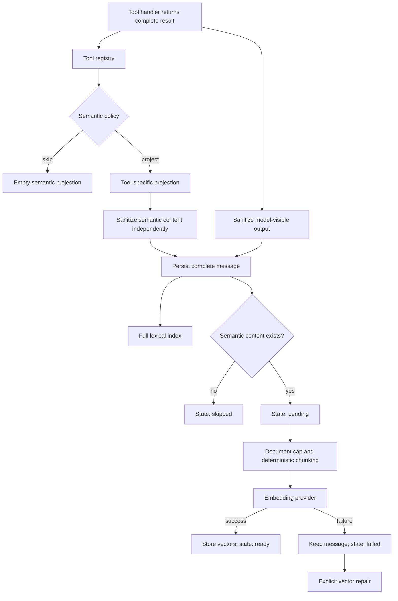

# Morph Semantic Tool Indexing Study Guide

## 1. Why this document exists

This guide explains how Morph turns session messages and selected tool results into vector-searchable content without
sending unbounded inputs to embedding providers or weakening the reliability of an agent turn.

The change was prompted by a browser snapshot that completed successfully but was followed by an embedding failure.
In the observed incident, a snapshot-related tool message of roughly 14,434 characters exceeded the local Ollama
embedding runtime's 2,048-token processing capacity, so `/api/embeddings` returned an error. The completed design plan
records the 14,434-character regression case in its test plan.

The browser was not the real problem. It exposed two broader design issues:

- Morph treated too many tool result shapes as equally useful semantic documents.
- One large result could become one unbounded embedding input.

A third issue made the failure especially confusing: semantic indexing happened after the useful work, so a later
embedding error could make a completed turn appear to have failed.

Historical implementation context confirms that the earlier pipeline reused the same complete search row for lexical
and vector input, then reported a required vector error after durable message persistence had already succeeded. That
combination produced noisy inputs and partial-success semantics that a caller could not safely retry. (session history)

## 2. The shortest useful mental model

> Morph stores the complete sanitized tool result, indexes that result lexically, and embeds only an explicit, bounded
> semantic projection chosen by that tool.

For a browser snapshot, this means:

```text
Complete sanitized result
  URL, title, accessibility nodes, element refs, tab ID, generation, control metadata

Lexical representation
  The complete sanitized stored result, useful for exact terms and identifiers

Semantic projection
  URL, title, roles, names, values, and descriptions

Vector inputs
  Deterministic UTF-8 chunks, each within the configured byte limit
```

The projection does not replace the result. It is a separate internal representation optimized for semantic recall.

## 3. Four representations of one result

One successful tool call can produce four related representations:

| Representation | Purpose | What it contains |
| --- | --- | --- |
| Model and transcript content | Conversation continuity and user visibility | The complete sanitized tool-result envelope |
| Lexical body | Exact keyword, identifier, and metadata search | The complete persisted message content |
| Semantic content | Meaningful vector-search source | A deterministic tool-specific projection |
| Vector chunks | Byte-bounded embedding and retrieval | Bounded slices of semantic content |

This separation prevents one concern from distorting another.

If Morph replaced the stored result with the projection, the transcript would lose useful details. If it used the full
result for vectors, IDs, flags, transport structure, and repeated search payloads would distort similarity. If it sent
the whole projection as one embedding input, a browser snapshot or command result could still exceed a provider's
capacity.

The message model therefore stores both `Content` and `SemanticContent`. Search rows similarly contain a full `Body`
and an optional `SemanticBody`.

The role determines how these fields are used:

- User and ordinary assistant prose use the message content for both lexical and semantic search.
- Assistant tool-call arguments remain lexically searchable but are not embedded.
- Tool messages use complete content for lexical search and persisted semantic content for vector search.

## 4. Architecture at a glance



The boundaries are intentional:

1. Permission checks decide whether the tool may run.
2. The semantic policy decides whether successful output is useful for vector search.
3. Output safety independently sanitizes the complete result and the projection before persistence.
4. Persistence commits the durable message, lexical rows, and initial vector state.
5. Embedding happens after the durable message boundary.
6. Repair reconciles vector state without rerunning the tool.

Permission and semantic eligibility are independent. Allowing `browser + read` does not mean every browser response
should be embedded. Conversely, selecting a projection never grants permission to execute the tool.

## 5. Explicit semantic policy on every tool

Every `tools.Definition` must declare a `SemanticIndexPolicy`.

There are two valid choices:

```go
SemanticIndex: tools.SkipSemanticIndex()
```

or:

```go
SemanticIndex: tools.ProjectSemanticIndex(projectSemanticContent)
```

The mode's zero value is `unset`, and it is invalid. Registration also rejects an unknown mode, a `project` policy
without a projector, and a `skip` policy that supplies one.

This is a deliberate fail-closed contract. A new tool cannot silently inherit generic indexing behavior. Its author
must decide whether the result contains durable semantic meaning or is control-oriented, duplicative, or mostly
metadata.

Projection runs only after permission checks and successful tool execution. It does not run for permission denials,
handler failures, structured tool errors, or skipped definitions.

The registry places projected text in `tools.Result.SemanticContent`, leaving `tools.Result.Output` unchanged. The
agent then sanitizes both values independently before creating the durable tool message.

## 6. What Morph projects and skips

The built-in catalog favors content that a user may later want to rediscover by meaning.

### Projected results

| Tool | Semantic content |
| --- | --- |
| `read_file` | File path and file content |
| `run_command` | Standard output and standard error |
| `process` | Standard output and standard error for the `read` action only |
| `search_files` | Matched path, line number, and text |
| `web_extract` | Title, URL, content/text, summary, and description |
| `web_search` | Result title, URL, and snippet |
| `browser` | Snapshot URL/title and readable accessibility fields, or console level/text |

Action-sensitive tools may declare `project` while returning an empty projection for control variants. For example,
browser lifecycle, tab, navigation, interaction, and artifact actions are not embedded. Only snapshot and console
content are eligible. Process start, status, stop, and list results are also empty; only process output read from an
existing process is projected.

### Skipped results

Morph skips automation management, file listings, file mutation acknowledgements, patches, plan state, time output,
session-message retrieval, session search, and memory management/search results.

These results usually fall into one of four categories:

- control state rather than durable knowledge;
- acknowledgements and identifiers;
- mutation metadata;
- content already indexed at its canonical source.

Session and memory search results are a particularly important skip case. Embedding a search result would duplicate
the underlying messages or memories and could recursively index copies of previously retrieved content.

Projectors must follow the actual result contract. A projector that assumes lowercase JSON fields when a result
marshals uppercase Go field names can silently produce an empty projection. Tests therefore invoke real result shapes,
not only hand-written JSON that happens to match the projector.

## 7. Size-aware, UTF-8-safe chunking

The vector configuration adds two byte limits:

```yaml
search:
  vector:
    maxInputBytes: 2048
    maxDocumentBytes: 32768
```

`maxDocumentBytes` caps how much semantic text from one row is eligible for vectors. `maxInputBytes` caps each
individual embedding input. Zero selects the defaults, negative values are invalid, and the document limit must not
be smaller than the input limit.

Morph uses bytes rather than tokens because it supports embedding providers with different tokenizers. A byte limit
is provider-independent and easy to enforce before an external request, but operators must still choose limits that
fit their provider. It is conservative rather than perfectly token-efficient.

The chunker proceeds in this order:

1. Trim empty surrounding whitespace.
2. Truncate at the document byte limit without splitting a UTF-8 rune.
3. Prefer a paragraph boundary within the input limit.
4. Fall back to line, carriage-return, tab, then space boundaries.
5. Use a UTF-8-safe hard split when no natural boundary exists.
6. Discard empty chunks and continue without overlap.

Very small limits receive special care. If the configured limit falls inside the first multibyte rune, the chunker
advances by one complete rune instead of stalling. A final invariant immediately before provider invocation rejects
any resulting input that still exceeds the configured limit. This turns an impossible configuration into an
observable failed source rather than an infinite loop or an oversized request.

## 8. Stable source, row, and chunk identity

Every vector input receives an ID with message, row, and chunk identity:

```text
session_message:{sessionID}:{messageID}:row:{rowNumber}:chunk:{chunkNumber}
```

For example:

```text
session_message:default:42:row:1:chunk:3
```

The source remains message-level:

```text
session_message:default:42
```

This distinction lets Morph address one chunk precisely while treating every chunk derived from a message as one
repair and deduplication unit.

When a vector match is read, Morph verifies the source prefix, parses the row and chunk ordinals, reconstructs the
current semantic rows, rechunks with the effective limits, and checks the stored content hash. Malformed IDs,
wrong-source IDs, impossible indices, legacy row-only IDs, and stale hashes are not accepted as current matches.

A large message may have several strong chunk matches. Search collapses those matches to one message result and keeps
the strongest matching chunk as `MatchedText`. Large documents therefore do not crowd smaller messages out of the
result set merely because they own more vectors.

## 9. Persistence and the vector lifecycle

Each message source has one lifecycle state:

| State | Meaning |
| --- | --- |
| `pending` | Semantic input exists, but indexing has not completed |
| `ready` | The expected vector inputs were embedded and stored successfully |
| `failed` | An online or repair attempt failed |
| `skipped` | The message has no eligible semantic input |

State also records the attempt count, a safe error kind, update time, session ID, and message ID. SQLite stores this in
`session_vector_index_states`; the memory store keeps the equivalent map.

For SQLite, message rows, full-text rows, and initial `pending` or `skipped` states are written in one transaction. If
the initial state cannot be persisted, the append rolls back. After that transaction commits, Morph performs embedding
and vector upsert, then changes eligible states to `ready` or `failed`.

This transaction boundary explains the new failure behavior. Once a message and lexical index have committed, an
embedding error cannot undo them. Returning an append failure would be misleading and could cause callers to retry a
message that already exists.

Morph therefore logs online indexing errors, marks the source failed where possible, and returns success for the
persisted message. This remains true when `search.vector.required` is enabled. `required` still applies to vector
initialization/readiness and explicit repair, but it does not retroactively invalidate a completed turn.

Deleting a session or clearing its messages also removes the corresponding lifecycle state and vector records.

## 10. Repair uses both lifecycle and freshness

Lifecycle state and vector correctness answer different questions:

- State answers whether a source should be retried.
- IDs and hashes answer whether stored vectors match the persisted semantic content.

A `failed` source remains retryable even if vector records happen to exist. A `ready` source is still dirty if records
are missing, stale, malformed, or unexpected. Neither signal replaces the other.

Repair reloads the durable message and its persisted `SemanticContent`. It does not rerun the original tool projector
or reparse historical tool JSON. This makes repair independent of the live registry and ensures it rebuilds what was
approved and stored at message creation time.

For each dirty source, repair:

1. Recreates bounded vector inputs from persisted semantic content.
2. Embeds the new inputs.
3. Deletes the source's old vector set.
4. Writes the current vector records.
5. Marks the source `ready` or `failed`.

Embedding happens before old records are deleted, so a provider failure does not destroy an existing stale vector
set. The repair result now reports `attempted sources`, `recovered sources`, and `still failed sources`, alongside the
existing scanned, missing, stale, rebuilt, deleted, and batch counters. These fields flow through the domain result,
RPC response, client mapping, and `morph session repair` output.

Legacy row-only vector IDs may be removed as unexpected records during repair. This is cleanup of an encountered
source, not a migration that recreates historical semantic projections.

## 11. Worked browser snapshot example

Consider the prompt:

```text
List the tabs and take an accessibility snapshot.
```

The expected flow is:

1. The model invokes browser `tabs`. It is a control result, so its projection is empty.
2. The model invokes browser `snapshot`.
3. The browser handler returns snapshot JSON, which output safety sanitizes before persistence.
4. The projector keeps URL, title, roles, names, values, and descriptions.
5. Tab IDs, element references, generations, and control metadata remain in the complete sanitized result but not the
   projection.
6. Morph sanitizes the result and projection independently.
7. One durable tool message stores both representations.
8. The complete sanitized JSON enters lexical indexing.
9. The projection is capped and split into deterministic byte-bounded chunks.
10. Each chunk is embedded separately and stored under a stable chunk ID.
11. Later vector search returns at most one result for the message, using its best matching chunk as the snippet.

If Ollama is unavailable or rejects an input, steps 1 through 8 remain successful. The source becomes `failed`, logs
record safe diagnostics, and a later repair can retry it. The user does not lose the browser result because an internal
retrieval enhancement failed afterward.

## 12. Observability without content leakage

Tool completion logs and traces report whether semantic content was `projected` or `skipped`, plus its byte count.

Vector indexing diagnostics include:

- embedding model;
- safe source IDs and tool names;
- source and chunk counts;
- configured input and document limits;
- largest input size;
- truncated-source count;
- attempt increment and lifecycle status;
- safe error classification.

They do not log the semantic content itself. This is important because projections can contain file contents, command
output, web pages, console text, or browser page data.

The status field is named `semantic_projection_status`, not semantic index status. At tool completion the system knows
whether it created a projection; indexing happens later and has its own lifecycle state.

## 13. Source map

| Concern | Primary source |
| --- | --- |
| Semantic policy and projector helpers | `internal/tools/registry.go` |
| Policy validation and projection execution | `internal/tools/registry_default.go` |
| Independent output sanitization and tool messages | `internal/agent/agent.go` and `internal/agent/turn.go` |
| Persisted semantic message content | `pkg/agent/message/message.go` |
| Lexical/semantic row separation and vector ID parsing | `internal/state/search/message_index.go` |
| Deterministic bounded chunking | `internal/state/search/vector_chunk.go` |
| Vector input construction and diagnostics | `internal/state/search/vector_input.go` |
| Lifecycle states | `internal/state/search/vector_status.go` |
| Repair result and freshness helpers | `internal/state/search/vector_repair.go` |
| In-memory lifecycle, indexing, and repair | `internal/state/storememory/session.go`, `vector.go`, and `repair.go` |
| SQLite lifecycle, indexing, and repair | `internal/state/storesqlite/session.go`, `vector.go`, and `repair.go` |
| Vector configuration and defaults | `internal/config/retrieval.go` and `internal/constants/search.go` |
| Repair RPC contract | `internal/rpc/proto/morph.proto` |
| Repair CLI presentation | `cmd/session/output.go` |
| Tool and vector trace payloads | `internal/trace/payloads.go` |

## 14. Contributor checklist

When adding or changing a tool:

1. Decide explicitly whether its result should be skipped or projected.
2. Skip control state, acknowledgements, identifiers, mutation metadata, and copies of already indexed data.
3. Project stable human-readable meaning from successful output only.
4. Use the actual handler result contract, including its real JSON field names and action variants.
5. Exclude transport envelopes, cursors, IDs, handles, timestamps, and state flags unless they carry genuine meaning.
6. Return an empty projection for non-content actions of a projected tool.
7. Test the projector using a real handler-shaped result.
8. Keep catalog parity tests updated so an unset policy cannot ship.
9. Verify large and multibyte output remains deterministic under the document and input limits.
10. Confirm denied and failed calls produce no semantic content.

## 15. Trade-offs and boundaries

- Byte limits are portable but less precise than provider-specific token counting.
- Content beyond `maxDocumentBytes` is absent from vectors but remains in the transcript and lexical index.
- Persisted projections make repair deterministic, but projector changes affect new messages only.
- Assistant tool-call arguments remain exact-searchable but intentionally do not influence semantic recall.
- Skipping session and memory search results reduces duplication, but similarity search does not target the wording of
  those rendered result envelopes.
- A durable message may temporarily have `failed` vector state. This is intentional, observable eventual consistency.
- Memory-item embedding is unchanged because durable memory has its own semantic indexing contract.
- Context-window compaction is a separate concern. Bounded embedding inputs do not by themselves reduce model context.

## 16. Related reading

- [Browser Automation Study](./browser-automation-study.md), including how accessibility snapshots are produced.
- [Permission System Study](./permissions-system-study.md), including tool authorization before invocation.
- [Search and Traces](../website/docs/docs/guides/search-and-traces.md), for operator-facing search behavior.
- [Sessions](../website/docs/docs/concepts/sessions.md), for the durable session model.
- [Session Guide](../website/docs/docs/guides/sessions.md), for repair commands and workflows.
- [Configuration Reference](../website/docs/docs/reference/config.md), for vector limits and `required` behavior.
- [Local Models](../website/docs/docs/guides/local-models.md), for local embedding setup and model changes.
- [Semantic Tool Indexing Plan](../.plan/semantic-tool-indexing.md), for the original requirements and delivery units.
