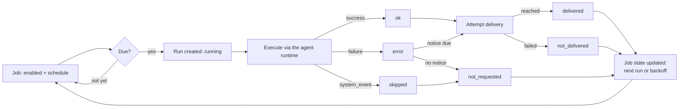

# Automation

Automation lets Morph run on a schedule instead of only when you send a message: a recurring check-in, a one-shot
reminder, or a daily summary. The daemon owns a scheduler that evaluates due work, runs it through the normal agent
runtime, and optionally delivers the result somewhere.

This page explains the model. For hands-on setup, see the [Automation Guide](../guides/automation); for every
command and field, see the [Automation Reference](../reference/automation); for diagnosing a job that misbehaved,
see [Automation Operations](../operations/automation).

## Three Separate Things

Automation deliberately splits one idea ("a scheduled task") into three persisted pieces. Confusing them is the
most common source of automation questions, so keep them distinct from the start:

| Piece | What it is | Lives where |
| --- | --- | --- |
| **Job** | The durable definition: name, schedule, prompt, profile, session target, delivery config | One row per job (`auto_…` id) |
| **Job state** | Mutable scheduler bookkeeping attached to the job: next run time, whether it's currently running, last status/error/duration | Embedded in the job row, overwritten on every run |
| **Run** | An immutable record of one execution: status, output, error, session, delivery outcome | One row per execution (`autorun_…` id), kept as history |

A job is what you configure. Job state is what the scheduler updates to decide *when to act next*. A run is the
audit trail of *what already happened*: you can list a job's runs to see its history even after the job itself is
paused or removed.

## Schedules

A job's schedule determines when it becomes due. Three kinds are supported:

| Kind | Example | Behavior |
| --- | --- | --- |
| `at` | an RFC3339 timestamp | Runs once. After it fires, the job has no next run. |
| `every` | `every 30m` | Runs repeatedly. The next run is anchored to the *last run's* end time, not a fixed clock slot. |
| `cron` | `0 9 * * *` (five fields) | Runs on a cron schedule, optionally in a specific timezone. |

:::note[`every` drifts with when the job actually runs, not the clock]
An `every 1h` job that fires at 10:15 runs next at 11:15, not at the top of the hour. If you need a fixed
wall-clock slot (e.g. "always at 09:00"), use `cron` instead.
:::

Cron expressions resolve their timezone in this order: an explicit `TZ=<zone>` prefix on the expression itself,
then the daemon's configured default timezone, then the server's local system timezone as a last resort. The
resulting run time is stored in UTC, but displayed in that same timezone wherever the job's next run is shown.

## Execution

A due job runs through the **same agent runtime** used for an interactive chat turn: the same model call and tool
execution loop, not a separate lightweight executor. What differs is how that turn is set up:

- **Profile**: which profile's config, credentials, and tools the run uses.
- **Overrides**: a job can override model, provider, base URL, tool groups, max iterations, timeout, and retry
  behavior for just that run, without touching your interactive session's config.
- **Session target**: which conversation the run writes into.

### Permission Policy Is a Prerequisite

Before a due job's agent turn starts, the scheduler checks permission policy for an `automation` actor executing
`resources: [automation]`, `actions: [execute]` on the job's ID. The `ask` and `approve` presets deny the `automation`
surface kind, as does the default `custom` policy, so **every scheduled run is denied outright** because there's no
interactive owner around to answer an `ask`, and `deny` doesn't wait for one. A job you create will sit there failing
on schedule until you use `permissions.preset: custom` with an explicit rule.

That rule only authorizes the run to *start*. Once inside, the job's prompt drives the same tool registry as any
other turn and is still authorized as the `automation` actor. Each tool call needs an applicable rule for its
operation. For example, a job that reads files, accesses the web, writes files, or runs commands needs additional,
narrower rules for those actions:

```yaml
permissions:
  preset: custom
  default: deny
  surfaceKinds:
    local: ask
    gateway: deny
    automation: deny
    rpc: deny
  rules:
    - name: allow scheduled job execution
      actors: [automation]
      surfaces: [automation]
      resources: [automation]
      actions: [execute]
      effects: [execution, external_system]
      decision: allow
      reason: scheduled jobs are expected to run
    - name: allow scheduled job to write its report
      actors: [automation]
      surfaces: [automation]
      resources: [file]
      actions: [update]
      targetPrefixes: ["/srv/reports/"]
      decision: allow
      reason: scheduled report job writes its output file
```

See [Permissions: Custom Policy Rules](./permissions#custom-policy-rules) for the full rule schema, and
[Troubleshooting: Permissions and Approvals](../guides/troubleshooting#permissions-and-approvals) if a previously
working job starts failing after a policy change.

### Session Targets

| Target | Where the run's messages go |
| --- | --- |
| `isolated` (default) | A brand-new session created just for this run. Keeps automation output out of your regular chat. |
| `main` | The default session (the same one your everyday TUI/CLI conversation uses). |
| `current` / `origin` | Whatever session is currently active for the profile at run time. |
| `session:<id>` | A specific, named session, reused on every run. |

:::note[`current` and `origin` behave identically today]
Both resolve to "whatever the active session is right now." There is no separate origin-tracking behavior yet.
Treat them as the same target when reading job configuration.
:::

:::warning[`system_event` payloads don't do anything yet]
Jobs support a `prompt` payload (a normal agent turn) and a `system_event` payload. `system_event` is reserved for a
future "wake the thread with a reminder" flow. Today it just produces a `skipped` run with no agent turn. Don't
build an automation around it expecting output.
:::

## Delivery Is a Separate Outcome From Execution

A run finishing successfully and its output *reaching somewhere* are two different claims. A run can succeed and
still fail to deliver (for example, a webhook endpoint that's down), and that failure is recorded independently of
the run's own status.

| Mode | What happens |
| --- | --- |
| `none` | Nothing beyond the run record. |
| `local` | No external call: the persisted run record *is* the delivery. |
| `origin` | Sent back to the channel/thread the job's context came from. |
| `gateway` | Sent to an explicit Telegram or Slack channel and target. |
| `webhook` | HTTP POST to a configured URL. |

:::tip[`local` still counts as "delivered"]
It's tempting to read `local` as "no delivery," but the scheduler treats the persisted run record itself as a
successful delivery. Only `none` produces a `not_requested` status.
:::

Delivery is only attempted for a successful (`ok`) run. A failed (`error`) run instead attempts a **failure
notice** (a separate, optional, threshold-gated alert), and a `skipped` run never attempts delivery at all.

| Run status | Meaning |
| --- | --- |
| `running` | In progress. |
| `ok` | Finished successfully; eligible for normal delivery. |
| `error` | Failed; may trigger a failure notice instead. |
| `skipped` | No agent turn happened (e.g. a missed catch-up, or a `system_event` payload). |

| Delivery status | Meaning |
| --- | --- |
| `delivered` | Reached its destination (including `local`). |
| `not_delivered` | Delivery was attempted and failed. |
| `not_requested` | No delivery was needed for this run (`none` mode, or a non-`ok` status). |
| `unknown` | Reserved for compatibility; not produced by current execution paths. |

A run that fails doesn't stop the job: its next attempt is delayed with increasing backoff, and it keeps trying
indefinitely. A job whose *schedule itself* becomes invalid (for example, a broken cron expression) is different: it
disables itself after a few consecutive evaluation failures rather than retrying forever. See
[Automation Operations](../operations/automation) for the exact thresholds and how to recover either case.

## Lifecycle at a Glance



Pausing a job (`enabled: false`) stops it from being scheduled without deleting its definition or run history;
resuming makes it eligible again on its next due time.

## Where To Go Next

- [Permissions](./permissions): the actor/policy model a scheduled run must clear before it starts.
- [Automation Guide](../guides/automation): create, inspect, pause, resume, and remove jobs, with delivery examples.
- [Automation Reference](../reference/automation): every command, flag, schedule form, and status value.
- [Automation Operations](../operations/automation): startup recovery, retries, backoff, and diagnosing a stuck job.
- [Automation System](../development/automation-system): scheduler, execution, and delivery internals for contributors.
- [Daemon and RPC](./daemon-and-rpc): how the daemon that owns the scheduler fits into the rest of Morph.
- [Tools](./tools): the owner-only tool that lets the agent manage automations conversationally.
