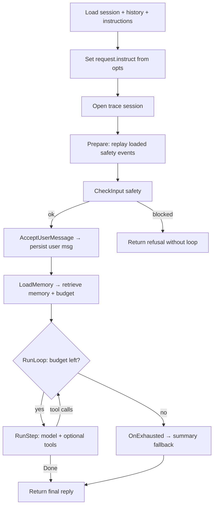

# Agent Loop

This page explains how Morph executes one **turn**: the path from an inbound user message through prompt assembly, model
inference, optional tool calls, streaming events, and persistence. It is written for contributors who need to follow or
change runtime behavior.

For package boundaries and how the daemon wires dependencies, start with [Development Architecture](./architecture).
For the user-facing tool model, see [Tools](../concepts/tools). The [Learning Path](../getting-started/learning-path)
Contributor track lists this page as step two after architecture.

## Entry Points

Every chat turn — RPC, TUI, gateway, or `morph --chat` — eventually calls the same method:

```text
internal/agent.Agent.Respond(ctx, message, opts)
  └─ internal/agent.Turn.Run(ctx, message, opts)
       └─ pkg/agent.RunTurnLifecycle(ctx, message, opts, lifecycle)
            └─ pkg/agent.RunLoop(ctx, LoopOptions)
```

| Layer | File | Role |
| --- | --- | --- |
| RPC adapter | `internal/rpc/service.go` | Maps `MorphService.Respond` to `Agent.Respond`; streams `RespondEvent` messages |
| Agent service | `internal/agent/agent.go` | Validates runtime, constructs a `Turn`, runs it, optionally generates a session title |
| Turn orchestration | `internal/agent/turn.go` | Morph-specific lifecycle hooks, model calls, safety, compaction, tool dispatch |
| Generic lifecycle | `pkg/agent/turn_lifecycle.go`, `pkg/agent/turn.go` | Provider-agnostic hook ordering and iteration budget consumption |

The RPC handler always enables trace fanout (`TraceEvents: true`) and forwards `OnEvent` callbacks to the gRPC stream.
Gateway dispatch reuses the same `Agent.Respond` path described in [Gateway Internals](./gateway-internals).

:::info Two agent packages
Production turns run through **`internal/agent/turn.go`**, not through `pkg/agent.Agent.Respond` directly.
**`pkg/agent`** owns the reusable lifecycle/loop primitives (`RunTurnLifecycle`, `RunLoop`, `ExecuteToolCalls`) and a
small reference `Agent` used by package tests and embedders. That reference agent defaults to **8** iterations; the
daemon uses profile config instead — see [Iteration budget](#iteration-budget).
:::

## Turn Lifecycle

`Turn.Run` delegates to `pkg/agent.RunTurnLifecycle`, which runs hooks in a fixed order and only enters the model/tool
loop when preflight checks pass.



### Lifecycle hooks

| Hook | Implementation | What happens |
| --- | --- | --- |
| `Load` | `Turn.load` | Resolve session; load summary state and messages from the summary tail offset; load base instructions; hydrate plan state from history |
| `SetRequestInstruction` | closure in `Run` | Stores per-request `opts.Instruct` as `request.instruct` |
| `Open` | closure in `Run` | Opens a trace session; optionally wraps it for live trace fanout when `TraceEvents` and `OnEvent` are set |
| `Prepare` | closure in `Run` | Replays loaded content-safety trace events; records plan hydration when a plan was restored from history |
| `CheckInput` | closure in `Run` | Runs input guardrails; blocked input returns a refusal **without** entering the loop or persisting the user message |
| `AcceptUserMessage` | closure in `Run` | Appends and persists the user message; records `user.message.accepted` |
| `LoadMemory` | closure in `Run` | Retrieves memory instructions; creates the iteration budget; resolves streaming mode |
| `ConsumeIteration` | closure in `Run` | Decrements the per-turn iteration budget before each `RunStep` |
| `RunStep` | closure in `Run` | One model request and optional tool execution (see below) |
| `OnExhausted` | `Turn.summaryFallback` | When the budget is spent, one final non-tool model call asks for a wrap-up summary |

Hook ordering is defined in `pkg/agent/turn_lifecycle.go`. Morph-specific behavior lives in the closures wired from
`internal/agent/turn.go`.

:::note
`RunTurnLifecycle` is deliberately small: it orders hooks and then calls `RunLoop`. It does not know about profiles,
memory, traces, RPC, or model providers. Those concerns stay in `internal/agent`.
:::

## Loading Turn State

`Turn.load` prepares everything needed before the first model call:

1. **Session resolution** — `sessionStore.Resolve(ctx, opts.SessionID)`.
2. **Summary state** — loaded via `internal/agent/context/summary`; determines the message tail offset so summarized
   history is not re-sent verbatim.
3. **Message history** — `GetMessages` from the tail offset into `sessionHistory`.
4. **Base instructions** — from the prompt provider (`internal/environment` via `NewPromptProvider`). Instruction
   composition order is documented in [Prompt Assembly](./prompt-assembly).
5. **Plan hydration** — if a plan was stored in session history, plan state is restored and traced in `Prepare`.

At the end of load, the turn holds in-memory history, summary recall state, token counts (`lastPromptTokens`), and a
fresh `runcontext.Context` for trace and tool identity.

## Memory and Iteration Budget

`LoadMemory` runs once per turn, after the user message is accepted:

- **Memory retrieval** — `retrieveMemoryInstruction` (`internal/agent/memory_retrieval.go`) loads pinned and searched
  memory when enabled, sanitizes values, and renders a `memory.context` instruction block. Failures are traced but do
  not abort the turn. See [Memory System](./memory-system).
- **Iteration budget** — `newIterationBudget()` reads `session.maxIterations` from the environment-backed config
  (default **90**, from `constants.DefaultMaxIterations`). Each `RunStep` consumes one unit before dispatch.
- **Streaming** — defaults to profile `models.main.stream`; `RespondOptions.Stream` overrides when non-nil.

Configure the limit in profile YAML or with `morph config set session.maxIterations <n>`. The [Config Reference](../reference/config)
documents the key.

## One Loop Step (`RunStep`)

Each iteration performs the same sequence. Tool availability is recomputed **every step**, so capability or config
changes on a restarted daemon show up on the next turn, not mid-turn.

### 1. Resolve tools

`availableToolDefinitions` calls the environment tool registry with the active policy (`cap.*` switches and subsystem
gates). See [Tools](../concepts/tools) and [Tools Runtime](./tools-runtime).

### 2. Build the model request

```go
model.Request{
  Model, API, Instructions: buildRequestInstructions(tools),
  Messages: Context(), Tools: availableToolDefinitions,
}
```

`buildRequestInstructions` assembles the system prompt in a fixed order: plan context, session summary instructions,
retrieved memory, environment/tool context, per-request `instruct`, and any extra blocks (for example summary fallback).
Details belong in [Prompt Assembly](./prompt-assembly).

`Context()` merges summary prefix messages, trimmed session history, and messages emitted during this turn
(`internal/agent/context` builder).

### 3. Summary refresh and compaction

Before the model call, `maybeRefreshSummary`:

- may flush memory before compaction (`maybeFlushMemoryBeforeCompaction`);
- calls `summaryService.MaybeRefreshSummary` when the context message count has grown;
- trims in-memory `sessionHistory` to the new summary tail.

This can change both `Instructions` and `Messages` for the same step. Preflight compaction is traced; token usage from
the previous model response drives refresh decisions. Compaction policy is shared with [Session Storage](./session-storage).

### 4. Model inference

The turn calls either `CompleteStream` or `Complete` on the configured model client. The request/response contract is
defined in `pkg/agent/model`; `internal/model` aliases that contract for provider implementations.

| Mode | When | Client behavior |
| --- | --- | --- |
| Streaming | `streamingEnabled == true` | `CompleteStream`; each non-empty delta invokes `opts.OnEvent` with `EventKindTextDelta` and a channel (`assistant` or `reasoning`) |
| Blocking | otherwise | `Complete`; full response returned at once |

Trace events record the request shape (`model.request`), response metadata without assistant text (`model.response`),
and postflight token counts (`context.postflight.usage_recorded`). Prompt tokens also update `session.lastPromptTokens`
in storage.

Model provider wiring is covered in [Model Providers](./model-providers).

### 5. Final assistant reply (no tool calls)

When `RequiresToolCalls` is false:

1. **Output safety** — `applyAssistantOutputSafety` runs for non-streaming responses when output safety is enabled.
   Streaming turns skip server-side assistant output scanning because clients receive deltas as they arrive.
2. **Persist** — assistant message appended via `appendSessionMessages`.
3. **Trace** — `final.assistant.response`.
4. **Return** — `LoopDecision{Done: true, Reply: reply}` ends the loop.

### 6. Tool call path

When the model requests tools:

1. Persist an assistant message containing the tool calls.
2. **`executeToolCalls`** — delegates to `pkg/agent.ExecuteToolCalls`:
   - `BuildToolCallBatches` groups consecutive `ParallelSafe` tools;
   - parallel batches run concurrently with shared cancellation;
   - sequential tools run one at a time.
3. For each call, `executeToolCall` records `tool.invocation.started` / `tool.invocation.completed`, attaches a trace
   recorder to the tool context, and invokes through `invokeToolWithEnvironment` (production) or the registry adapter.
4. Tool results are sanitized (`sanitizeToolOutputForModel` in `agent.go`) before being returned to the model.
5. Persist tool messages and continue the loop (`LoopDecision{}` with `Done: false`).

Structured tool errors such as unknown tools, denied commands, and handler failures become normal tool messages so the
model can recover. User-facing behavior is described in [Tools](../concepts/tools#how-a-tool-call-runs).

## Iteration Budget

The loop in `pkg/agent/turn.go` calls `Consume()` before each `RunStep`. When the budget reaches zero, `OnExhausted`
runs instead of another tool/model iteration.

Morph's `summaryFallback`:

- builds a final request with `instruct.BuildSummary(remaining)` and **no tools**;
- requires a plain-text completion (tool calls are an error);
- applies output safety, persists the assistant message, and records `final.assistant.response`.

If the fallback model call fails, the turn returns an error wrapping the underlying failure.

:::tip Debugging short turns
For local experiments, lower `session.maxIterations` or pass `--max-iterations` on one-shot chat commands. The reference
`pkg/agent.Agent` uses a much smaller default (**8**) and returns a plain exhaustion error; production `internal/agent`
uses `summaryFallback`.
:::

## Streaming and Trace Events

`RespondOptions` (`pkg/agent/agent.go`) controls per-turn client behavior:

| Field | Purpose |
| --- | --- |
| `Instruct` | One-turn guidance merged into instructions as `request.instruct` |
| `SessionID` | Target session (empty uses the active session) |
| `Stream` | Optional override for streaming vs blocking completion |
| `TraceEvents` | When true with `OnEvent`, trace events are fanout-wrapped |
| `OnEvent` | Callback for `text_delta` and `trace_event` payloads |

Event kinds:

- **`text_delta`** — assistant or reasoning stream chunks (`EventKindTextDelta`).
- **`trace_event`** — persisted trace events mirrored live (`EventKindTrace`).

The RPC layer maps these to `RespondEvent` protobuf messages. When the model is not streaming, the RPC service sends one
assistant `TEXT_DELTA` with the final reply before `DONE`. Event names and payloads are listed in
[Trace Events](../reference/trace-events); the RPC shape is in [RPC Reference](../reference/rpc).

The TUI renders inline tool and trace activity; see [TUI](./tui).

## Safety Checkpoints

| Stage | Location | Behavior |
| --- | --- | --- |
| Input | `CheckInput` in `Run` | Blocks before the user message is persisted; returns `RefusalMessage` |
| Loaded content | `Prepare` | Replays prior blocked-content trace events into the turn trace |
| Assistant output | `applyAssistantOutputSafety` | Redacts/blocks non-streaming final text |
| Tool output | `sanitizeToolOutputForModel` | Scans untrusted tool output before the model sees it |
| Memory writes | tool handlers | Separate scans before durable storage |

Operator-facing policy overview: [Safety and Guardrails](../concepts/safety-and-guardrails).

:::warning
Streaming assistant text is emitted before a complete final answer exists, so server-side output safety only applies to
non-streaming assistant responses. Tool output and user input safety still run on the server side.
:::

## Cancellation

The turn respects `context.Context` cancellation:

- checked at the start of each `RunStep`;
- checked before each tool invocation;
- checked in `summaryFallback`.

Canceled turns record `session.failed` on the trace session and return `context.Canceled` (or deadline exceeded) to the
caller. RPC clients should cancel the stream context to abort in-flight model or tool work.

## Persistence

Messages and metrics written during a turn:

| When | What | Store API |
| --- | --- | --- |
| User accepted | User message | `sessionStore.AppendMessages` |
| Tool iteration | Assistant tool-call message | same |
| Tool iteration | Tool result messages | same |
| Final reply | Assistant text | same |
| After each model response | `lastPromptTokens` | `sessionStore.UpdateLastPromptTokens` |
| Summary refresh | Updated summary state | summary service → [Session Storage](./session-storage) |
| Trace fanout | Timeline events | trace session → SQLite / JSONL per profile trace settings |

All session writes go through the `agentsession.Store` adapter backed by `internal/state/manager` and
`data/state.db`. Backup implications: [Backups and State](../operations/backups-and-state).

After a successful turn, `Agent.Respond` may generate a session title from the new messages (best-effort, non-blocking
for the reply).

## Code Map

| Concern | Primary files |
| --- | --- |
| Turn lifecycle wiring | `internal/agent/turn.go` (`Run`, `load`, `RunStep` closures) |
| Generic loop | `pkg/agent/turn_lifecycle.go`, `pkg/agent/turn.go` |
| Model contract | `pkg/agent/model/types.go`; aliases in `internal/model/types.go` |
| Tool batching | `pkg/agent/agent.go` (`ExecuteToolCalls`, `BuildToolCallBatches`) |
| Tool invocation adapter | `internal/agent/agent.go` (`invokeToolWithEnvironment`) |
| Memory retrieval | `internal/agent/memory_retrieval.go` |
| Prompt/context assembly | `internal/agent/turn.go` (`buildRequestInstructions`, `Context`) |
| RPC streaming | `internal/rpc/service.go` (`Respond`, `eventToProtoRespondEvent`) |
| Iteration budget factory | `internal/environment/environment.go` (`NewIterationBudget`) |

When changing loop behavior, start in `internal/agent/turn.go` and only move logic into `pkg/agent` if it is genuinely
provider-agnostic.

## Where To Go Next

Pages that link here for deeper reading:

- [Development Architecture](./architecture) — repository layout, daemon assembly, and the orchestration vs core loop split.
- [Tools](../concepts/tools) — built-in tools, capabilities, guardrails, and how calls appear in the UI.
- [Learning Path](../getting-started/learning-path) — contributor reading order.

Conceptual background for turn inputs and outputs:

- [Sessions](../concepts/sessions) — session identity, history, and summaries loaded at the start of each turn.
- [Daemon and RPC](../concepts/daemon-and-rpc) — how clients reach `MorphService.Respond`.

Related internals:

- [Prompt Assembly](./prompt-assembly) — instruction and context composition before each model call.
- [Tools Runtime](./tools-runtime) — registry, schemas, and adding tools.
- [Model Providers](./model-providers) — `Complete` / `CompleteStream` clients.
- [Session Storage](./session-storage) — messages, summaries, and compaction persistence.
- [Memory System](./memory-system) — retrieval, flush-before-compaction, and promotion.
- [Gateway Internals](./gateway-internals) — inbound messages that share this loop.
- [TUI](./tui) — rendering streaming text and trace events.

References and operations:

- [RPC Reference](../reference/rpc) — `MorphService.Respond` streaming protocol.
- [Trace Events](../reference/trace-events) — event names emitted during turns.
- [Config Reference](../reference/config) — `session.maxIterations`, streaming, safety, compaction.
- [Contributing](../contributing) — workflow for changes that touch the loop.
- [Testing](./testing) — running the suite (`make test`) after loop changes.
