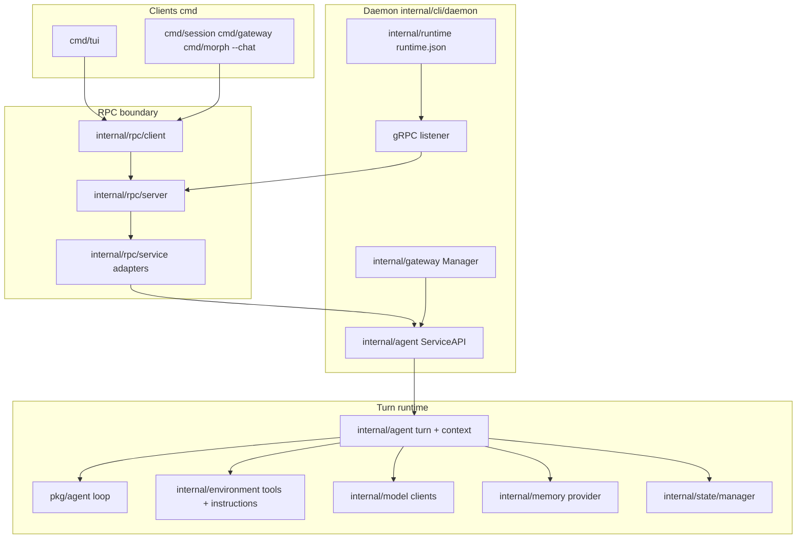

# Development Architecture

This page maps the Morph Go repository for contributors: where commands live, how the daemon assembles the runtime, and
which packages own sessions, memory, tools, gateways, and RPC. For the user-facing runtime model (daemon, clients,
profiles), start with [Architecture](../concepts/architecture). For day-to-day contribution workflow, see
[Contributing](../contributing).

The layout follows a simple rule: **`cmd/`** wires CLI commands, **`internal/`** holds application logic, and **`pkg/`**
holds reusable libraries, with a few intentional cross-imports documented below.

:::info
When adding behavior, start in the owning `internal/` package. `cmd/*` should mostly parse flags, load profile-aware
config, and call the relevant internal service or RPC client.
:::

## Repository Layout

```text
morph/
  cmd/           # urfave/cli command packages (morph, daemon, session, …)
  internal/      # private application code
  pkg/           # shared libraries (agent loop, gateway helpers, TUI markdown, logging)
  website/docs/  # Docusaurus documentation
  Makefile       # build-proto, build, test (CGO + sqlite_fts5)
  AGENTS.md      # contributor notes (tests, naming)
```

The single binary is built from **`cmd/morph`**. Subcommands are implemented in sibling `cmd/*` packages and registered
in `cmd/morph/main.go`.

## Runtime Layers

Morph runs one **daemon per profile**. Clients talk to it over gRPC; the gateway is HTTP on the same process.



**Inbound chat path:** client → `internal/rpc/client` → `MorphService.Respond` → `internal/agent` turn → model +
tools → `internal/state` persistence → streamed events back to the client.

**Gateway path:** platform HTTP → `internal/gateway` dispatch → same `Agent.Respond` / session binding code as RPC
clients. See [Gateway Internals](./gateway-internals).

## Command Packages (`cmd/`)

Each command package exports `NewCommand()` (or `Run` for the root TUI) and stays thin: parse flags, call
`internal/cli` helpers, delegate to RPC or local I/O.

| Package | Command | Role |
| --- | --- | --- |
| `cmd/morph` | `morph` | Root binary: registers subcommands, global flags, `--chat`, default TUI entry |
| `cmd/daemon` | `morph daemon`, `morph daemon status` | Starts daemon lifecycle and reports daemon health |
| `cmd/tui` | `morph` (no subcommand) | Bubble Tea UI; RPC client to daemon |
| `cmd/session` | `morph session …` | Session RPC client |
| `cmd/gateway` | `morph gateway …` | Gateway RPC client |
| `cmd/auth` | `morph auth …` | Reads/writes `internal/credential` store (no RPC) |
| `cmd/profile` | `morph profile …` | Profile selector and `profile init` |
| `cmd/morph/configcmd` | `morph config …` | Config get/set on profile YAML |
| `cmd/doctor` | `morph doctor` | `internal/diagnostics` + readiness |
| `cmd/trace` | `morph trace view` | Local trace JSONL viewer (`internal/trace/inspect`) |

Shared CLI behavior (profile resolution, config load, env preload, daemon bootstrap) lives in **`internal/cli`**, not
in each `cmd/*` package. When adding a flag that affects every command, start in `internal/cli/flags.go` and
`internal/cli/main.go`.

## Daemon Assembly

Daemon code is split across two package layers:

| Package | Role |
| --- | --- |
| `internal/cli/daemon` | Runtime assembly: config reload loop, startup banner, model clients, gateway, RPC server |
| `internal/cli` (`daemon.go`) | Public CLI-facing helpers: daemon status, health probes, one-shot/TUI bootstrap, output suppression |

`internal/cli/daemon` owns the running process:

1. Load and normalize config; build model clients (`internal/model/client`).
2. Construct `internal/agent.Agent` and call `Start`.
3. Open the state store (`internal/state/manager.OpenStore`).
4. Start `internal/gateway.Manager` when enabled.
5. Bind gRPC (`internal/rpc/server`) and write `internal/runtime` metadata (`runtime.json`).

Config file watching and debounced restarts are implemented here; see [Daemon Operations](../operations/daemon#config-reload).
Gateway start/stop without config reload is exposed through RPC (`GatewayService`) and implemented in
`internal/rpc/service.go` + `internal/gateway`.

## Agent: Orchestration vs Core Loop

Morph splits agent code across two packages on purpose:

| Package | Responsibility |
| --- | --- |
| **`pkg/agent`** | Provider-agnostic loop: `Respond`, iteration budget (`RunLoop`), message/session/tool types, streaming events |
| **`internal/agent`** | Morph-specific orchestration: compaction, memory retrieval/flush, guardrails, trace recording, timeline, RPC `ServiceAPI` |

The turn implementation lives in **`internal/agent/turn.go`**. It builds prompt context
(`internal/agent/context`), calls into **`pkg/agent`** for the model/tool loop, and persists through
`internal/state/manager`. Subpackages:

- `internal/agent/context/compaction`: automatic context trimming
- `internal/agent/context/summary`: session summary recall and updates
- `internal/agent/runcontext`: per-turn metadata (session, trace session, instruct)

Deep dive: [Agent Loop](./agent-loop) and [Prompt Assembly](./prompt-assembly).

## RPC

| Path | Purpose |
| --- | --- |
| `internal/rpc/proto/morph.proto` | gRPC service definitions |
| `internal/rpc/proto/*.pb.go` | Generated messages (run `make build-proto`) |
| `internal/rpc/server` | Registers `MorphService`, `SessionService`, `ModelService`, `GatewayService` |
| `internal/rpc/service.go` | Maps protobuf ↔ `internal/agent.ServiceAPI` |
| `internal/rpc/client` | Client used by TUI, session/gateway commands, and tests |

:::warning
Daemon RPC is currently designed for local profile clients. It uses plaintext gRPC and does not yet have application-level
authentication, so keep `rpc.address` on loopback unless the host network boundary is doing the protection. A gRPC auth
phase is tracked in the project plan.
:::

Regenerate protobufs after `.proto` changes:

```bash
make build-proto
```

Public API reference: [RPC Reference](../reference/rpc). Conceptual overview: [Daemon and RPC](../concepts/daemon-and-rpc).

## Configuration And Profiles

| Package | Role |
| --- | --- |
| `internal/config` | YAML/env loading, normalization, validation |
| `internal/profile` | Profile name resolution, `~/.morph/state.json`, profile home paths |
| `internal/credential` | `auth.json` OAuth/API key storage |
| `internal/datadir` | Profile home paths: `data/`, `traces/`, `state.db` |
| `internal/constants` | Defaults shared with docs and CLI |
| `internal/diagnostics` | `morph doctor` config checks |
| `internal/diagnostics/readiness` | `morph doctor` subsystem readiness groups |

Operator docs: [Profiles and Config](../getting-started/profiles-and-config), [Doctor](../operations/doctor).

## State And Storage

Persistence is abstracted behind **`internal/state/core`** interfaces (`Store`, `SessionStore`, `MemoryStore`,
`TraceStore`). The manager in **`internal/state/manager`** adds session lifecycle, archiving, gateway bindings, and
pairing helpers on top of the store.

| Implementation | Path | Use |
| --- | --- | --- |
| `internal/state/storesqlite` | `data/state.db` | Production default (`storage.backend: sqlite`) |
| `internal/state/storememory` | in-process | Tests and `storage.backend: memory` |

Search and vectors:

- **`internal/state/search`**: BM25 / hybrid search, reranking hooks, vector repair
- **`internal/state/search/vectorstore/sqlite`**: embedding rows in the same SQLite DB
- **`internal/db`**: SQLite open helpers (WAL, busy timeout, FTS5 when built with tags)

Deep dive: [Session Storage](./session-storage). Operator backup guide: [Backups and State](../operations/backups-and-state).

## Memory

**`internal/memory`** is the policy layer between tools/agent and storage: guardrails, pinned files, episodic
extraction, reflection, promotion, and background workers. Subpackages include `pinned`, `episodic`, `guardrails`, and
`observability`. Storage stays dumb; lifecycle rules live here.

See [Memory System](./memory-system) and the [Memory Guide](../guides/memory).

## Tools And Environment

| Package | Role |
| --- | --- |
| `internal/tools` | Tool definitions, registry, groups, invoke contract |
| `internal/tools/*` | One package per tool (`readfile`, `runcommand`, `websearch`, …) |
| `internal/environment` | Prepares registry + system instructions for a profile run |
| `internal/instructions` | Named instruction fragments merged into the system prompt |
| `internal/workspace` | Workspace rule files (`rules.files`) |
| `internal/personality` | Personality overlays |

Tools depend on **`internal/environment.Environment`** for filesystem roots, web providers, memory provider, and trace
sessions, not on RPC or CLI directly.

Deep dive: [Tools Runtime](./tools-runtime). User model: [Tools](../concepts/tools).

## Model Providers

**`pkg/agent/model`** defines the shared model request/response contract used by the generic agent loop.
**`internal/model`** keeps the model catalog and provider registry, and aliases the public agent model types for
provider implementations. Provider-specific HTTP lives in subpackages (`provider_openai`, `provider_anthropic`,
`provider_copilot`, …). **`internal/model/client`** builds main, summary, reranker, and embedding clients from resolved
auth.

Web search credentials use **`internal/providers/web`**.

Deep dive: [Model Providers](./model-providers). Operator setup: [Provider Auth](../guides/provider-auth).

## Gateway

| Package | Role |
| --- | --- |
| `internal/gateway` | HTTP server, `Manager` lifecycle, generic `/v1/respond` |
| `internal/gateway/dispatch` | Shared inbound message dispatch |
| `internal/gateway/session` | Conversation → session binding |
| `internal/gateway/slack`, `telegram` | Platform adapters (socket, HTTP, polling, webhook) |
| `pkg/gateway/*` | Shared auth, pairing messages, formatting helpers used by adapters |

The gateway HTTP listener registers `/health`, generic HTTP at `/v1/respond`, Telegram webhooks at
`/gateway/telegram/webhook`, and Slack webhooks at `/gateway/slack/webhook`.

Pairing persistence uses the profile SQLite store via `internal/state`; pairing crypto/helpers live in
`pkg/gateway/pairing`.

Deep dive: [Gateway Internals](./gateway-internals). Operator docs: [Gateway Management](../operations/gateway-management).

## Guardrails And Traces

| Package | Role |
| --- | --- |
| `internal/guardrails` | Input/output scanning and redaction |
| `internal/trace` | Trace session factory, JSONL disk writer, event types |
| `internal/trace/inspect` | `morph trace view` web UI |

Traces dual-write to disk (`traces/*.jsonl`) and/or the database depending on `trace.*` config. See
[Search and Traces](../guides/search-and-traces).

## Terminal UI

| Path | Role |
| --- | --- |
| `cmd/tui` | CLI entry, RPC client setup, Bubble Tea program |
| `internal/tui/app` | Main model: input, streaming chat, panels |
| `internal/tui/rpc` | Maps RPC stream events → Bubble Tea messages |
| `internal/tui/transcript`, `composer`, `layout`, `render` | UI building blocks |
| `pkg/terminalmd`, `pkg/termtheme`, `pkg/jsonterms` | Markdown and theme rendering |

The TUI is an RPC **client** only; it does not embed the agent loop. Package-local notes: `internal/tui/README.md`.

Deep dive: [TUI Internals](./tui). User guide: [TUI Guide](../guides/tui).

## Public `pkg/` Boundaries

`pkg/` is for code that should stay importable without pulling in the whole daemon. In practice:

| Package | Typical consumers |
| --- | --- |
| `pkg/agent` | `internal/agent`, tests, gateway dispatch |
| `pkg/agent/message`, `model`, `session`, `tool`, `prompt` | Agent loop, model clients, and storage adapters |
| `pkg/gateway/*` | `internal/gateway` adapters |
| `pkg/logutils` | Logging across cmd, internal, pkg |
| `pkg/terminalmd`, `termtheme`, `jsonterms` | TUI rendering |
| `pkg/fetch`, `pkg/netpolicy`, `pkg/cache`, `pkg/nanoid`, `pkg/promptio` | Small shared utilities |

Prefer **`internal/`** for anything that touches config, profile paths, SQLite, or RPC unless you are deliberately
extracting a reusable library.

## Testing And Build

From the repository root:

```bash
make test          # build-proto + CGO_ENABLED=1 go test -tags sqlite_fts5 ./...
make build         # produces build/morph
make build-proto   # regenerate gRPC stubs after morph.proto edits
```

SQLite-backed tests require **CGO** and the **`sqlite_fts5`** build tag; the Makefile sets both. Without them, FTS5
tests fail with `no such module: fts5`. See [Testing](./testing) and [Contributing](../contributing).

Other useful targets:

- `make test-spec`: e2e/spec tests under `internal/e2e` and selected `cmd/*` packages
- `make lint`: golangci-lint
- `internal/e2e`: harness for live and isolated RPC tests (see package docs and `MORPH_E2E_*` env vars)

Use **`internal/mocks`** and package-local `mocks_test.go` files for test doubles; follow existing patterns in the
package you are changing.

## Where To Change What

| Goal | Start here |
| --- | --- |
| New CLI subcommand | `cmd/<name>`, register in `cmd/morph/main.go`, shared flags in `internal/cli` |
| New config key | `internal/config`, validation in `validation.go`, docs in reference/config |
| New tool | `internal/tools/<tool>`, register in `internal/environment` |
| New model provider | `internal/model/provider_*`, registry in `internal/model/provider` |
| New gateway platform | `internal/gateway/<platform>`, dispatch hooks, docs in guides/gateway |
| New doctor check | `internal/diagnostics/readiness` or `internal/diagnostics` |
| RPC API change | `internal/rpc/proto/morph.proto` → `make build-proto` → `service.go` + clients |

## Where To Go Next

Pages that link here for implementation detail:

- [Documentation home](../): high-level doc map including this page.
- [Learning Path: Contributor](../getting-started/learning-path): contributor reading order starting here.
- [Architecture](../concepts/architecture): user-facing runtime diagram and daemon model.
- [Daemon and RPC](../concepts/daemon-and-rpc): why clients use gRPC and how endpoints resolve.
- [Agent Loop](./agent-loop): turn iteration, streaming, persistence.
- [Prompt Assembly](./prompt-assembly): system prompt and context construction.
- [Model Providers](./model-providers): provider clients and auth resolution.
- [Tools Runtime](./tools-runtime): registry, policies, and Hands.
- [Session Storage](./session-storage): SQLite schema, search, repair.
- [Memory System](./memory-system): candidates, promotion, background workers.
- [Gateway Internals](./gateway-internals): dispatch, pairing, platform adapters.
- [TUI Internals](./tui): Bubble Tea model and RPC streaming.
- [Testing](./testing): Makefile targets, FTS5, e2e harness.
- [Contributing](../contributing): PR expectations and local checks.
