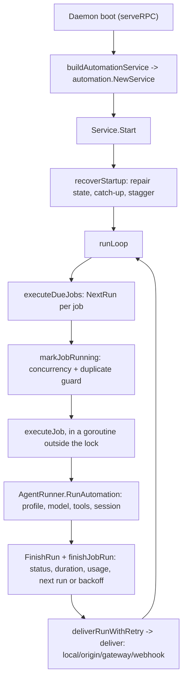

# Automation System

This page traces how a scheduled job actually runs, package by package, for contributors changing the scheduler,
execution, or delivery paths. For the user-facing model, see [Automation](../concepts/automation); for every
command and field, see [Automation Reference](../reference/automation). Package layout in general: see
[Development Architecture](./architecture).

## Component Ownership

| Package | Owns | Primary tests |
| --- | --- | --- |
| `internal/automation` | Domain types, schedule math, the scheduler service, execution retry/backoff, delivery routing, diagnostics | `service_test.go`, `schedule_test.go`, `execution_test.go`, `delivery_test.go`, `diagnostics_test.go`, `validation_test.go` |
| `internal/state/core` | `AutomationJob`/`AutomationRun` domain structs, enums, patch/merge semantics | Exercised via `storesqlite`/`storememory` tests below |
| `internal/state/storesqlite` | SQLite persistence (`automation_jobs`, `automation_runs` tables) | `automation_test.go` |
| `internal/state/storememory` | In-process store for tests | `automation_test.go` |
| `internal/cli/automation` | CLI commands, flag parsing, `diagnose`/`inspect`/`recover` (CLI-only) | `automation_test.go`, `operations_test.go`, `output_test.go` |
| `internal/tools/automation` | Owner-only agent tool, JSON schema, partial-update decoding | `automation_test.go` |
| `internal/rpc` (`automation_service.go`) | `AutomationService` gRPC adapter, proto ↔ domain conversion | `automation_test.go`, `service_test.go` |
| `internal/rpc/client` | Client-side `AutomationAPI` used by the CLI | `client_test.go` |
| `internal/gateway` (`automation_delivery.go`) | `origin`/`gateway` delivery sink routing to Telegram/Slack senders | `automation_delivery_test.go` |
| `internal/diagnostics/readiness` (`automation.go`) | `morph doctor`'s **automation** readiness group | `readiness_test.go` |
| `internal/tui/app` (`tool_display.go`, `tool_transcript_renderer.go`) | Action-specific transcript rendering for the automation tool | `events_test.go`, `timeline_test.go`, `tui_test.go` |
| `internal/e2e/tests/automation` | Daemon-backed end-to-end smoke coverage | `automation_command_e2e_test.go` |

## The Call Path

1. **Construction.** `internal/cli/daemon/rpc.go`'s `serveRPC` calls `buildAutomationService`, which constructs
   `automation.NewService(ServiceOptions{...})` (`internal/automation/service.go`) with the store, an `AgentRunner`
   (`execution.go`), a delivery sink, logger, and tracer. `ServiceOptions{}` is built empty today, so every numeric
   default in [Automation Operations](../operations/automation#numeric-defaults) is a hardcoded constant, not a
   config key.
2. **Startup recovery.** `Service.Start` calls `recoverStartup`: clears any job's stale `RunningAt` marker older
   than the stuck-job threshold, skips missed recurring jobs, catches up recent missed one-shot jobs (staggered via
   `catchUpOffset`), then calls `RunMaintenance` for run-history cleanup.
3. **Scheduling.** `runLoop` alternates between `executeDueJobs` (scans jobs whose `NextRunAt` is due) and
   `nextSleep` (arms a timer for the soonest due job, capped at `maxTimerSleep`, woken early by `notifyWake` on
   add/update/remove/run). The schedule math itself, `ParseSchedule`/`NextRun`/`EvaluateJob`, lives in
   `schedule.go` and is intentionally free of any store or execution dependency.
4. **Concurrency guard.** `markJobRunning` (mutex-protected) rejects a second concurrent run for the same job and
   enforces `maxConcurrentRuns`; once marked, `executeJob` runs in its own goroutine so the scheduler loop and
   `status`/`list` reads stay responsive while a run is in flight.
5. **Execution.** `AgentRunner.RunAutomation` (`execution.go`) resolves the profile, loads config, applies payload
   overrides (`applyPayloadOverrides`: model/provider/base URL/max iterations), builds model clients, constructs a
   `RuntimeAgent` via `morphagent.NewAgent`, resolves the session target (`resolveRunSessionID`), and calls
   `agent.Respond`. This is the same `internal/agent` entry point an interactive turn uses; there is no
   automation-specific agent loop.
6. **Finalization.** Back in `executeJob`, the run row is created before execution and finished after
   (`store.CreateRun` / `store.FinishRun`), then `finishJobRun` updates the job's own `JobState`: clears the running
   marker, records status/duration/error, and computes either the next scheduled run or a failure backoff
   (`getFailureBackoff`, reusing the same curve as run retries).
7. **Delivery.** `deliverRunWithRetry` wraps `deliverRun` (`service.go`) with its own timeout and retry loop.
   `deliverRun` dispatches on delivery mode in `deliver` (`delivery.go`): `local` is a no-op that still reports
   `delivered`; `origin`/`gateway` call the injected `DeliverySink.DeliverAutomation`, implemented by
   `gateway.AutomationDeliverySink` (`internal/gateway/automation_delivery.go`) for Telegram/Slack; `webhook` POSTs
   directly via `deliverWebhook`. Failure notices reuse the same path with a different target
   (`getFailureDeliveryTarget`) and an independent due-check (`checkFailureNoticeDue`).

## Control Surfaces

Three surfaces sit on top of the same `Service` methods (`Status`, `List`, `Add`, `Update`, `Remove`, `Run`, `Runs`):

| Surface | Package | Notes |
| --- | --- | --- |
| CLI | `internal/cli/automation` | Also implements `diagnose`/`inspect`/`recover` **client-side**, by composing `List`/`Update`/`Runs`; these have no dedicated service method |
| RPC | `internal/rpc/automation_service.go` | Thin proto ↔ domain adapter (`automationJobToProto`, `automationJobFromProto`, and similar); no business logic |
| Agent tool | `internal/tools/automation/automation.go` | Exposes a **subset** of actions (no `diagnose`/`inspect`/`recover`); `capture_context` stamps origin metadata; numeric payload fields are nanoseconds in the tool schema, not the CLI's duration strings |

The TUI never talks to the `Service` directly. It renders whatever the agent tool call already produced: RPC streams
the tool invocation as a normal `TRACE_EVENT`, and `internal/tui/app/tool_display.go`'s
`getAutomationToolDisplayDetail` / `getAutomationToolBranchDetail` / `automationToolActionTarget` turn the decoded
action and target into the pending/completed labels a user sees (`"Pausing automation"` → `"Paused automation
auto_…"`), without re-exposing the raw tool input. This is the same generic tool-transcript mechanism every other
tool uses; there is no automation-specific RPC method or transport for it.

## Where To Go Next

- [Automation](../concepts/automation): the user-facing job/run/delivery model this code implements.
- [Automation Guide](../guides/automation): everyday commands, for context on what each control surface is for.
- [Automation Reference](../reference/automation): exhaustive flags, enums, and statuses.
- [Automation Operations](../operations/automation): numeric defaults, recovery, and runbooks.
- [Development Architecture](./architecture): package boundaries and daemon assembly in general.
- [Tools Runtime](./tools-runtime): the tool registry the owner-only automation tool registers into.
- [TUI Internals](./tui): the transcript rendering pipeline automation's tool output flows through.
- [Testing](./testing): `make test` targets, including the automation e2e suite.
