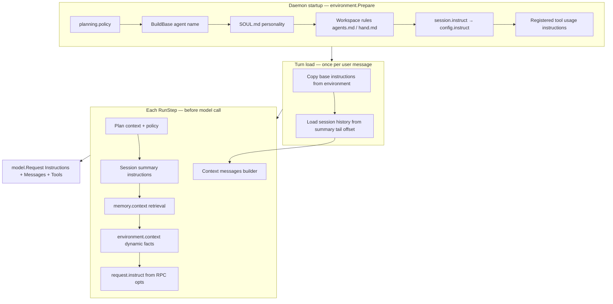

# Prompt Assembly

Hand separates what the model reads into two surfaces on every inference call:

1. **`Instructions`** — the system prompt: static profile rules, runtime facts, retrieved memory, and turn-specific
   guidance. Assembled as named instruction blocks, then joined into one string.
2. **`Messages`** — the conversation transcript: summarized tail history plus messages emitted during the current turn
   (user input, assistant replies, tool calls, tool results).

This page explains how those surfaces are built, in what order, and where to change them. For when assembly runs inside
the turn lifecycle, see [Agent Loop](./agent-loop). For package boundaries, see
[Development Architecture](./architecture). The [Learning Path](../getting-started/learning-path) Contributor track
lists this page after the agent loop.

:::info
Think of **instructions** as the hidden operating manual and **messages** as the visible transcript. Summaries and memory
usually become instructions; user, assistant, and tool turns remain messages.
:::

## Overview



Assembly happens in three layers:

| Layer | When | Primary code |
| --- | --- | --- |
| **Environment base** | Once when the daemon prepares the profile (`environment.Prepare`) | `internal/environment/environment.go` (`prepareInstructions`, `prepareTools`) |
| **Turn load** | Start of each turn, before the loop | `internal/agent/turn.go` (`load`, `loadBaseInstructions`) |
| **Per-step merge** | Every model iteration inside `RunStep` | `internal/agent/turn.go` (`buildRequestInstructions`, `Context`) |

The prompt provider adapter (`internal/agent/prompt.go`) copies environment instructions at turn load. Dynamic
environment facts are added later in `buildEnvironmentContextInstruction` (`internal/agent/environment_context.go`)
because they depend on the resolved tool list, runtime facts, and session origin for that step.

## Instruction Blocks

Instructions are `internal/instructions.Instruction` values with an optional `Name` and a markdown `Value`. Named blocks
can be replaced or omitted during merge; unnamed blocks append in load order. Final system text is
`Instructions.String()` — values joined with `\n\n`.

Common named blocks:

| Name | Source | When loaded |
| --- | --- | --- |
| `planning.policy` | `instructions.BuildPlanningPolicy` | Environment prepare |
| *(unnamed)* | `instructions.BuildBase(name)` | Environment prepare |
| *(unnamed)* | Personality / `SOUL.md` | Environment prepare |
| *(unnamed)* | Workspace rules | Environment prepare |
| `config.instruct` | Profile `session.instruct` | Environment prepare |
| `tool.*` | Registered tool usage guidance | Environment prepare (per registered tool) |
| *(unnamed)* | Session summary sections | Each `RunStep` when a summary exists |
| `memory.context` | Turn memory retrieval | Once per turn in `LoadMemory` |
| `environment.context` | Runtime facts for this step | Each `RunStep` |
| `request.instruct` | RPC `RespondRequest.instruct` / one-shot flags | Per turn (from `RespondOptions`) |

Builders for summaries, memory flush, web extract, reranking, and session titles live in the same package
(`internal/instructions/builders.go`) but are used by background or auxiliary model calls, not the main merge path.

## Base Instructions at Daemon Prepare

When `internal/agent.Agent.Start` calls `environment.Prepare`, Hand builds the static instruction stack before tools
register.

### Core behavior and planning policy

1. **`planning.policy`** — when to use `plan_tool` and how to maintain step status.
2. **`BuildBase`** — agent identity, tool-use honesty, instruction-secrecy rules, and terminal-friendly formatting. The
   agent name comes from profile `name` (default `"Hand"`).

### Personality overlays

`internal/personality` loads `SOUL.md`:

- **Profile** — `<profile-home>/SOUL.md` when no named personality is active.
- **Workspace** — `<cwd>/SOUL.md` when the process working directory contains that file.

Content is safety-scanned, truncated to **15,000** characters (`constants.PersonalityMaxContentLength`), and appended as
an unnamed instruction block. Blocked findings are replaced with a `[BLOCKED: …]` placeholder and recorded for trace
replay at turn start. Configure named personality maps under `personalities` in profile YAML; see
[Config Guide](../guides/config).

### Workspace rules

`internal/workspace` loads rule files from the **current working directory** of the daemon process:

| Source | Behavior |
| --- | --- |
| **Default discovery** | When the workspace root contains a top-level `agents.md` or `hand.md`, Hand walks the tree (skipping `.git`, `node_modules`, virtualenvs, and similar dirs) and loads every matching file, shallow paths first. Matching is case-insensitive. |
| **`rules.files`** | Additional explicit paths (relative to the workspace root or absolute). Configured via profile YAML or the `HAND_RULES_FILES` env var. See [Config Guide](../guides/config). |

Each file is safety-scanned, prefixed with a `## <path>` heading, and concatenated. The combined text is truncated to
**15,000** characters (`constants.WorkspaceMaxContentLength`) with a middle `[... workspace rules truncated ...]`
marker when needed.

:::tip AGENTS.md vs agents.md
Hand's default filenames are **`agents.md`** and **`hand.md`** (see `constants.WorkspaceDefaultInstructionFiles`). A
repository `AGENTS.md` is picked up because matching is case-insensitive on supported platforms.
:::

### Session-level instruct

If `session.instruct` is set in profile config, it is stored as **`config.instruct`** and included in every turn until
changed. This differs from **`request.instruct`**, which applies to a single RPC/chat request via `RespondOptions.Instruct`.

### Tool usage guidance

During `prepareTools`, each registered tool may contribute a `UsageInstruction` (for example session-search or
memory-write guidance). Registration depends on subsystem availability, such as memory support or web provider
credentials. Per-turn capability and group policy filtering happens later when `availableToolDefinitions` resolves the
model-visible tool schemas. See [Tools](../concepts/tools) and [Tools Runtime](./tools-runtime).

## Per-Turn Instruction Merge

At the start of each turn, `Turn.load` copies the environment base instructions through `PromptProvider.LoadBaseInstructions`.
Then, on **every** `RunStep`, `buildRequestInstructions` merges dynamic blocks in this order:

1. **Plan context** — active non-completed plan steps from in-memory plan state (hydrated from prior `plan_tool`
   messages). When present, **`planning.policy`** is moved to the top of the merged stack and plan markdown follows
   immediately after it (`internal/agent/plan.go`, `renderPlanInstructions`).
2. **Session summary** — structured handoff text from persisted compaction state: summary, current task, discoveries,
   open questions, and next actions (`summary.State.RenderSummaryInstructions`). This replaces older messages in
   **instructions**, not in the message list.
3. **Memory context** — retrieved durable memory for this turn (`memory.context`). See [Memory at turn start](#memory-at-turn-start).
4. **Environment context** — fresh runtime facts for this step (`environment.context`). See [Environment context](#environment-context).
5. **Request instruct** — one-shot guidance from the client (`request.instruct`).
6. **Extra blocks** — for example iteration-exhaustion summary fallback (`instruct.BuildSummary`).

The result becomes `model.Request.Instructions`. Tool JSON schemas are attached separately in `model.Request.Tools`.

### Mid-step refresh

`maybeRefreshSummary` can update summary state and trim in-memory history **after** the first request build inside a
step, then `buildRequestInstructions` and `Context` run again before the model call. See [Agent Loop](./agent-loop#3-summary-refresh-and-compaction).

:::note
This double-build is intentional. The first request shape gives compaction enough context to decide whether a summary
refresh is needed; the second build is what the model actually receives after any summary update.
:::

## Message Context

Conversation history is assembled by `Turn.Context()` → `internal/agent/context.Builder.Build`:

```text
PrefixMessages  +  SessionHistory  +  EmittedMessages
        ↓                  ↓                  ↓
              sanitizeToolCallMessageGroups
                        ↓
                 model.Request.Messages
```

| Slice | Contents |
| --- | --- |
| `PrefixMessages` | Reserved for recall-style prefix messages; currently unused in normal turns (`summary.State.Recall` returns `nil`). |
| `SessionHistory` | Messages loaded from storage starting at the summary tail offset — older compacted messages are omitted from the transcript. |
| `EmittedMessages` | Everything appended during this turn: the user message, assistant replies, tool-call messages, and tool results. |

The builder keeps assistant tool-call messages adjacent to their tool results. If a prior run ended before a tool result
was persisted, it synthesizes a placeholder tool message so provider APIs stay valid
(`[Tool result unavailable: …]`).

Session history loading and summary offsets are described in [Sessions](../concepts/sessions) and
[Session Storage](./session-storage).

## Memory at Turn Start

During `LoadMemory`, `retrieveMemoryInstruction` (`internal/agent/memory_retrieval.go`) builds **`memory.context`**:

1. **Pinned** items load regardless of the user message.
2. **Semantic search** runs against the user text when the provider supports search; hits below the minimum score are
   dropped.
3. Items are sanitized (PII redaction + safety scan); failures are traced and omitted.
4. Surviving items render through `instructions.BuildMemoryContext` with a total budget of **4,500** characters
   (`constants.AgentMemoryContextInstructionChars`).

Retrieval limits for pinned vs search items are defined in `internal/constants/memory.go`. User-facing behavior:
[Memory](../concepts/memory#retrieval-at-turn-start). Implementation details: [Memory System](./memory-system).

Memory flush passes before compaction use separate instruction builders (`BuildMemoryFlushGuidance`,
`BuildMemoryFlushRequest`) and a bounded auxiliary model call — not the main merge path. See
[Agent Loop](./agent-loop) and [Memory](../concepts/memory#how-memory-is-written).

## Environment Context

`buildEnvironmentContextInstruction` renders **`environment.context`** on every loop step from the current resolved tool
list, tool policy, config, filesystem roots, model selection, and session origin.

Typical fields include:

- Current date, time, and timezone
- OS, architecture, platform, working directory
- Filesystem roots (`fs.roots`, normalized; defaults to working directory when unset)
- Effective capabilities (`cap.*`) and sorted active tool names
- Main and summary model/provider/API identifiers
- Web provider name when configured
- Session ID and **session origin** (gateway account, conversation, thread, source)

When the session origin indicates a chat surface, Hand adds **channel response guidance** — for example Telegram
MarkdownV2 or Slack-compatible formatting hints (`renderEnvironmentSessionResponseGuidance` in
`internal/instructions/builders.go`). Gateway bindings populate origin metadata; see
[Gateway Internals](./gateway-internals).

## Guardrails and Truncation

Prompt assembly applies guardrails **before** text enters instructions or messages:

| Stage | Mechanism | Effect |
| --- | --- | --- |
| Workspace / personality load | `guardrails.SafetyScan` | Prompt-injection patterns and invisible Unicode → `[BLOCKED: …]` placeholder; trace event queued for turn `Prepare` |
| Memory retrieval | `guardrails.Sanitize` on each item | Unsafe items dropped; retrieval traced |
| Memory context budget | Character cap on `BuildMemoryContext` | Hard truncate of rendered block |
| Workspace / personality size | `promptio.TruncateMiddle` | Middle truncation with explicit marker |
| User input | Input safety in turn lifecycle | Blocked before messages persist — see [Agent Loop](./agent-loop#safety-checkpoints) |
| Assistant / tool output | Output safety after model or tool handlers | Separate from instruction assembly — see [Safety and Guardrails](../concepts/safety-and-guardrails) |

Blocked workspace or personality content still occupies a short placeholder string so the model knows material was
withheld; full blocked payloads are replayed into the turn trace via `recordLoadedContentSafety`.

## Configuration Reference

Keys that affect prompt assembly:

| Key | Effect |
| --- | --- |
| `name` | Agent name in `BuildBase` |
| `session.instruct` | Persistent `config.instruct` block |
| `rules.files` | Extra workspace rule paths |
| `personalities` | Named `SOUL.md` / instruct overlays (when selected) |
| `fs.roots` | Filesystem roots in `environment.context` |
| `cap.*` | Capability flags in environment context and per-step tool resolution |
| `platform` | Platform string in environment context |
| `memory.*` | Whether retrieval runs and provider behavior |
| `compaction.*` | When summaries refresh and history tail moves |
| RPC `instruct` field | Per-request `request.instruct` |

Full schema: [Config Reference](../reference/config). Operator-oriented tables: [Config Guide](../guides/config).

## Code Map

| Concern | Primary files |
| --- | --- |
| Instruction type and merge helpers | `internal/instructions/instructions.go` |
| Prompt text builders | `internal/instructions/builders.go` |
| Environment base stack | `internal/environment/environment.go` |
| Prompt provider adapter | `internal/agent/prompt.go` |
| Per-step merge | `internal/agent/turn.go` (`buildRequestInstructions`, `Context`) |
| Environment context | `internal/agent/environment_context.go` |
| Message context builder | `internal/agent/context/builder.go` |
| Session summary → instructions | `internal/agent/context/summary/state.go` |
| Workspace rules | `internal/workspace/loader.go` |
| Personality overlays | `internal/personality/loader.go` |
| Memory retrieval → instructions | `internal/agent/memory_retrieval.go` |
| Plan context | `internal/agent/plan.go` |

When adding a new instruction source, prefer a named builder in `internal/instructions`, wire it explicitly in
`prepareInstructions` or `buildRequestInstructions`, and document the name in this table.

## Where To Go Next

Pages that link here:

- [Agent Loop](./agent-loop) — when `buildRequestInstructions` and `Context` run inside `RunStep`.
- [Development Architecture](./architecture) — agent orchestration packages and context subpackages.
- [Learning Path](../getting-started/learning-path) — contributor reading order.
- [Memory](../concepts/memory) — retrieval budgets and flush behavior.
- [Config Guide](../guides/config) — `rules.files`, capabilities, and session instruct.

Related internals:

- [Tools Runtime](./tools-runtime) — tool registration and usage instructions.
- [Session Storage](./session-storage) — summaries, compaction offsets, and message persistence.
- [Memory System](./memory-system) — providers, search, and sanitization.
- [Model Providers](./model-providers) — how `Instructions` and `Messages` are sent to APIs.
- [Gateway Internals](./gateway-internals) — session origin and channel formatting hints.

Concepts and operations:

- [Tools](../concepts/tools) — which tools register and contribute guidance blocks.
- [Sessions](../concepts/sessions) — history vs summary split.
- [Safety and Guardrails](../concepts/safety-and-guardrails) — scans applied around prompts.
- [Contributing](../contributing) — change workflow.
- [Testing](./testing) — run `make test` after prompt changes.
